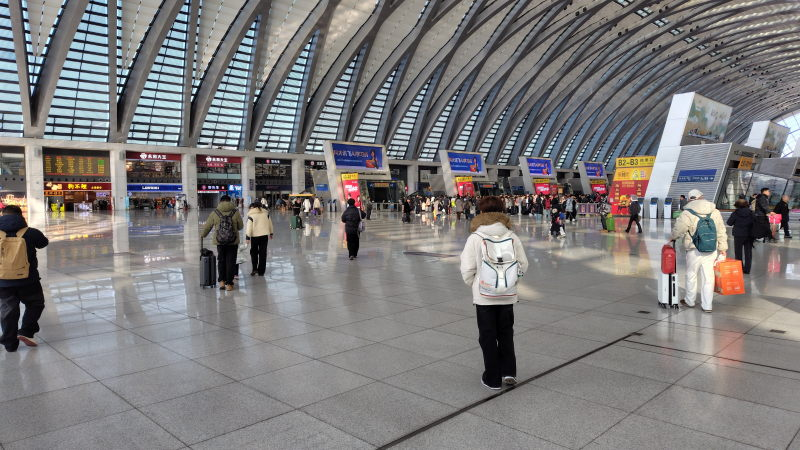
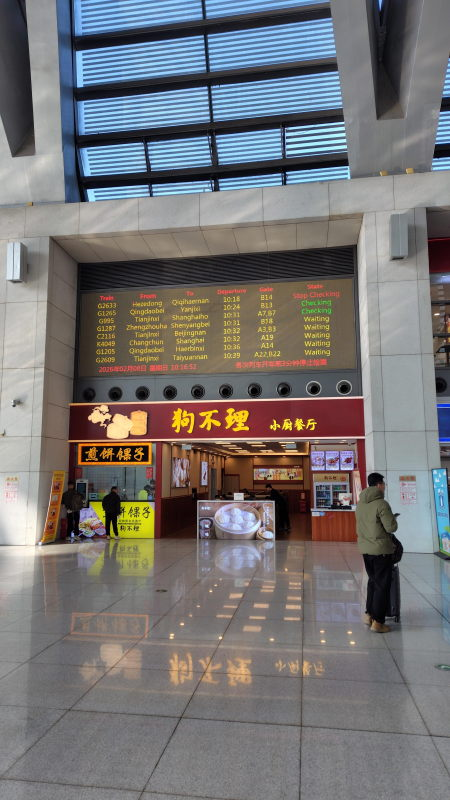
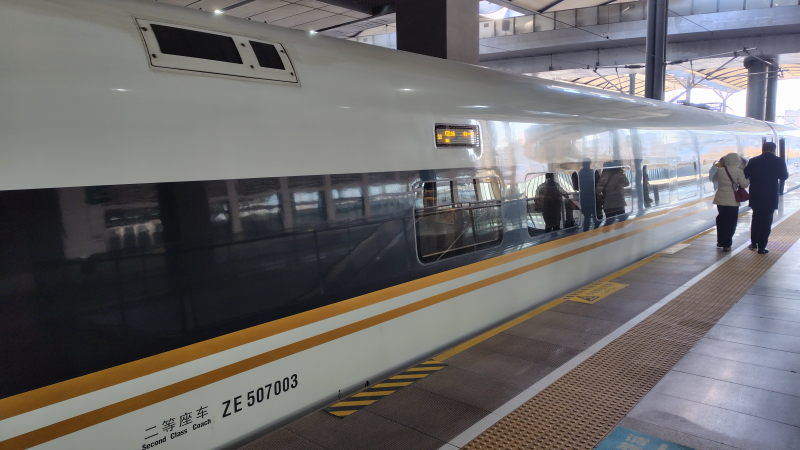

---
tags:
    - china
---
# 12306(高速鉄道)
## インストール
アプリを公式からダウンロードする。
核験（核验）、実名認証手続きを済ませておくと
QRコードを表示できるようになる。

- 電話番号認証、SMSで999と発信して番号を受け取る仕組み。
- パスポート写真とパスポートを持った本人の写真を送る。

## 購入
アプリで手順に沿って操作すれば迷うことなく購入できる。
2等席なら各列3-2、5席あってA-Eのどの位置に座りたいかは決めることができる。
ただ、日本みたいにどの車両のどの場所にというような決め方はできない。

片道分予約した後の確認画面で復路の予約もあわせて取れる。
## 乗車
駅の構内に入るためのセキュリティチェックを受ける。
無人ゲートは中国人しか通れないため、有人列でパスポートを見せて通ること。
荷物検査はバッグを検査機に通す。スマホは手に持っていても特に問題ない。
飲み物を飲むように求められることがある。

発車時間の15-20分くらい前に改札が始まる、ここもパスポートを見せないと通れないので有人の改札に並ぶほうがよい。
アプリでQRコードを表示させておいてパスポートと一緒に見せる。
## 車内
車両に入った後は日本と同じ。

## 下車
下車時はQRコードをかざせば良いが、
駅によっては出られないときがあるのでその場合は有人の列でパスポートとQRコードを見せれば良い。
## 予約変更
アプリで購入したチケットを表示すると変更画面に移動できる。
手数料はかからなかったが条件によるかもしれない。

## 天津西駅の様子

