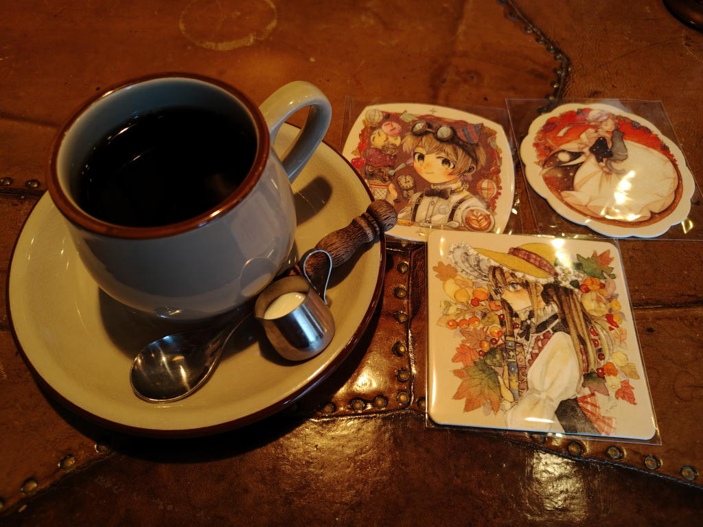
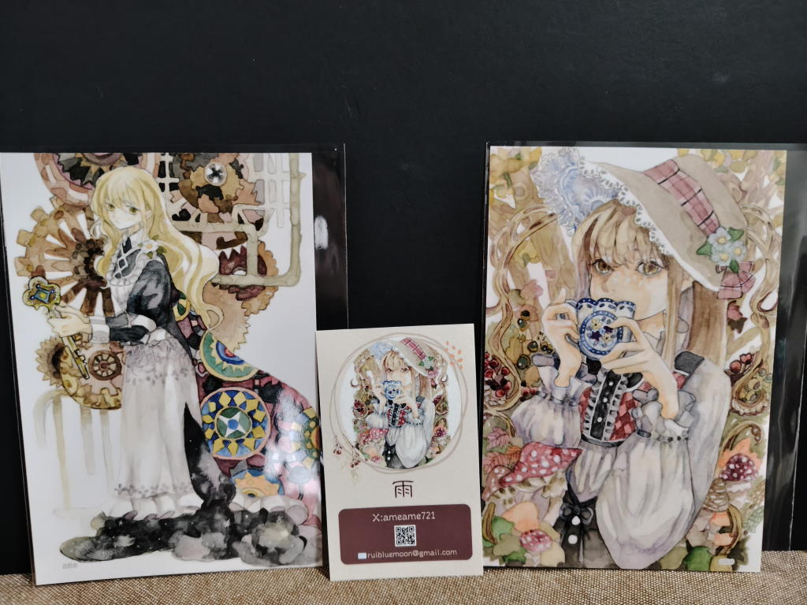
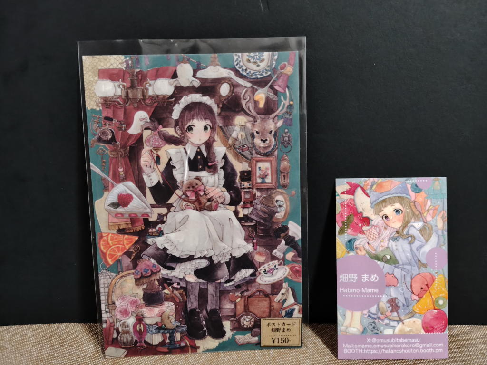
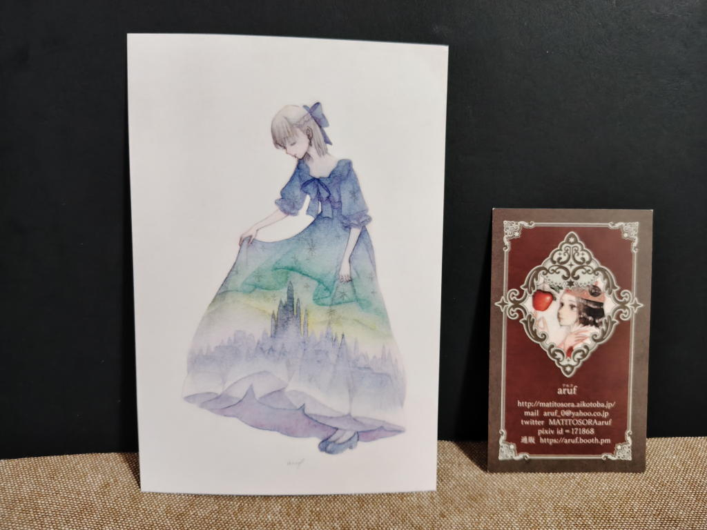

---
tags:
    - exhibition
date: 2026-09-19
---
# 雨・畑野まめ・aruf 3人展「秋色エフェメラル」
## 概要
- 訪問: 2026年9月19日
- 場所: [Velo&Galerie Cafe du miconos](./velo-galerie-cafe-du-miconos.md)

<https://x.com/ameame721/status/2060374462768541748>

- 雨 <https://x.com/ameame721>
- 畑野まめ <https://x.com/omusubitabemasu>
- aruf <https://x.com/MATITOSORAaruf>

の3人による展覧会。

ephemeralは「一時的な」という意味。秋のひととき、秋の一瞬。

[ARTs*LABo プラネタリウム・ボタニカルガーデン](./arts-labo-20260909.md)でDMを見つけて存在を知った。

開催期間が[ハマクリ](./hamakuri-vol3.md)と被っていたのもあって行ってみることに。
## 記録
16:00ちょうどくらいにカフェの前に着いた。
外から中の様子がある程度見えるのだけど、
カウンター席に人が座っている様子はなかったと言うか、
全体的に人がいないように感じられた。

おしゃれなカフェでちょっと入りにくさも感じたが、
ここまで来て引き返すわけにもいかないし何よりもギャラリーカフェに入るという経験をしてみたかった。

入ってみるとテーブル席に3人座っていて、それが在廊中のアーティストさんたちだったのだが、
それ以外には誰もいなかった。

とりあえず挨拶をしてカウンターの一番奥の席へ座った。

店名にもなっているミコノスブレンド(\500)というのを頼んでみた。
頼んだあとにこのコーヒーでノベルティをもらえるのかなと言う疑問に気付き、
「ノベルティってもらえますか」と確認したら作家さんの一人がコースターを3個持ってきてくれた。
「コーヒー1杯で3つももらっていいのかな」と思いつつ、ありがたく頂いた。

映っているのは展覧会のノベルティコースター

3人まとめて在廊していると誰だかわからないというのが少し残念ではあった。

店内の雰囲気はかなり私の好みでイラストレーターさんの作品が壁のあちこちに飾られていたり、
店主の趣味が垣間見えるようなレイアウトだった。
BGMも良くて、こんな店が近くにあったら良いのにと思うような場所だった。

ただ、今回の目当てはイラストを鑑賞すること。
でも、この手のカフェに来たのは初めてでどんな風に観に行ったら良いのかわからない。
作品は私の座ったところからちょうど真反対にあって座っている場所からはどうやっても見えない。

しかも作家さんたちが普通にお茶会しているような感じでそっちの方に近づくのも何となく気が引けた。

とりあえず注文したコーヒーを飲みながらあれこれ今の状況のメモを取りつつ、
「これは授業中に立ち上がって『保健室に行っていいですか?』って先生に聞くくらいの勇気がいるぞ...」と思いながら
機をうかがっていていた。

そんなこんなを考えながら40分くらい経った時に1名来店してきた。
店内も静かになってきていて今なら見に行けると思い、ついに立ち上がって作品を見に行くことができた。

額装されているのからフレームレス?のものまで色々と展示されていた。
ただ、絵に対する感想を描けるほどの語彙力がないからここには書けないのだけれども...

原画はお高くて手が出せないけど、各作家さんのポスカもそれなりに販売されていて、
気に入ったのを1,2枚ずつお迎えすることにした。

今回の展示会記念のサインが描かれた大きなボードが置いてあって、
その中にROROICHIさんもいらっしゃって、「おおっ！[この前](./art-complex-center-of-tokyo-2026-09-15-roroichi.md)の！」となってしまった。
イラストレーターさん同士の人間関係と言うか繋がりもいろいろなのだろうな。

<https://x.com/ameame721/status/2101257896340393989>

画像をよくよく見ると今回のというよりはこれまでの展示会に来てくれた作家さんに
書いてもらってるという感じなのかな。

その後間もなく二人組が入店してきた。この展示会が目当てなのかどうかわからないけど。

人も増えてきたしそろそろ出ようかと、50分くらい滞在して退店した。

おしゃれな喫茶店、初めてのギャラリーカフェ、良い経験ができた。
## お迎え品
ただ、ポスカにタイトルの書いていない作品が多くてメモしてくればよかったなと少し後悔。
次に活かそう!
### 雨さん

### 畑野まめさん

これだけはタイトルが書いてあって「賑やかcabinet」
### arufさん

## メモ
私も退店する時まで気づかなかったが、入ってすぐのカウンターの下に
作家さんたちの画集も置いてある。

<https://x.com/ameame721/status/2101215411169857803>

多分、言われないと気づかないと思う...わたしは画集目当てではなかったから良いのだけれども。
