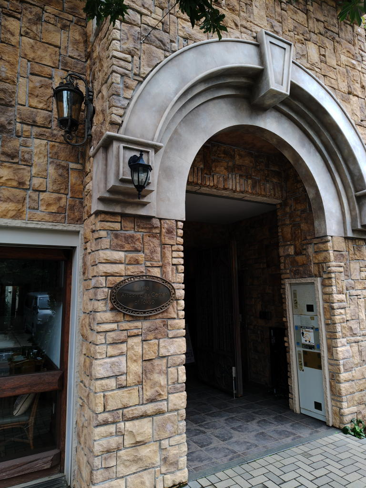
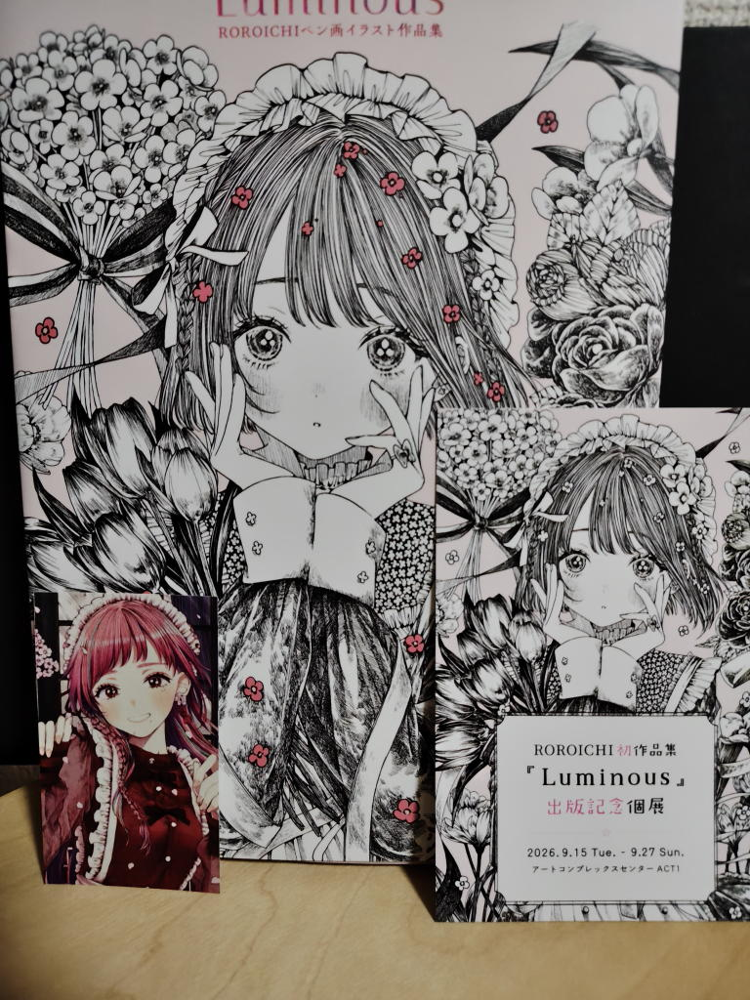

---
tags:
    - exhibition
date: 2026-09-15
---
# ROROICHI 初作品集『Luminous』出版記念個展
[アートコンプレックスセンター](./art-complex-center-of-tokyo.md)にて。
2026年9月15日訪問。

## きっかけ
きっかけは14日に神保町の三省堂に立ち寄っていつもどおりにイラスト本コーナーを見に行ったら
この作品集が平積み?ではないのかな、棚に表紙が見えるような感じで立てかけられていたこと。
中を見るとそれはそれはキレイなイラストが詰まっていて買っても良いかもと感じつつも
画集って買ったきりそのままにしてしまいがちなのだよなと思いとどまって、
ROROICHIという作家さんの名前だけメモしてその日は帰宅した。

家に帰ってXを見てみるとこの作品集の出版を記念した個展が開かれるという情報を見つける。

<https://x.com/souta_16/status/2089277817888616665>

しかも明日15日から!15時から在廊している!とりあえず行ってみよう!
ということで翌日訪問したという流れ。

## 訪問
四谷なんて初めて降りたな...などと思いつつ地図を見ながら住宅街の中を歩いていくと
レンガ造りと言うか何とも古風な建物が現れ、これがアートコンプレックスセンターかと中に入る。

1階はレストラン、展覧会用のスペースは2階になっている。

個展会場のACT1に入ってみると平日ということもあってか空いていた。ご本人がいらっしゃって挨拶をして作品を見て回る。
私はこの手のことに関しては語彙力がないからなんと言ったら良いのかわからないが、
「めっちゃいい」。線の一本一本がキレイで描かれている子たちもカワイイやらキレイやら、
それ以上になんと言ったら良いのやら...

昨日の迷いも吹き飛んで画集を買おうと決心を固める。
「どうせ買うならサインをもらいたいな」「なにか声を掛けたりしても良いのかな」
とか色々考えながらレジに画集を持っていって「お願いします」と係の方に声をかけた。

ROROICHIさんは入口脇の机で色紙にイラストを描き描きしていた。

そうしたらROROICHIさんが「ありがとうございます。よかったらサインしましょうか」と
聞いてくださって、是非お願いしますという流れでサインをしてもらうことができた。
「名前は何と書いたら良いですか?」と聞かれて「アルファベットのKでお願いします」と伝えながら、
用意されていた付箋に(下手な)字でKと書いた。
この扱いやすくてシンプルで私の名前も含んでいるハンドルネームを思いついて良かった!と心の底から思いながら。

「書いている間に展示を見ててもいいですよ」みたいに言われたのだが、
わたしとしては当然サインをしてくれているところが見たくてその場にとどまっていた。
話しかけたら迷惑かなと思って黙って見ていたのだが、そのうちに
「好き勝手描いちゃってごめんなさいね」みたいなことを言ってくれて、
私の方からも「昨日本屋でこの画集を見かけて少し調べたら個展があるというのを知って...」みたいな
ここに来るに至った経緯を伝えることができた。

（「じゃあ昨日買えよ😡」みたいな最悪な世界線も妄想していたが、
もちろんそんなことはなくて喜んでくださっていたようだった、伝えられてよかった。）

結局サインをもらったあともしばらく原画を見ていて、そろそろ満足したかなというあたりで
ありがとうございましたと伝えて退室した。

## ネタバレかもしれないので注意

ちょっとネタバレになるかもしれないが、画集のP108にある「もう、探さなくてもいいんだよ」という作品の
原画が展示されている。天使の女の子が橋の欄干にもたれかかってこちらを見ているという構図で
一体このタイトルはどういう意味なのだろうかとしばらく考えてしまった。何を探さなくてもいいの?

私の今のメンタル状態も多分に影響していると思われるが、

「もう現世で何も探さなくても大丈夫、こっちにおいで」

要は死に際のお迎えなのかなと想像してしまった。

でも、あとからじっくり考えると、この女の子の目線の先には彼氏か彼女がいて、

「もう私のことを探さなくても大丈夫、私はあなたのそばにずっといるよ」

というほうがよほどしっくりくるかな。

こういう疑問を作家さんに聞いてみても良いのかなと思ったが、聞く勇気は私にはなかった。
でも、聞いたら色々教えてくれたのかなと思うとやっぱり聞いてみればよかったのかな。
やらない後悔よりもやる後悔?というやつだろうか。
