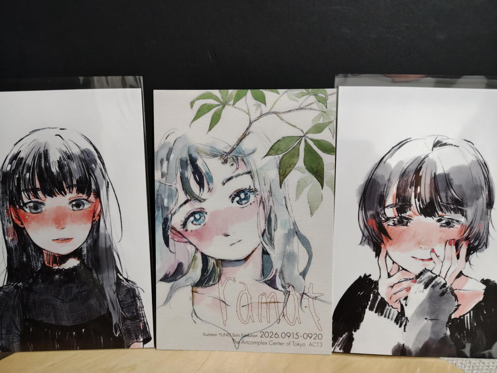

---
tags:
    - exhibition
date: 2026-09-15
---
# ゆの個展『ramat』
[アートコンプレックスセンター](./art-complex-center-of-tokyo.md)にて。
2026年9月15日訪問。ROROICHIさんの個展と同時期に開催されていた個展。

調べてみるとramat（ラマッ）はアイヌ語で魂という意味。

人と植物がテーマみたいで木に直接イラストを描いているのが印象的だった。
ライブドローイングと言ってその場で書いた作品をその場で販売もするようなこともされているようだった。
わたしが訪ねたときはちょうど画材メーカーの方?が来ていてその方と使っている紙か何かの話をしていて
見ることはできなかったのが少し残念。

ポストカードを2枚お迎えした。真ん中のは今回の個展の宣伝用のポスカです。

丸顔の短髪の子の方は値札に「MCM4」と書いてあって
2024年に開かれていたMCM4 マルイクリエイターズマーケットのことみたい。

## リンク
<https://x.com/_emakaw/status/2084451914947895418>
