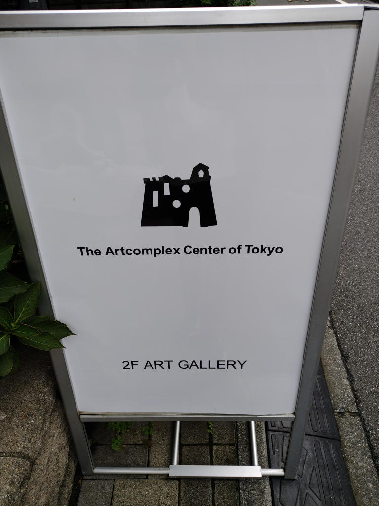

---
tags:
    - tokyo
---
# アートコンプレックスセンター
四谷三丁目駅の1番出口から歩いて10分くらいのところにある
住宅街のどまんなかにひっそりと佇むレンガ造りの古風な建物。

1階はレストラン、2階が美術館になっていて
5つのフロアそれぞれで展覧会が開かれている。

廊下には個展の宣伝用のチラシやポストカードがこれでもかと並べられている。

## 訪問記録
- 2026-09-15訪問 [ROROICHI 初作品集『Luminous』出版記念個展](./art-complex-center-of-tokyo-2026-09-15-roroichi.md)
- 2026-09-15訪問 [ゆの個展『ramat』](./art-complex-center-of-tokyo-2026-09-15-yuno.md)
## 写真

## リンク
<https://www.gallerycomplex.com/>
