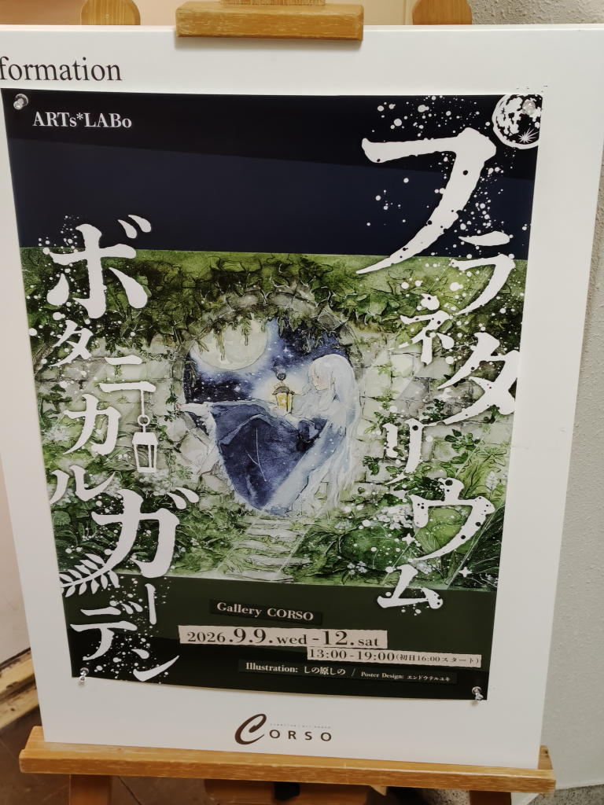
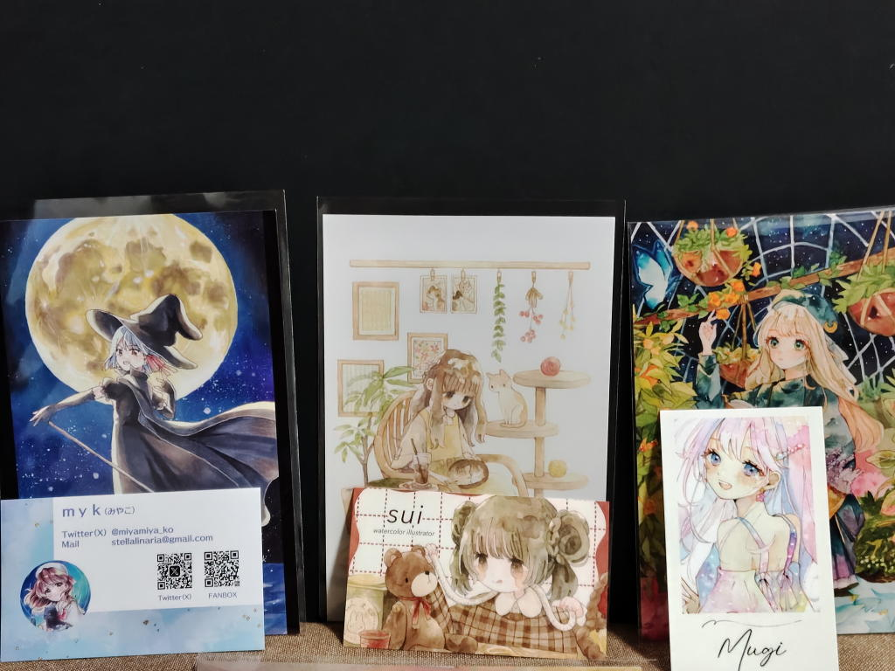
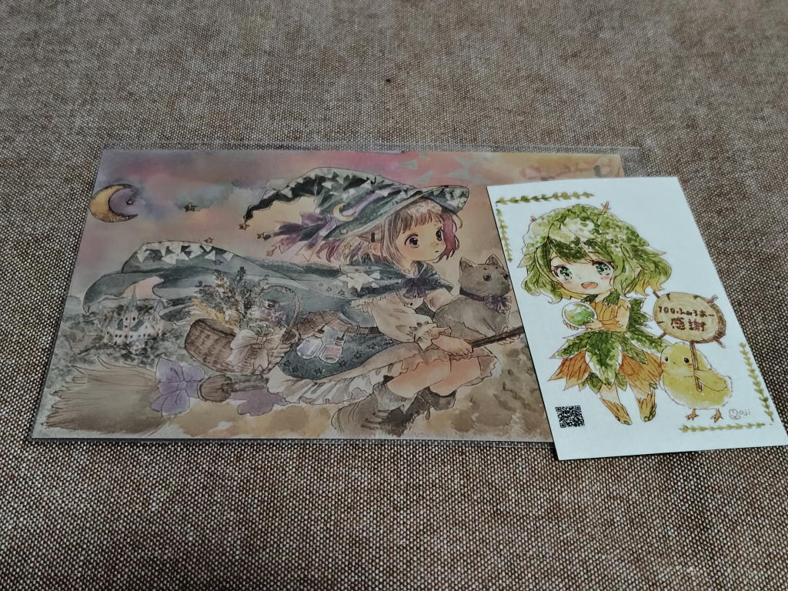
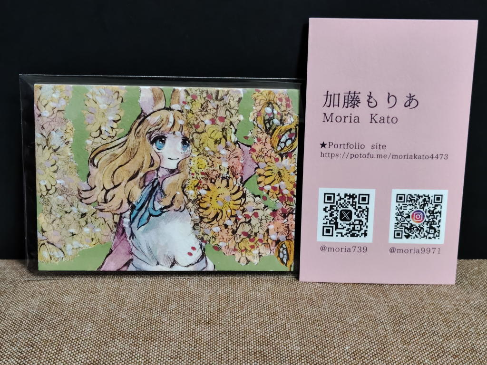

---
tags:
    - exhibition
date: 2026-09-10
---
# ARTs*LABo プラネタリウム・ボタニカルガーデン
訪問日: 2026年9月10日

抽選販売で混雑する13:00-15:00は避けたほうが良いとHPに書いてあったのを見て
三省堂で少し過ごしてから会場へ向かう。

Gallery CORSO。神保町駅の西口から出てすぐのところにある。
この手の展示会に行くのは初めてで少し勇気が要ったが、
ビルのエレベーターに乗って三階に上がるとこじんまりとした雰囲気のギャラリーが広がっていた。

平日というのもあってか空いていた。ただ、壁に青丸のシールが貼っている箇所がところどころにあって、
その部分はもともと作品が飾ってあった場所でお迎えされたことを示しているようだった。

ATCを1枚お迎えしようということは心に決めていて、
じっくり一通り見て回って良さそうな作品2つまで絞り込む。

1つはもじさんという方のATC

<https://x.com/ARTs_LABo/status/2097953033825169467>

の左下にチラッと映っている。
と思ったらその日の夜には売れていた。

<https://x.com/ARTs_LABo/status/2097987513361248451>

もう1つは加藤もりあさんという方のATC

<https://x.com/ARTs_LABo/status/2097943207946625490>

これ。私がお迎えしたのだ。

最終的にもじさんの方はポスカを発見して、もう一方の加藤もりあさんの作品をお迎えすることに決めた。

名刺くらいの小さなカード。でも、これが世界に一つ、私だけが持っているのだと思うと感慨深いものがある。

さんざん悩んで、結局1時間くらい滞在してしまった。
でも、どのイラストも本当に素敵で何時間でも居られそうだった。
それから、ATCの作者さんの感想ノートに「人生初のATC、大切にします!」みたいなことを書いてきた。

わたしはこういうのが好きなのだろう。有名とかどうとかではなくて、
自然なもの、天然、ピュアなもの?
想いが込められているというか、手作りというか、わたしは絵を描くことが全然できないけど、
こういう風に好きと感じる作品を見つけて足を運んで応援の気持ちを示すために作品をお迎えする...
そういうことはできるのだ。

今までは絵が下手で作品を創り上げることのできない自分に劣等感を感じていたが、
これでいいのかなと思えるようになってきた。

こういったイラストを好きと感じるのもわたしだし、
プログラムを書いてツールを書いているのもわたし。
山に登ったり旅行をしているのもわたし。
これだけ組み合わせたら、全部に当てはまるのはきっとわたしだけ。
それが個性というものなのかな。

## お迎えした作品たち

ホウキに乗った魔女はアルマちゃんというみたい。

## 作者さんのコメント
<https://x.com/moria739/status/2097990909195616615>

お迎えして頂き、誠にありがとうございます✨ 春をモチーフとしたリースと、うさぎちゃんの鮮やかで華やかな感じを楽しんで頂けたら幸いです🐰

大切にします!
## 気になった方々
- mugi 癒しの箱庭 ポスカ <https://x.com/mugi_sketch/status/2097840210499514595/photo/1>
- 七花 フォローしていたかも <https://x.com/nanaka_787>
- のあ <https://x.com/noa_n428>
- cocoda coco <https://x.com/cocoda_coco>
- 加藤もりあ <https://x.com/moria739>
- moji 月夜に咲く紫の蝶 <https://x.com/cJTXBPfB75DjgsZ>
- myk <https://x.com/miyamiya_ko>
- sui <https://x.com/sui____23>
- みしょう <https://x.com/mishow_e>
- 霧野とばり <https://x.com/_shioconbu_>
### 付箋
Secret Base ARTLABO Store賞

<https://illumy.cc/ARTs_LABo/diary/51770/>

下の方にイラストの画像がある。

めちゃくちゃ良かったのだが、Xアカウントを見つけられない。

## リンク
- <https://illumy.cc/ARTs_LABo/event/3578>
