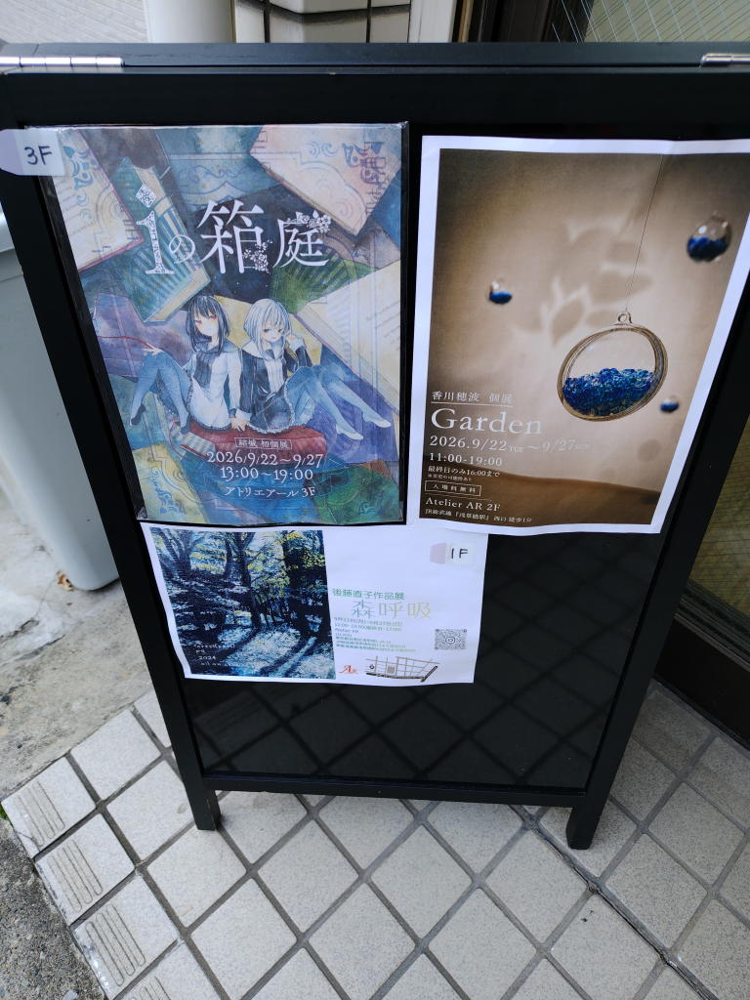
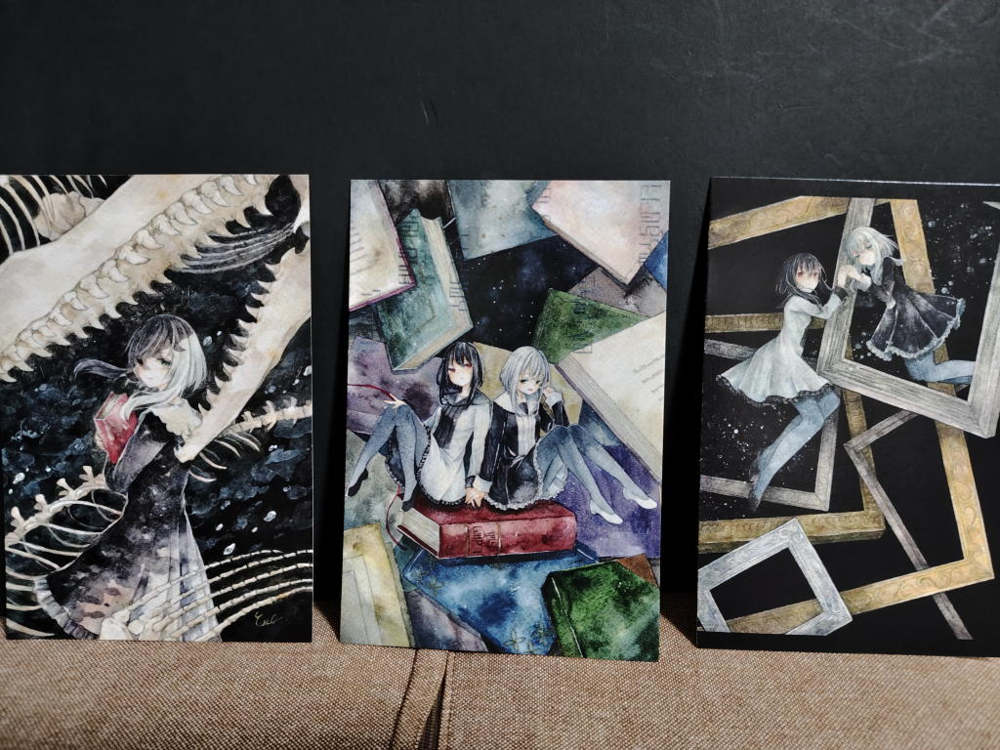
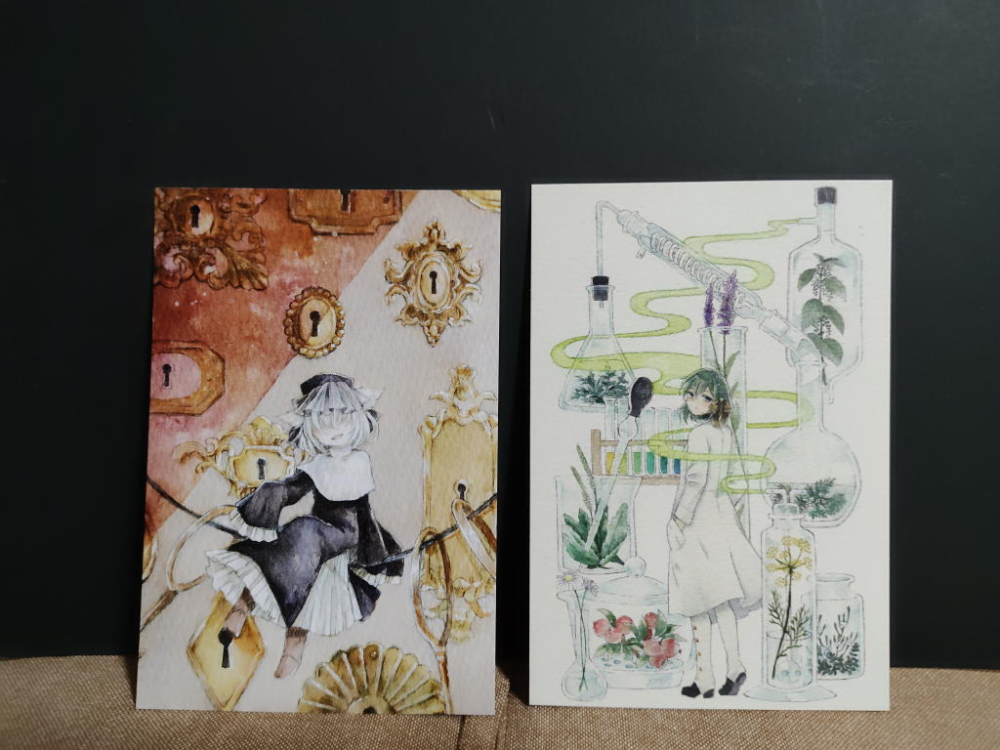
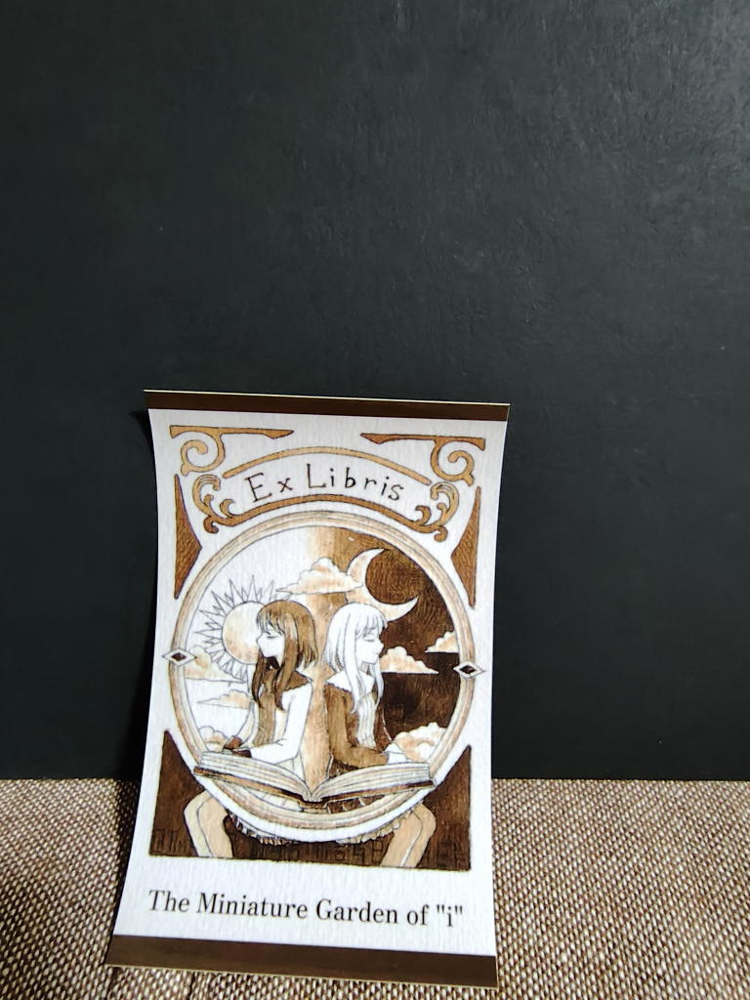

---
tags:
    - exhibition
date: 2026-09-24
---
# 結城(ゆしろ)初個展 iの箱庭
- 訪問日 2026年9月24日
- 場所 [アトリエアール](./atelier-ar.md)

[ARTs*LABO](./arts-labo-20260909.md)で知った結城さん、
作風というか画風というか、そういうものが好みでXをフォローしていて、そのときに今回の個展の存在を知った。

会場はアトリエアールの3階。3階へ上がるためには、1階の展示室を通って、奥にある階段を登らねばならない。

1階の会場を使っていた方に何となく申し訳無さを感じながらも3階へと上がっていった。

イラストは全体的に暗めと言うか物憂げな感じがしていて、展示室の雰囲気もそれに合わせるように
少し薄暗くて作品と調和しているように感じた。

ポストカードを5枚お迎えする。

例によって私は感想が言えない。

何が好きなのか。どうしてこの5枚を選んだのか。もっと言葉にできたら良いのに、と帰ってからも思う。

作家さんが在廊していたのに、大して言葉を交わせなかったのも少し残念だった。

まあ、「好き」という気持ちはポスカを買ったことで伝わっているのだろうし、
これで十分といえば十分なのだろうけど。

わたしは鑑賞というもののやり方を知らないのかもしれない。

## ポストカード

左から

- 深層の澱
- iの箱庭
- 移ろう境界

真ん中がメインビジュアル、白髪の子がエゼル、右側の黒髪の子がイディスなのかな。
fanboxを見るとそのようなな説明が書いてある。ゆしろさんの「うちの子」みたい。
現実の姿と、夢の中の姿、というような関係なのだろうか。

- 遍在と偏在の証明

画面いっぱいに描かれたたくさんの鍵穴と、目元が隠れた少女。ミステリアスな雰囲気が気に入った。

- ハーバル・ラボラトリ

これは前回のART*LABoで原画が飾られていて、今回も展示されていた。

来場記念にもらったステッカー。「てのひらのエクス・リブリス」。エクス・リブリスは蔵書票。
## リンク
- <https://lampbox.fanbox.cc/posts/11574244>
- <https://lampbox.fanbox.cc/posts/12603646>
