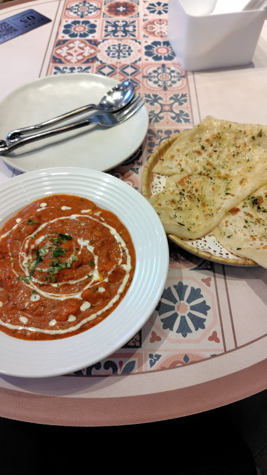
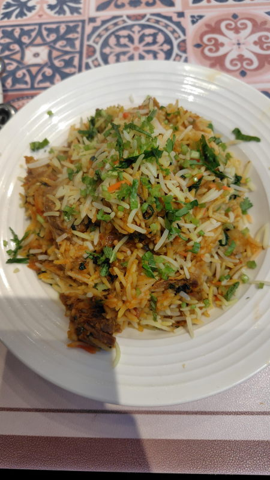
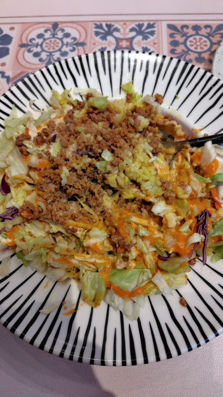
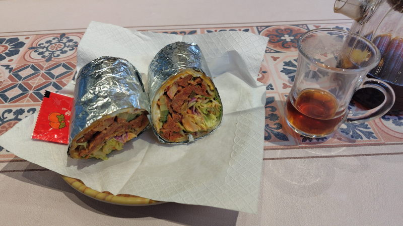
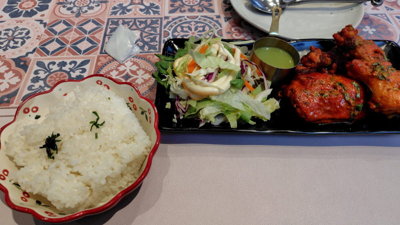
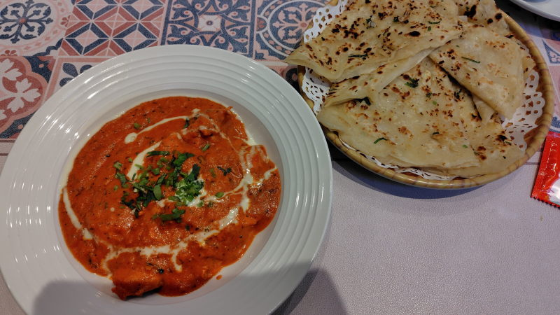
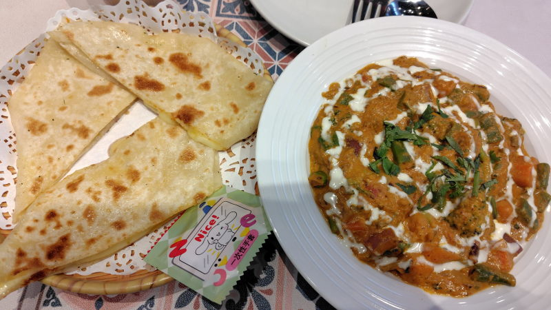
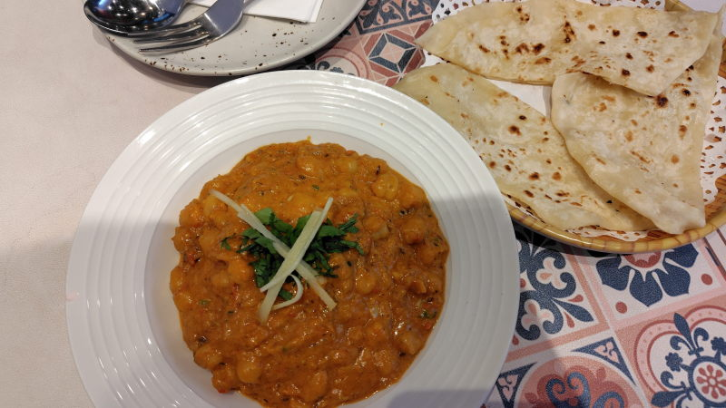
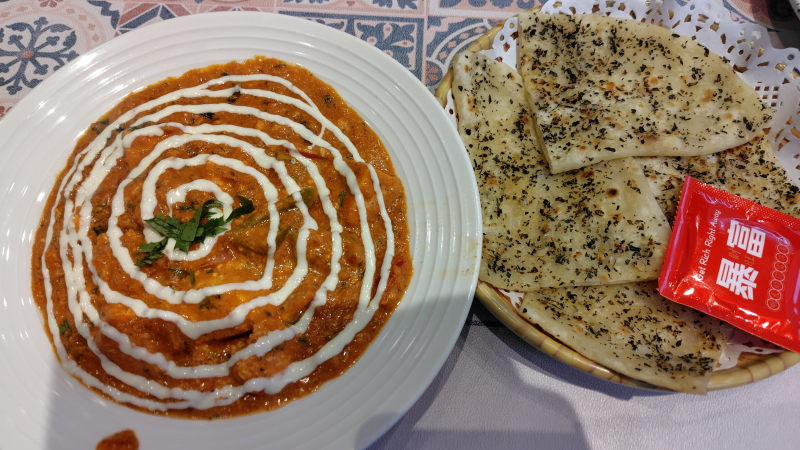
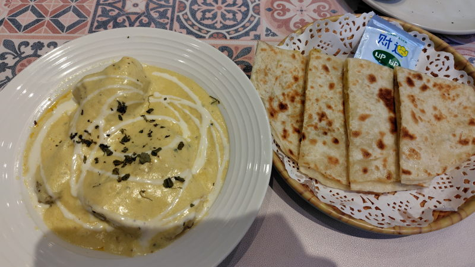

---
tags:
    - tianjin
---
# 巴卜印度菜
Bā bo yìndù cài

インド、巴卜(バブ)はシリアの街

## 香烤鸡肉咖喱 Xiāng kǎo jīròu gālí
43元。鶏肉入りのカレー

## 黄油烤馕 Huángyóu Kǎo náng
9元。バター入りナン。ナンという名前だが日本で見るようなパンみたいなナンと違ってシート状の薄いタイプ。チャパティというのかもしれない。

## 牛肉手抓饭 Niúròu shǒu zhuā fàn
42元。ビリヤニ。手づかみと書いてあるがスプーンもついている。

## 香烤牛肉饭 Xiāng kǎo niúròu fàn 中国米饭
38元。ひき肉とキャベツと黄色い米。米の種類は中国米か巴斯马蒂 Bā sī mǎ dì (バスマティ・ビリヤニに使われている細長い米)から選べる。

## 传奇羊肉沙威玛 Chuánqí yángròu shā wēi mǎ
42元。シャワルマ。ケンタッキーのツイスターのような感じ。食べにくいが使い捨てのビニル手袋がついてくる。

## 阿拉伯红茶 Ālābó hóngchá
5元。紅茶。

## 经典唐杜里烤鸡 Jīngdiǎn táng dù lǐ kǎo jī
39元。骨付きタンドリーチキン。

## 香烤鸡肉咖喱 蒜香烤馕x2
セットで49.9元。ニンニクナンと鶏肉カレー。

## 经典黄咖喱蔬菜
38元。野菜カレー

## 芝士烤馕
12元。チーズナン

## 鹰嘴豆咖喱 Chana Masala
36元。ひよこ豆カレー。

## 烤炉原味馕饼
8元。プレーンナン

## 罗勒烤馕Basil Naan
9元。バジルナン

## 香辣芝士咖喱Kadai Paneer
42元。豆腐見たいのが入っているビーガンカレー

## 土豆烤馕
12元。じゃがいもナン。中に潰されたじゃがいもが入っている。

## 腰果浓汁鸡肉咖喱
43元。カシューナッツチキンカレー

