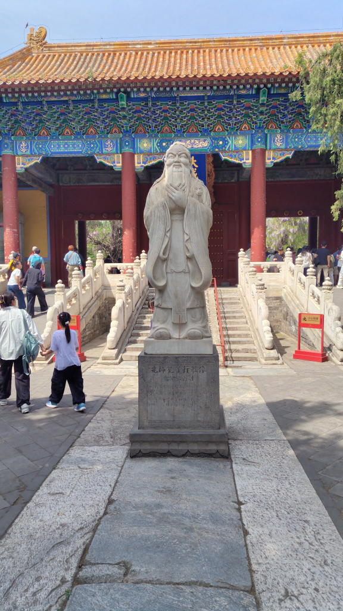
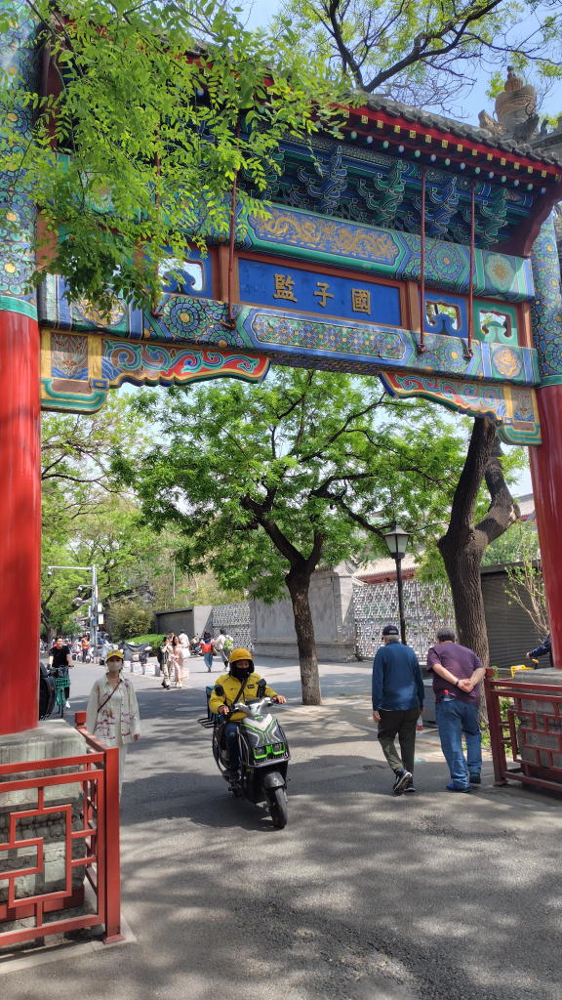
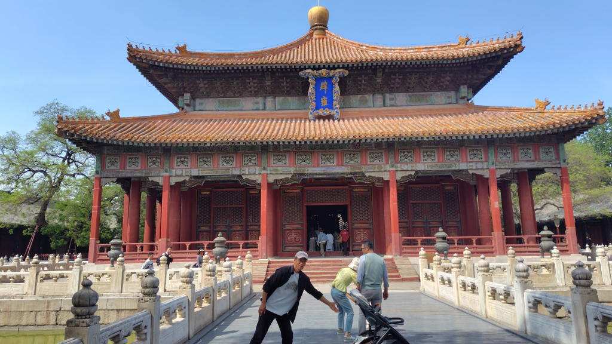
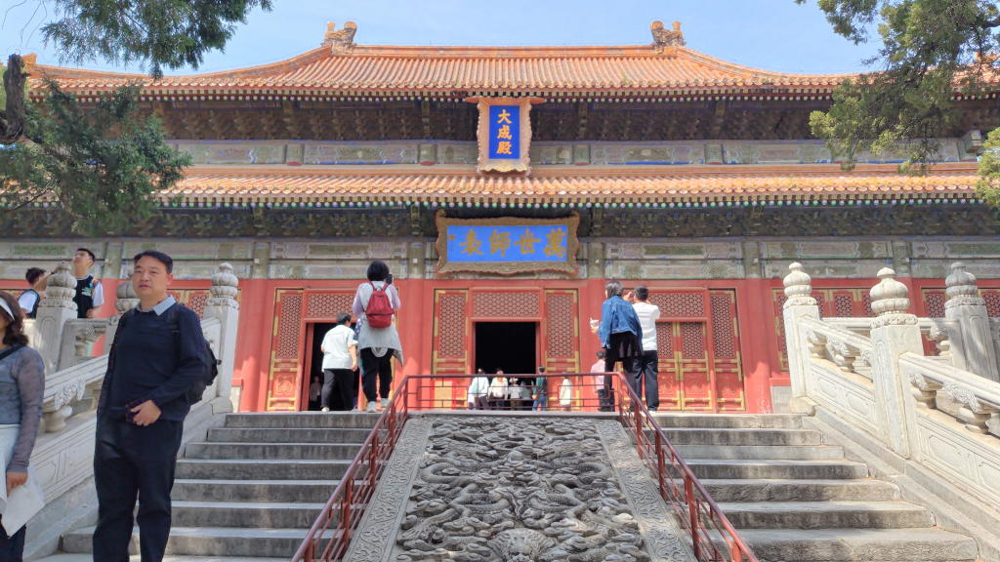
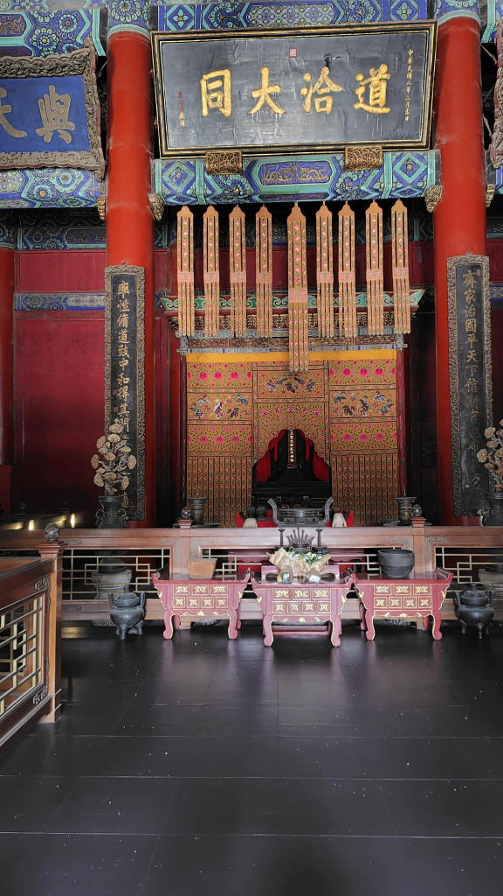
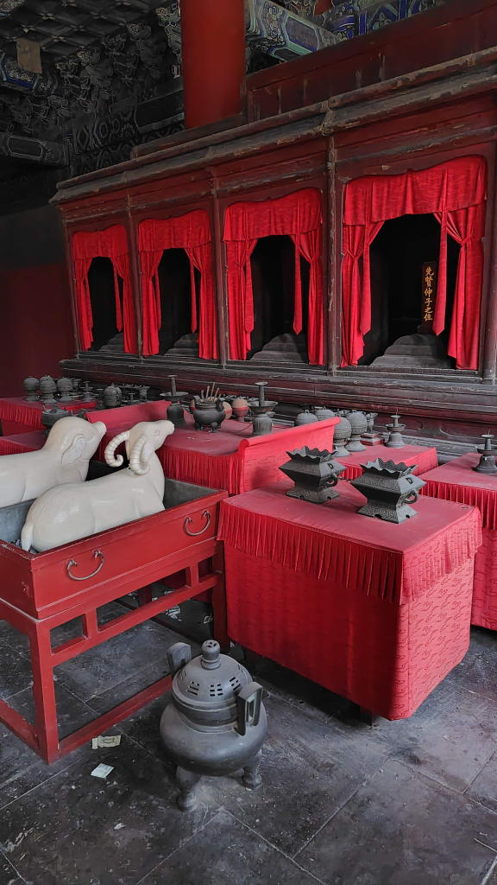
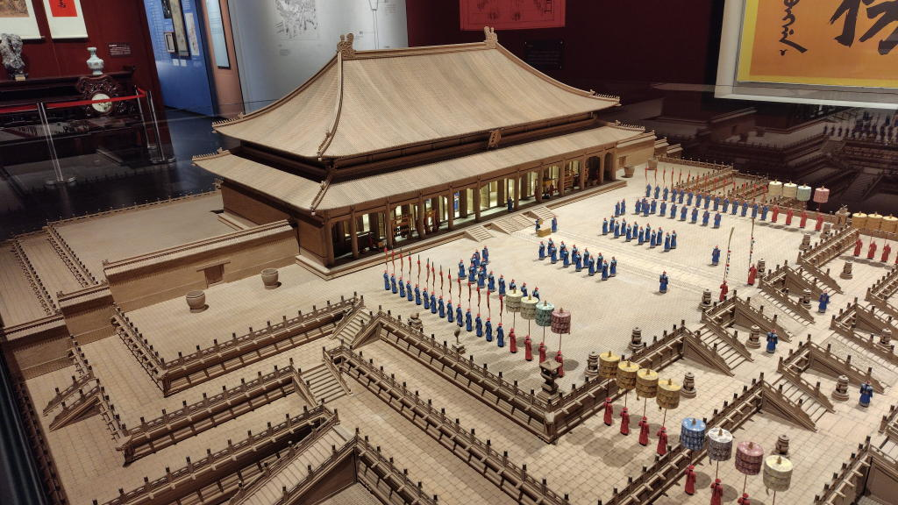
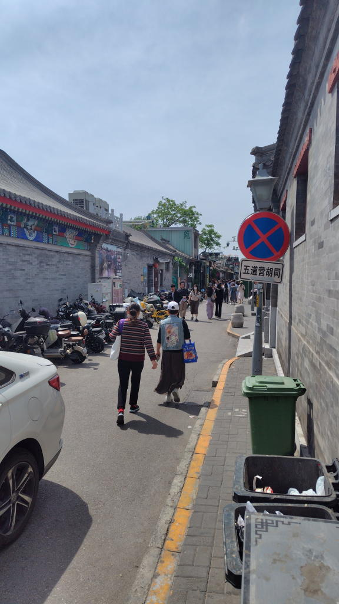
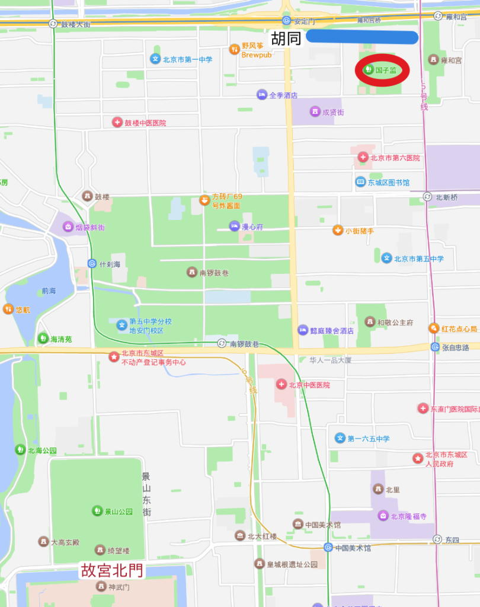

---
tags:
    - beijing
---
# 北京孔子廟
北京にある孔子廟。

左廟右学、廟を左、大学を右に置くという考えに基づき建てられている。

入るとすぐに孔子の像が迎えてくれる。

## 国子监
国子监は中国の最高学府のことで古代から首都に配置されていた。
北京の国子监は元、明、清代の最高学府だった。

## 辟雍
国子監の中にある皇帝が講義をするための建物

## 孔子廟(大成殿)
孔子を祀るための施設。

- 道：儒教の教え、道徳、正しい道
- 洽：行き渡る、調和する
- 大同：理想的な平和社会（『礼記』にある「天下為公」の世界）

ヤギか羊の置物がそれを参拝するような感じで置かれていて、さい銭が入れられている。

## 科挙
科挙の合格者を記念する石碑もある。
科挙の合格者は[紫禁城](./gugong.md)の太和殿に呼び集められる。

当時の様子を再現した模型が展示されていた

## 土産物屋にて
四字熟語のマグネットが色々とおいてある。

- 金榜题名 栄光の合格（科挙の合格発表で名前が載る）
- 高考必胜 受験に絶対勝つ！（高考勝利）
- 前程似锦 未来は錦のように輝く
- 逢考必过 どんな試験もサクッと合格
- 万世師表 孔子を意味する。孔子を敬っていた清の四代目皇帝 康熙帝の言葉。

鶴の書かれたマグネット、鶴は文官トップの象徴らしい。ちなみに武官のトップは麒麟?らしい。

## アクセス
最寄り駅は雍和宮駅。五道营胡同の南側にある。

胡同（フートン）というのは北京市内にある昔ながらの趣が残る古い路地のこと。
五道营胡同は観光地化されていて外国人も大勢歩いていた。

なお、胡同から孔子廟に入ることはできないので注意、入口は南側にしかない。

## 訪問日
2026-04-26
