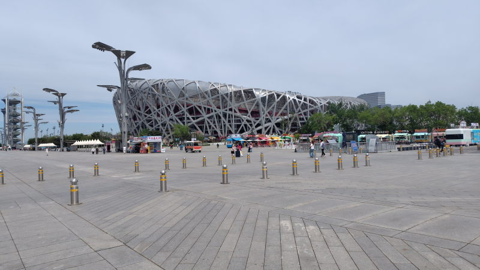
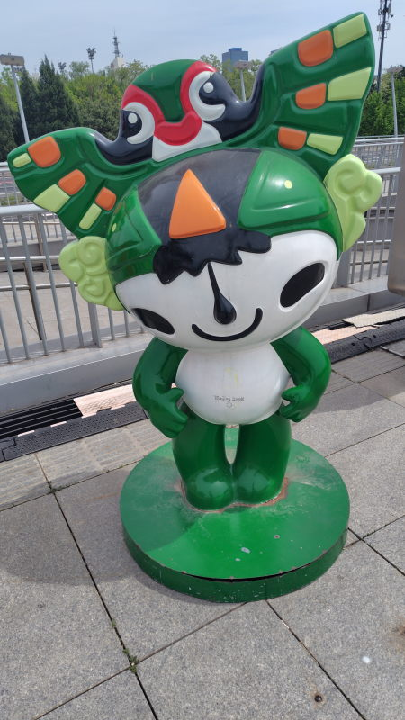
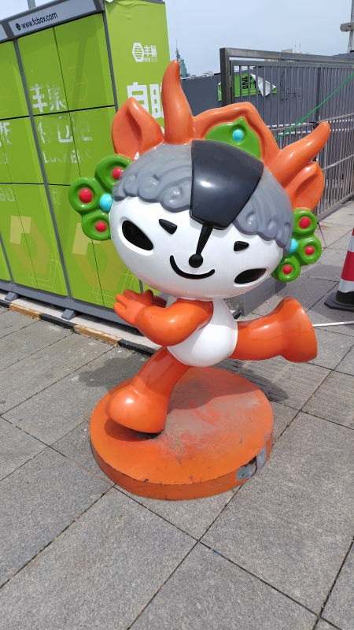

---
tags:
    - beijing
---
# 鳥の巣(北京オリンピック公園)
AAAAA級の観光地。天安門からかなり北に行ったところにある。
中に入るのは100元かかるらしく外から見るだけにした。

思いの外人は少なくて、静かな街の公園という感じだった。
長居はしなかったが、大勢の人で賑わう観光地よりも
穏やかな雰囲気が好印象だった。

## マスコット
名前も覚えていないが...

## 訪問履歴
- 2026-04-26
