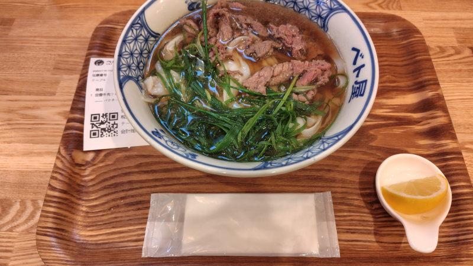

---
tags:
    - tokyo
---
# ベト屋
神保町にあるベトナム料理屋

テーブル近くにある掲示されているQRコードをスキャンして注文するスタイル。
中国ではむしろこういうスタイルが主流なのだが、日本で見かけるのは初めてだった。

支払いはクレジットかPaypay、レジでも払うことができる。
わたしはクレジットで払ったのだが、セキュリティを思うとレジで払ったほうがよさそうかな。

## 定番牛肉フォー
鶏か牛のスープだろうか、あっさりしていて独特なスパイスみたいな味付けがされていておいしかった。
フォーというのは名前くらいは聞いたことがあったのだが、ベトナム料理も私の口にあうののかもしれない。
今度はバインミーを食べてみたい。

### 訪問日
- [2026-07-18](./blog/posts/2026-07-18.md)

## リンク
<https://betoya.jp/>
