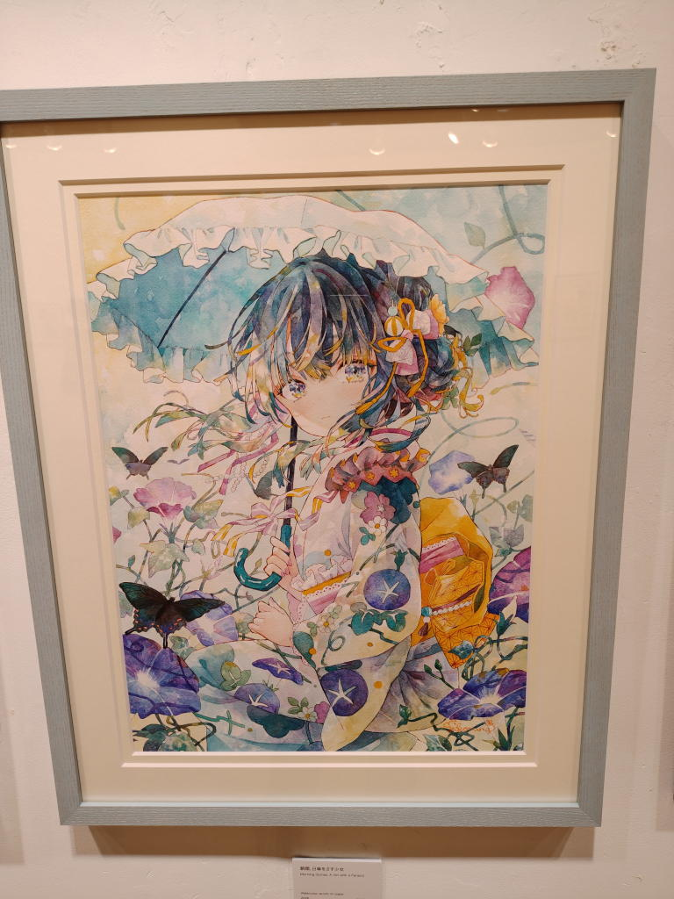
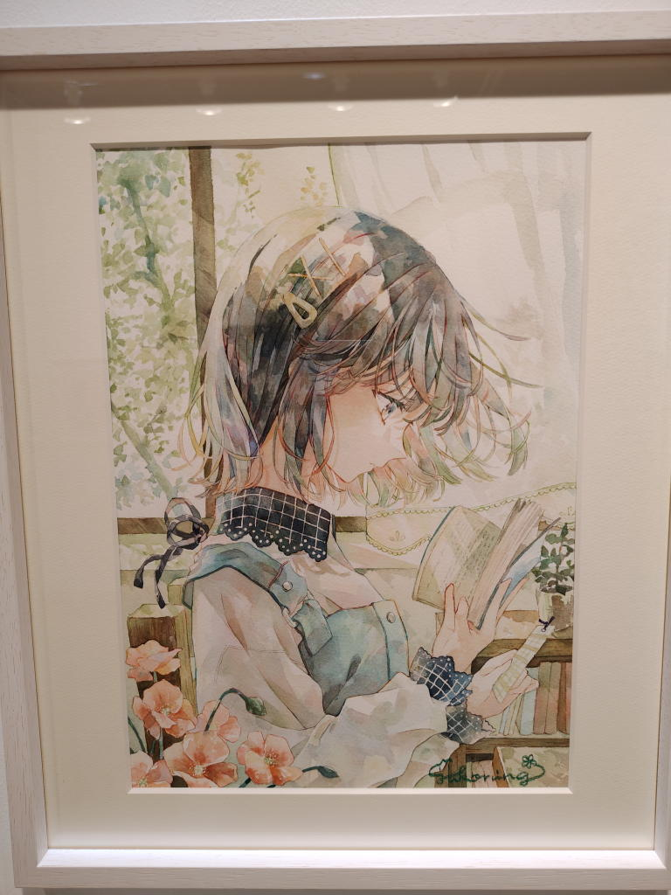
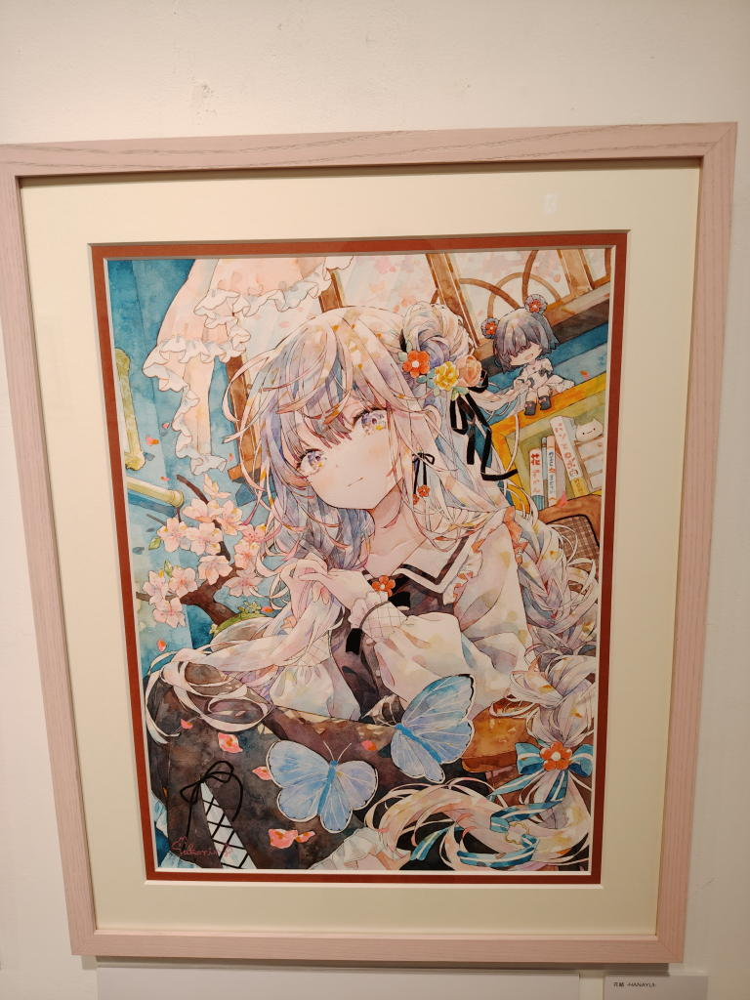
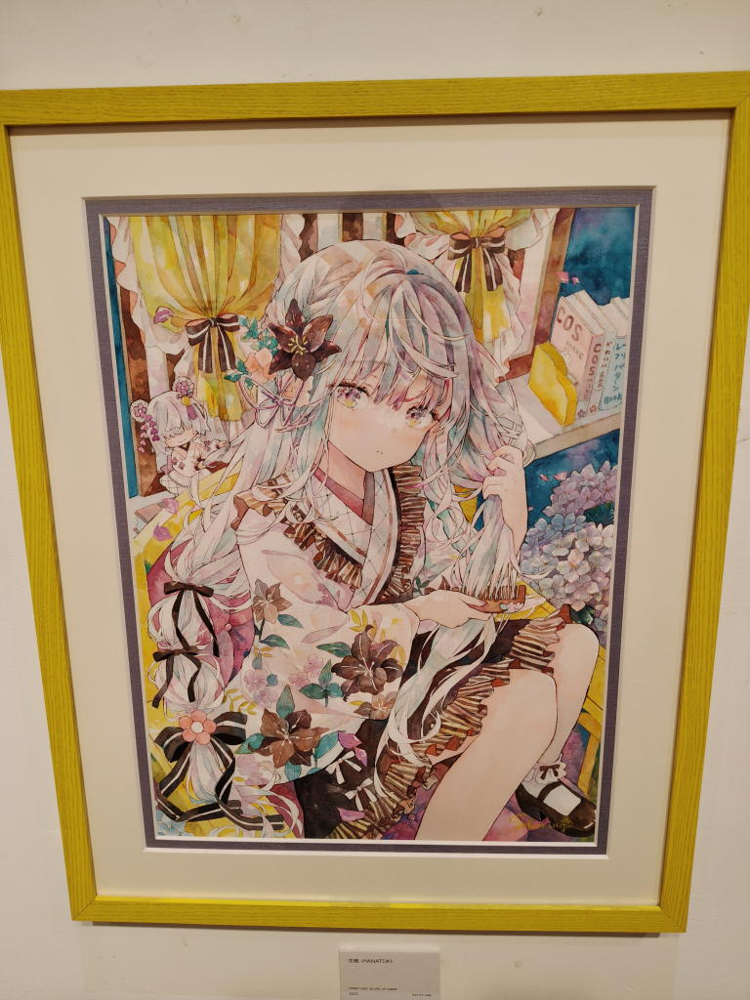
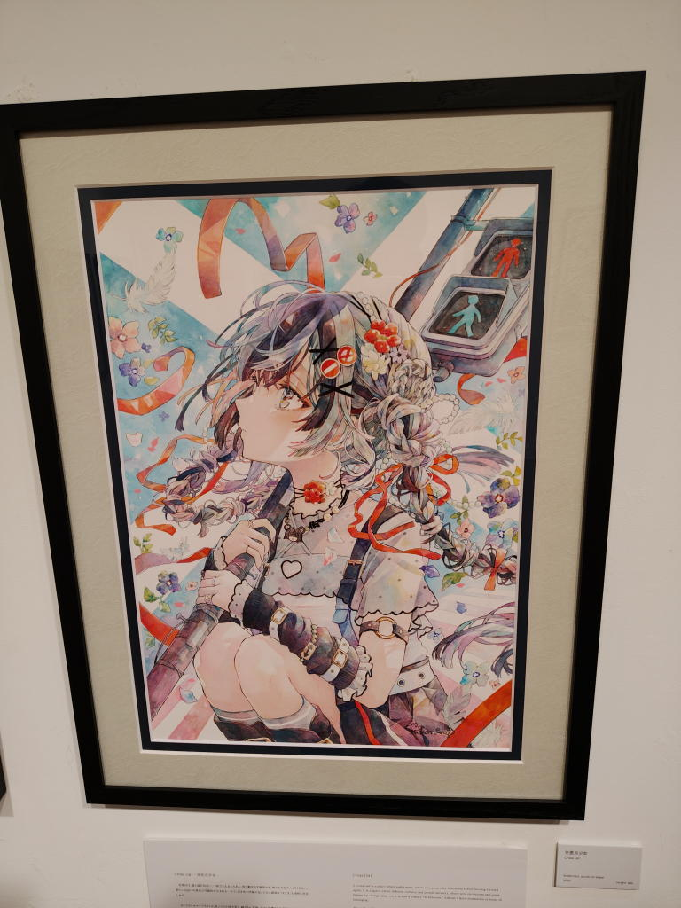
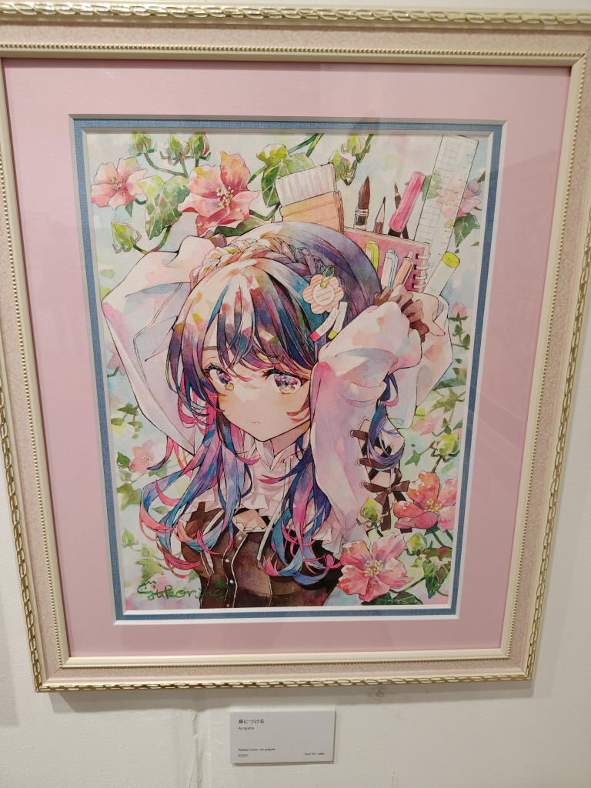
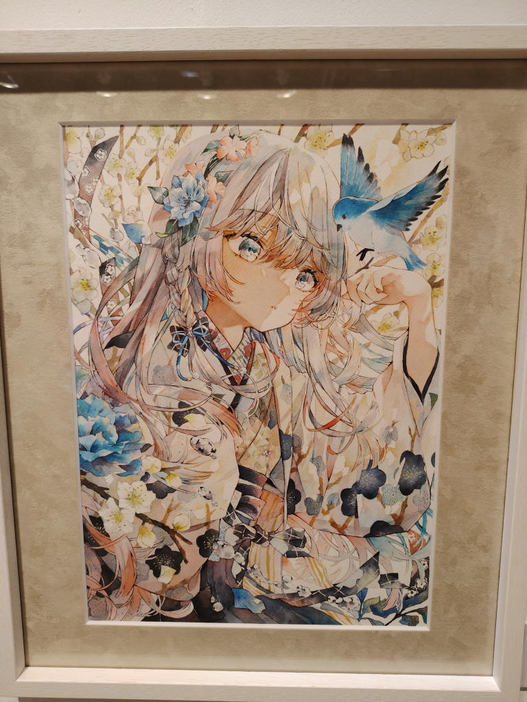
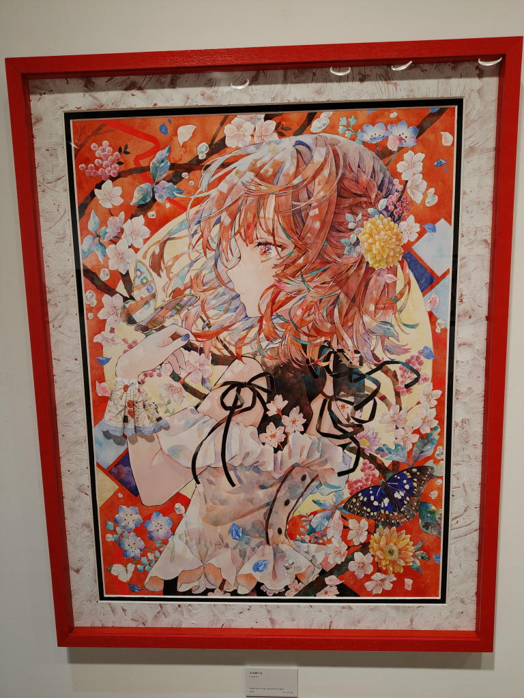
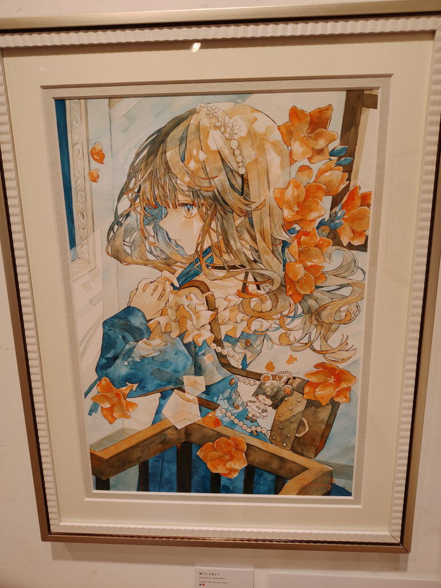
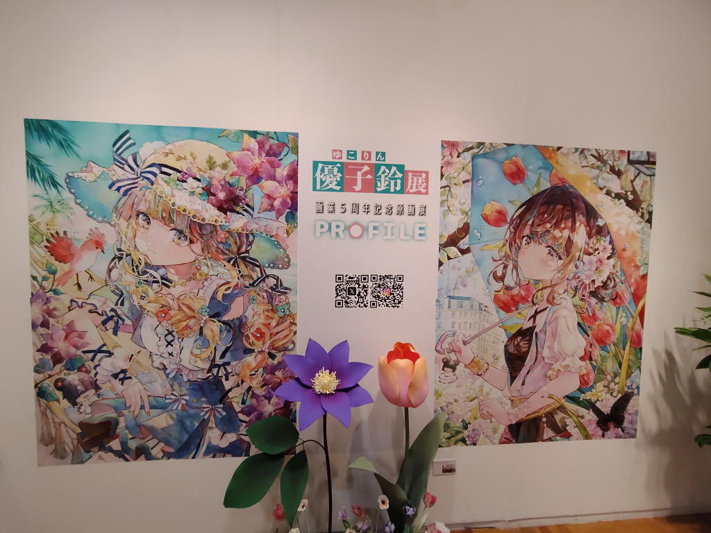

---
tags:
    - exhibition
date: 2026-09-17
---
# 優子鈴展 画業5周年記念原画展 『PROFILE』
- 訪問日：2026年9月17日
- 会場：文房堂

文房堂には何度か入ったことがあるが、3階まで上がったのは今回が初めてだった。

3階がギャラリーカフェになっていて、メインフロアはテーブル席。少し離れたところの西向きの窓際がカウンター席になっていた。

壁に沿って展示された作品をひと通り見て回ったところで、4階にはどうやって上がるのだろうと思ったのだが、レジの左側にエレベーターがあり、それを使うようだった。

4階に上がると広い展示室があり、物販もこちらで行われていた。

何時間でも見ていられそうな展覧会だった。

というか、しばらく開催されているようだし、神保町にはこれからも何度も行くだろうから、絶対にまた行こうと思う。

この日は、

1. 一通り見て回る
2. もう一回見て回る
3. グッズを見て回る
4. 画集を見る
5. ポストカードセットの内容を確認する
6. 画集との重複を軽く確認する
7. グッズを買う
8. もう一回見て回る
9. 撮った写真を確認しながら、もう一度展示を見て「どれが好きかな」と徘徊する

という具合に、何度も展示室を往復していた。

基本的に写真撮影可だったのでパシャパシャと撮りまくったのだが、全部載せ始めるときりがない。
反射して自分が写り込んでしまっている写真もあるので、載せられないものもある。

## 朝顔、日傘をさす少女

これがダントツに好き。淡い青と儚げな表情...

2番以降はどう順位をつけたら良いのかわからない...

## 窓辺で読書

## 花結

## 花梳

## 交差点少女

## 身につける

## 幸せを運ぶ
だったかな...青い鳥

## 生き続ける
タイトルに惹かれた

## 階下にさまよう

## メインビジュアル
おかえり / 変わる季節

## その他
- ナイトティータイム
- 青いコスモス
- 青模様、月景色
- 桜カフェ

## PAINTISM
五周年記念ということでこれまでの展覧会の作品とその際の挨拶文も掲載されていて読むことができた。

<https://www.yukoring.com/paintism>

その中に「PAINTISM（絵画主義）」というタイトルの展覧会があり、AIによる生成イラストの脅威や、すでに自身の作風を模倣したAIが存在することについて書かれていた。

AIがつくるイラストには、今はまだ見ればそれとわかるような不自然さがある。でも、そんな違和感は何年もしないうちに消えてなくなるのかもしれない。

そうなったあとに、イラストレーターがアナログで描くことに何の意味があるのか。

そう考えると、少し考えさせられるものがあった。

同じイラストを描けるのであれば、AIにつくらせてしまったほうが遥かに効率的だろう。

それでも、全く同じイラストでも、AIが描いたものと人が描いたものが一緒に並んでいたとしたら、私は人が描いたもののほうを手に取ると思う。

どうしてだろう。

結果じゃなくて、過程を知りたいのだ。

どうして、この創作をやっているのか。どうして、どんな想いでこの絵を描いたのか。

そういうものを知りたい。

AIについて考えるとき、「結果は出せても、その過程はブラックボックスになっている」と感じることがある。

もちろん、人間が絵を描く過程だって、すべてが言葉で説明できるわけではない。

それでも、人が描いた絵には、その人がこれまで何を見て、何を考え、何を好きになり、どんなものを積み重ねてきたのかという、その人自身の時間がある。

私が見たいのは、単に結果として出てきた綺麗な絵だけではないのだと思う。

今回この展覧会を見に来たのは、もともとはイラストの可愛さに惹かれたからに過ぎない。

けれど、こうして作家さんの想いや信念のようなものに触れると、単に「可愛い絵が好き」というだけではなく、作家さんも含めた全体として、ますます好きになれるように感じる。

そして、これまで私は作品の表面的な部分しか鑑賞できていなかったのかもしれないな、と少し反省もした。

絵に限らず、どんな分野でもAIによる置き換えは避けられないのだろう。

それでも、人が何かをつくるとき、そこに込められた想いや信念、その人がそこに至るまでの過程まで含めて作品を見ることは、AIによって結果だけを再現できるようになったとしても、なくならないのではないかと思う。

そして私は、これからもそういうものを見ていたい。

だから、今回の展示もまた見に行こうと思う。

