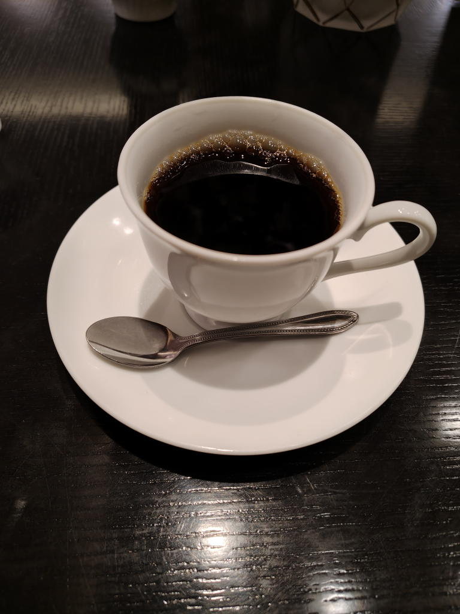

---
tags:
    - tokyo
---
# 文房堂
わたしが[イラストを描く](./creative-things-i-want-to-do.md)ために鉛筆とクロッキー帳を買ったところ。

3階がギャラリーカフェ、4階がギャラリーになっている。

3階までは階段で上がれるが、4階より先はエレベーターのみか。

## ギャラリーカフェ
3階にあるカフェ。ギャラリーも併設されていて壁際に作品が飾られている。
特に何も注文せずに鑑賞だけでも可。

WiFiあり。
席に座るとメニューを持ってきてくれる。
後払い、というか注文の品を運んできた時に伝票を渡されるタイプの店。

クレカ等も使用可能。

### 文房堂珈琲 ホット
2026年10月4日。

630円。おしゃれ。やや苦味の強い?感じがした。おいしい！

## 優子鈴展 画業5周年記念原画展 『PROFILE』
2026年9月17日から2026年9月28日

[訪問記録](./bunpodo-20260917-yukorin.md)

## なつき個展『甘さひかえめ』
[2026年10月4日訪問記録](./bunpodo-20261004-natsuki.md)

## リンク
<http://bumpodo.co.jp>
