---
tags:
    - tianjin
---
# 朝族小吃
Cháo zú xiǎochī。通称「朝鮮」

テーブルのQRコードを注文できる。

お茶、干からびたキムチ、スナック菓子が無料で置いてある。
箸はテーブル下の引き出しに入っている。

## 安格斯牛锅
22元。すき焼きみたいな味の牛鍋。

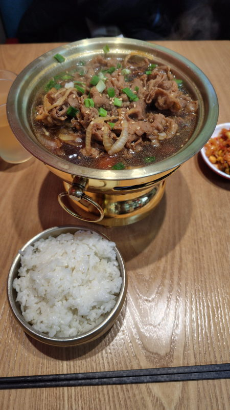

## 烤牛肉拌饭 Kǎo niúròu bàn fàn
20元。石焼ビビンバ。

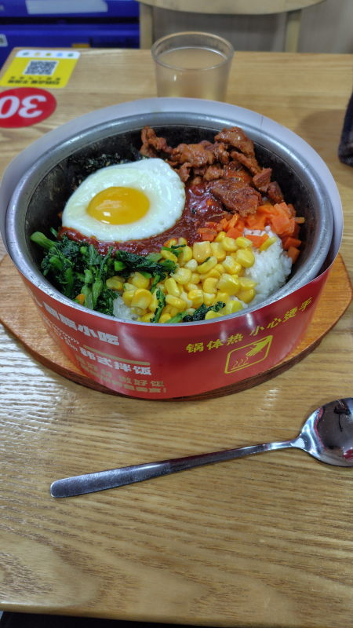

## 石板牛肉(不帯米饭) Shíbǎn niúròu (bù dài mǐfàn)
38元。米は別売りで2元。一人前の焼肉のような感じ。

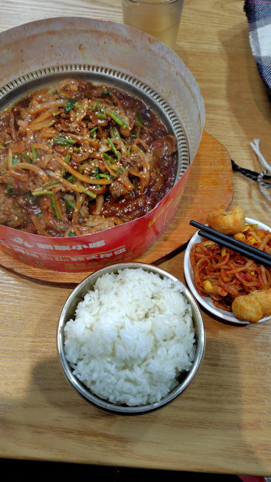

## 原味牛肉汤加米饭 Yuánwèi niúròu tāng jiā mǐfàn
22元。ご飯付き牛肉入りスープ。パクチー入り。

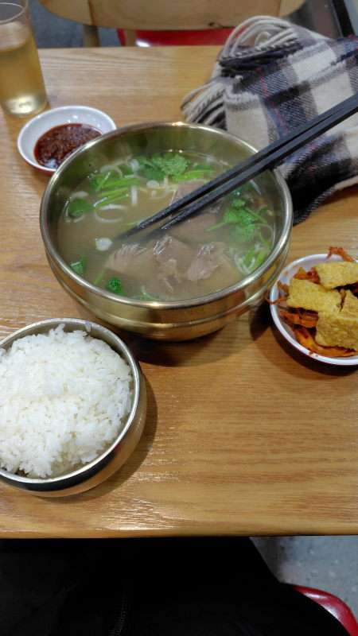

## 金汤肥牛乌冬面 Jīntāng féi niú wū dōng miàn
20元。乌冬面はうどんのこと。

## 炸薯条 Zhà shǔ tiáo
8元。 ポテト

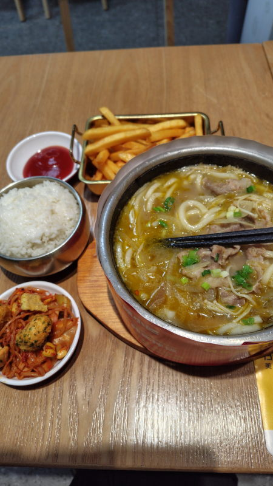

## 辣牛肉汤加米饭 Là niúròu tāng jiā mǐfàn
22元。赤みがかったスープの中に牛肉と豆腐としらたきみたいのが入っている。パクチー入り

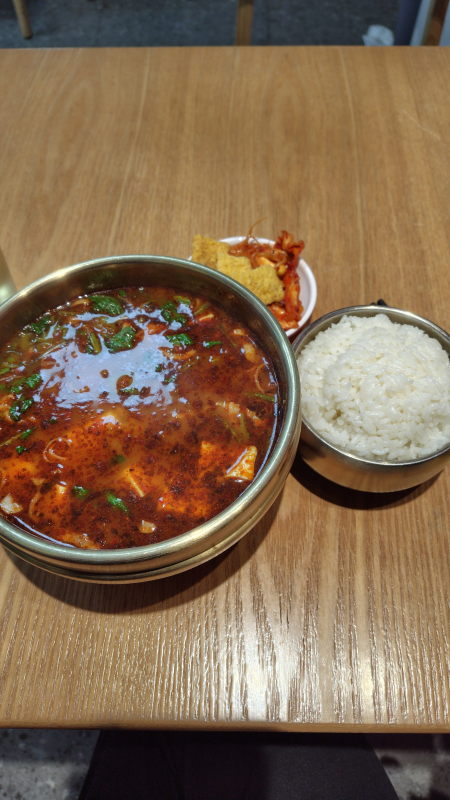

## 烤鱿鱼拌饭 Kǎo yóuyú bàn fàn
18元。鱿鱼はイカのこと。

## 糖醋肉 Táng cù ròu
16元。酢豚から野菜を取り除いて肉だけを残した食べ物。揚げ物だからか提供まで20分くらいかかった。

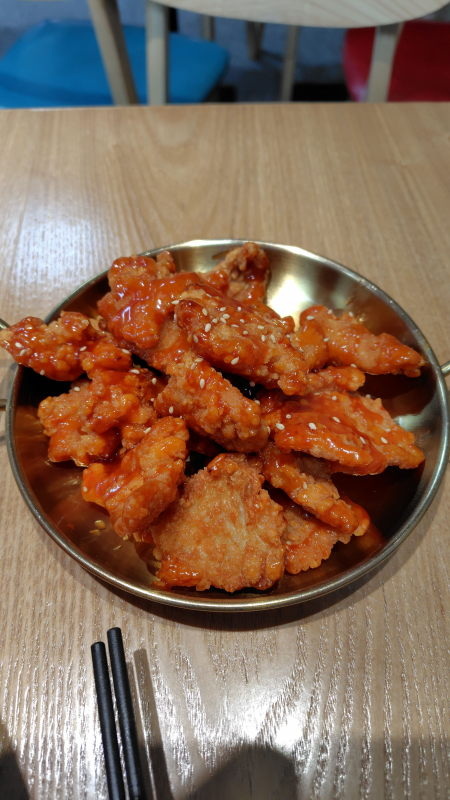

## 金汤肥牛 Jīntāng féi niú
22元。金汤は辛めのスープのこと。

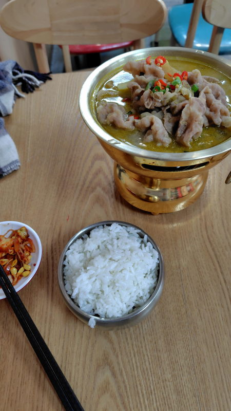

## 首尔炸鸡 Shǒu'ěr zhá jī
12元。ソウルフライドチキン。骨無し

## 肥肉板盖饭 Féi ròu bǎn gài fàn
22元。鉄板に玉子が敷かれていて、丸く盛られた米の上からカルビみたいな味の肉が掛けられている。

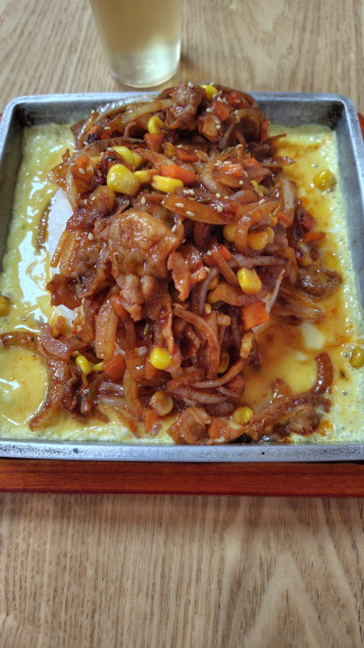

## 五花牛泡菜加汤米饭  Wǔ huā niú pàocài jiā tāng mǐfàn là
20元。五花はバラ肉、泡菜はキムチのことでキムチ鍋に近い。

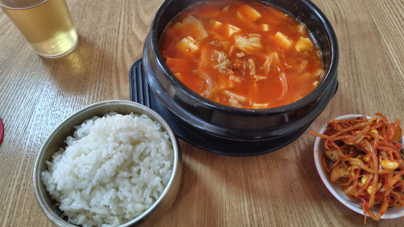

## 石板鱿鱼
28元

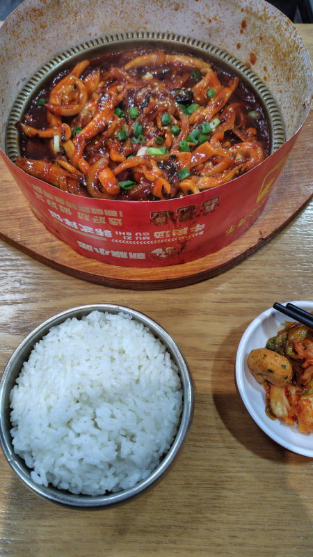

## 排骨米饭
25元。骨付き肉。可食部は少ない。

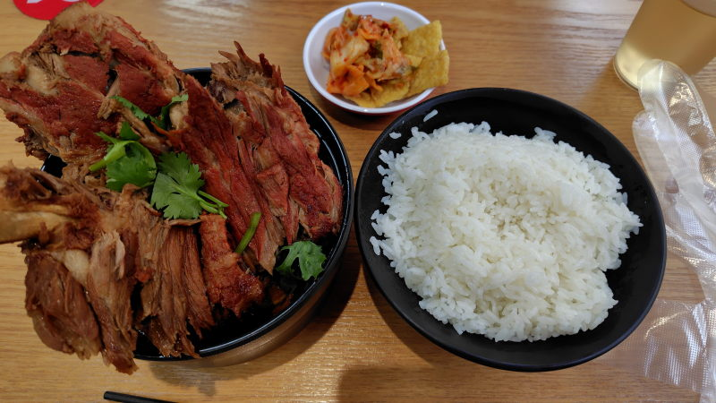

## 石板五花肉酸菜(不带米饭)
25元。

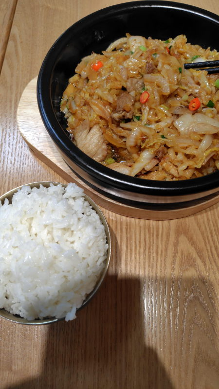