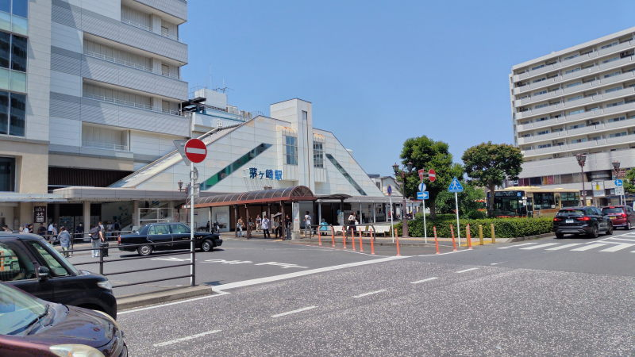
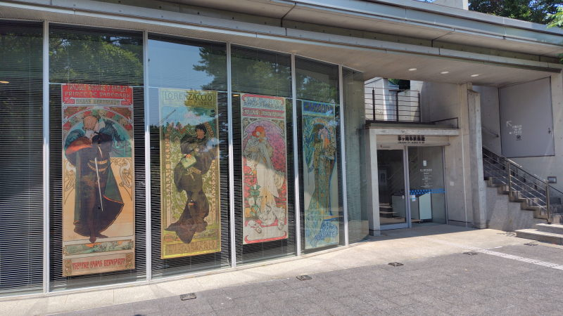

---
tags:
    - kanagawa
    - museum
---
# 茅ヶ崎美術館
（高砂）緑地のなかにひっそりと佇む美術館。
ミュシャ関連の展示会をよくやっている。

## アルフォンス・ミュシャ展　アール・ヌーヴォーの美しきミューズ
~2024-08-25まで開催されていたのだが、都合が合わずに訪問できなかった。

## 世紀末パリの煌めき ―OGATAコレクションにみるミュシャ、シェレ、ロートレック
[2026-07-22 訪問](./blog/posts/2026-07-22.md)

美術館は高砂緑地?の敷地内にひっそりと佇んでいて落ち着いた雰囲気だった。
平日というのもあって人も少なくてゆっくり見ることができた。

ポストカードを三枚購入

- 月
- カレンダーの挿絵になっていた 夏
- ジスモンダ

ジスモンダという絵は三菱の美術館での展覧会
「カフェに集う芸術家-印象派からゴッホ、ロートレック、ピカソまで」でも
展示されていた。

