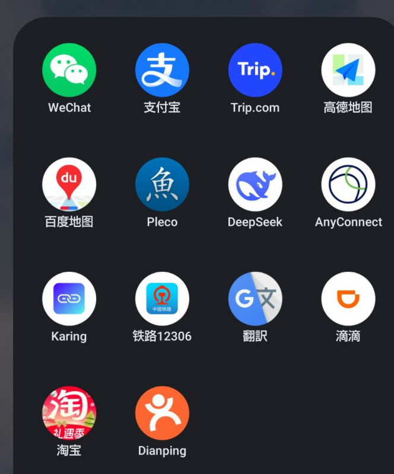

---
tags:
    - china
---
# アプリ

## 概要
WeChatとAlipayは入国前に必ず入れること。

よく使うアプリは実名認証（パスポートや顔写真の登録）をしておくと良いかもしれない。

英語・日本語に対応している場合もあるが、中国語設定の場合と比べて機能が制限されていることが多いため中国語のまま使用したほうが良い。

その他は入国後に必要になってからインストールすれば良い。

中国ではGoogle Playは使えないため、各アプリの公式サイトからインストールファイルをダウンロードしてインストールする方法が主流。

[VPN](./vpn.md)を見よ
## 決済
### WeChat
支払い、チャットツール。[WeChat](./wechat.md)も見よ。

### Alipay
支払い、地下鉄やバスに乗るためのQRコードも取得できる。[Alipay](./alipay.md)も見よ。

#### カード紐付け
カードによっては紐付けられないことがあるので注意、早めに確認しておくこと。

- Amazon MasterCardは紐付けられる
- 三井住友の銀聯カードは紐付けられない

## 交通
- タクシー [DiDi](./didi.md)
- 地下鉄・バス [Alipay](./alipay.md)のQRコードか地域ごとのアプリをインストールする
- 高速鉄道 [12306](./12306.md)

## 地図
- 高徳地図
- 百度地図

Googleマップは使えない(中国内の情報がほとんど登録されていない)ので注意。

## 翻訳
- Pleco
- Google翻訳

## 通販
### 淘宝
Alipayアカウントと紐付けて支払いすることができる。

上海はエントランス横の荷物台に、
天津はマンション区画内の集積所(2026年6月時点で11号楼の1階)に配達される。

## 点评
Dianping。中国版食べログ。

1人でも入れそうか、美味しそうな料理はあるか、
入ったことのない店のメニューを調べたり、
ユーザー投稿画像からQRコードでの注文ができそうかとか諸々を確認ができる。
## AI
### DeepSeek
中国に関することを聞くなら中国産のAIに聞いたほうが良い。

### ChatGPT
使用するにはVPN等が必要

## 天気予報
- 中国気象台 <https://www.nmc.cn/publish/forecast.html>
- 墨迹天气

など。

