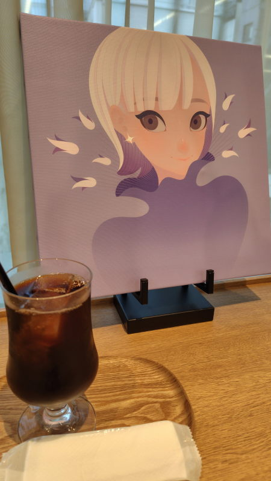
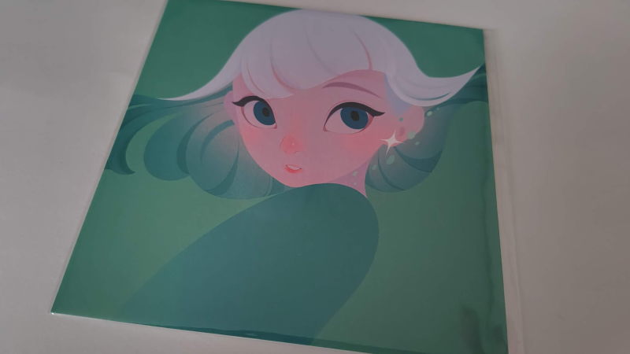

---
tags:
    - tokyo
---
# 喫茶ちそう
神保町にある三省堂の3階にある喫茶店。

## 訪問記録
### 2026-07-31
[2026-07-31](./blog/posts/2026-07-31.md)、クリニックに行った後に
考えを整理したくなって訪問。この日は平日の16:00頃というのもあって
空いていた。

先に席を確保してから...と書いてあったが、先に注文をしてから
カウンター席に座る。コンセントもあって、LINEで友達登録をするとwifiも使えるらしい。

開店当初から1度こういう場所でコーヒーを飲んで見たかったというのもある。

結局、コーヒー1杯で1時間、スマホで研修のことを振り返って、メモに思ったことを
吐き出しているだけで時間が過ぎてしまった。

はじめ飲んでいるうちは苦味と言うか、家で飲むコーヒーと余り変わらないな
などと思っていたが、最後の方は酸味みたいなものを強く感じた気がする。

悪くはない。空いていればまた行きたいなと思える。

この日は192さんという方の個展といっても、ボードがいくつか飾られているミニ個展なのだが、カウンター席にもきれいなイラストが飾られていて、気に入ったからポストカードを1枚お迎えした。

