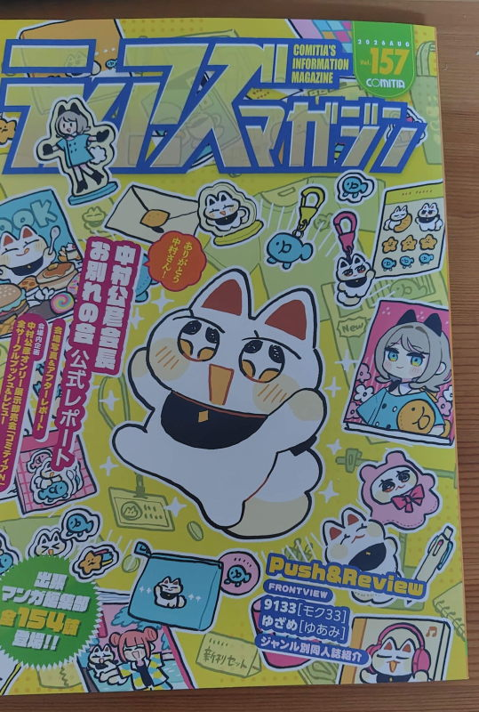
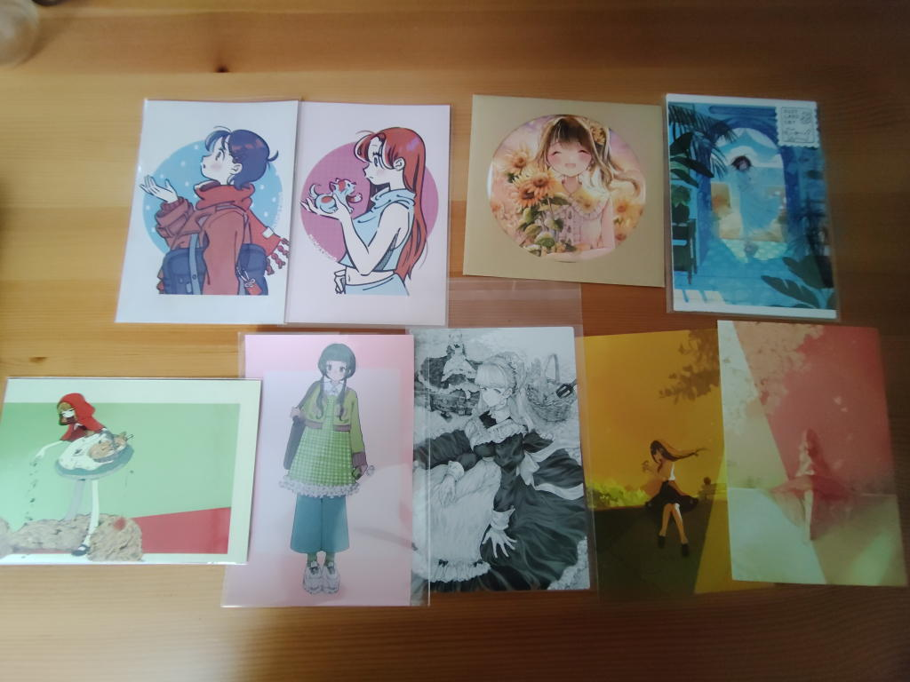
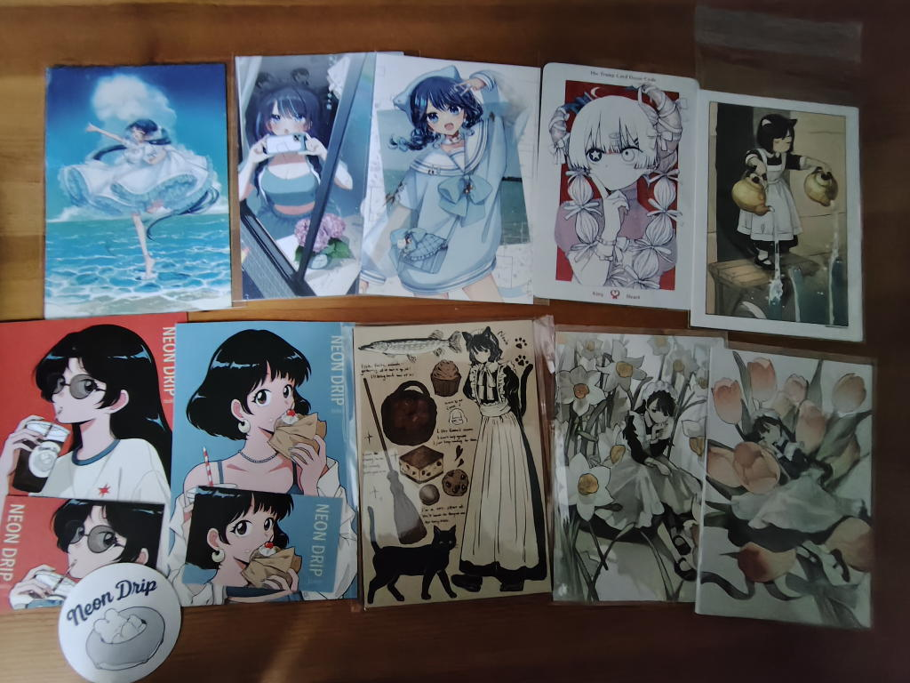

---
tags:
    - event
---
# COMITIA157
2026-08-10、神保町の書泉でカタログを購入。

## どこを見るか考える
2026-08-21、カタログのイラストを見ながら気になったサークルをチェック。
自分の好みの強弱が分かるような感じもしてなかなかに面白い。
## Xに登録する
SNSはあまり使いたくないという考えがあって、misskeyだけにしていたのだが、
おしながきを見ることができず、Xに登録した。

## お迎えしたポストカードたち
計5,250円。何となく予算5,000円と思っていたからちょうどよかった。

`*`付きは予定していなかったうれしい「出会い」

上段左上から右に

### MIMOTOMO みもとも*
ポストカード 2枚 \100 * 2

<https://x.com/mimo_tomo_/status/2090792923805990930>

### 葉山そら SOLA-na
スクエアカード3枚セット 「夏」 \600

個展の紹介をしてくれた。

<https://x.com/H__ymSrkt/status/2089650958095855734>

### おのやま みちのゆくま
ポストカードセット \500

<https://x.com/machikz1/status/2090048588126830973>

### 千助
恋落時効「聞き忘れたことがあったの」

\150

<https://x.com/kagimaruchisuke/status/2089357262821487069>

### ｺﾔｷﾞ ふぞろいさんにん*
ポストカード \100

<https://x.com/Coyaki183204/status/2090759984934277626>

### スタジオいわし（こるせ）*
ペン画ポストカード \100

<https://x.com/koruse02/status/2090759697024593928>

### 菜生（ななせ）*
ポストカード 2枚 \100 * 2

<https://x.com/nanase_enoki/status/2089668644792078378>

### Into the Blue 汐張神奈*
ポストカード 3枚セット \500

<https://x.com/shioharikanna/status/2086288360780464308>

### 水井軒間 要領の悪い子*
グリッターポストカード King Heart \200

<https://x.com/mizuinokima/status/2090998581188775941>

### 赤井さしみ
ポストカード4枚セット（初夏） \200

<https://x.com/sas_akai/status/2091102597788921906>

### tsukiko NEON DRIP
ポストカード+ステッカーセット \500

<https://x.com/tsu_ki_co_/status/2090743632110534984>

### からさね
ポストカードセット メイドと黒猫の日常 \1000

<https://x.com/karasane03/status/2090814400622150068>

### 柏木杜（柏木ちさめ）
- ポストカードセット「赤」 \500
- ポストカードセット「黃」 \500

<https://x.com/chisamell/status/2091138272793911744>

## かわいいを創るから、求めるへ--COMITIAに行ってきた(note記事抜き書き)
わたしはかわいい系のイラストが好きでSNSでクリエイターさんをフォローして
作品を眺めていることがよくある。

そうすると見ているだけのわたしは消費するだけでは物足りない、
自分でもこんなイラストを描けるようになりたい、
などと思うこともしばしばあった。

ただ、以前もどこかで書いたようにわたしは絵が絶望的に下手で、
その上、絵で表現したい世界を持っているわけでもなかった。

結局のところ向いていないということなのだろうし、
最近は無理にできないことに手を出すよりも得意なことは得意な人にやってもらえばいい、
それを見て感動して心を動かすというのも一つのクリエイティブな活動なのでは
ないかと考えられるようになってきた。

そんな折にCOMITIAが開催されるというのを知って、
さっそくよく利用している本屋でカタログを購入、サークルカットとXを
駆使しながら、どこを見に行こうかと準備を進めていた。

### 当日

11時開場ということで会場待ちの行列が落ち着く頃を見計らって
12時頃に会場入りをした。

当初、コミケみたいな人の量を想像していたのだが、思っていたよりは
ずっと少なくて、ブース間の移動も楽々でスムーズに回ることができた。

まずは目星をつけていたブースを順々に回って、それからは
ウインドウショッピングというか、適当に歩き回りながら
気に入ったイラストを購入するようにしていた。

滞在時間は1時間半くらいだったろうか。
外のベンチで戦利品を整理して、来てみて本当によかったな、
次も絶対に来ようと心に誓って帰路についた。

### 対面の良さ

創作グッズと言うとBOOTHを何度か使ったことがあるが、
今回のようにクリエイターさんと直接やり取りができたり、
思わぬ（うれしい）出会いがあったりと、
やはり対面できるイベントはネットとは全然違うのだなと改めて感じた。

### ポストカード集め

今回は冊子は買わずにポストカードだけを買うように決めていた。

以前、好きなアニメの同人誌を集めていたことがあったのだが、
サイズや綴じ方もまちまちで管理が大変だったのだ。

それに比べるとポストカードはサイズが均一でファイリングしてパラパラと眺めたり、
取り出して飾ったりと活用しやすい点が気に入っている。
### 課題とかメモとか
- 「見てもいいですか?」とか、今欲しいグッズはなくても気になる作家さんに「名刺だけもらってもいいですか?」とかそういう声かけをもうちょっとちゃんとできたらもっと楽しめたかな。
- マップ。スマホで見ることもできるし、メモをつけたりXへのリンクが張ってあったりと色々便利なのだが、やっぱり現地では紙のマップに色を塗って持ち歩いたほうが良いと思う。迷子になってしまう。
- 食事や水分補給について。会場内の隅で飲食している人もいるし、一度ブースから出ればベンチに座って食べることもできる。もちろん、レストランもあるが持参しておくと経済的。
- お迎えしたカードはバインダーに綴じているのだが、バインダーにステッカーを貼っても良いんじゃないかな。となると、ポスカだけでなくステッカーも選択肢になるかもしれない

## リンク
<https://note.com/ks_room1215/n/n50ae3478b920>
