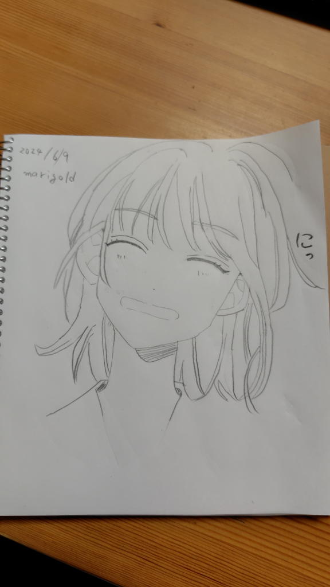
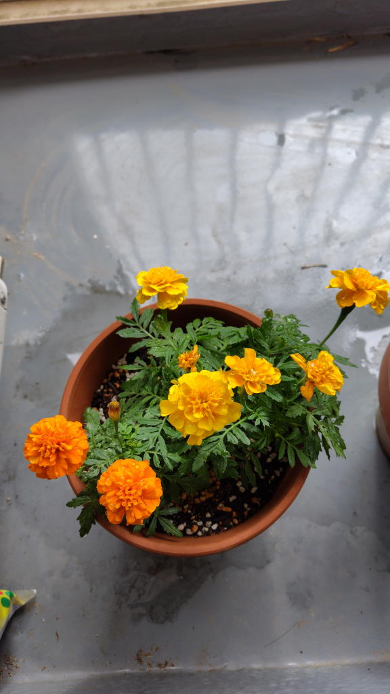
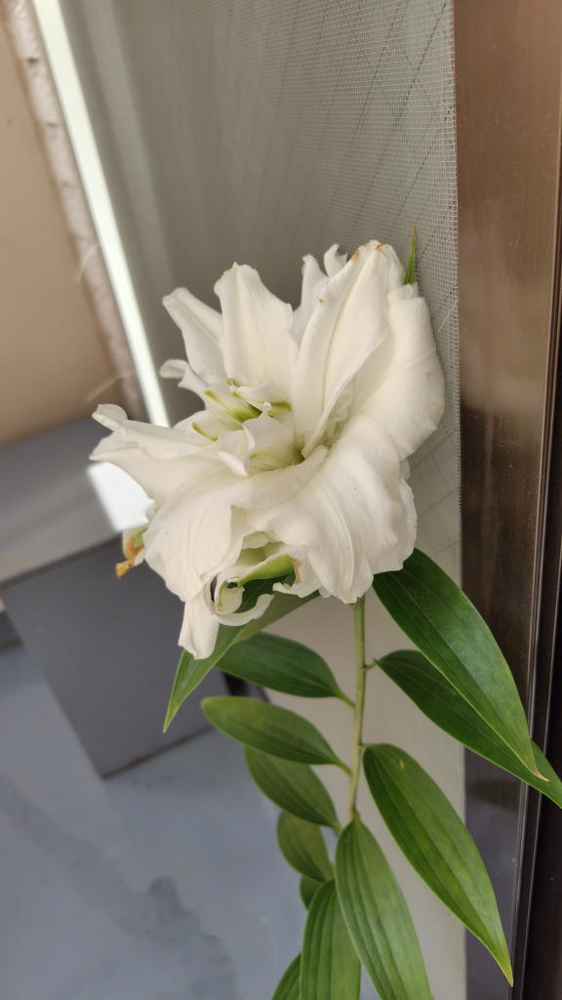

---
tags:
    - lifestyle
date: 2026-08-21
---
# クリエイティブなことをしたいという気持ち
SNSの影響だろう。私が言うクリエイティブというのは絵を描くことを指していて、その絵をみてカワイイとかキレイとかしか感じることのできない私はいわゆるコンテンツ消費者に過ぎないと思っていた。

何も生み出すことができない、ただ創られたものを消費するだけの存在。

だから、私も絵を描いてみようとイラスト本を買ってきて、そこに書いてある手本を模写して絵の練習をしていた時期がある。

2年位前、2024年の話だ。このころはボカロというか初音ミクにハマり始めていた時期でもあって創作イラストを良くみていた時期でもあった。

しかし、私は絵が壊滅的に下手で中学の美術の授業の際に二度と絵は描かないと誓いを立てたような人間だ。

基礎ができてないというのもあるのだろうが、どうやったってうまくなる気がしなかったし、そもそも模写できるようになったとして、その先自分がどんな絵を描いてなにを表現したいのかが全くイメージできなかった。

生産という意味では同じくらいの時期に花を育てていた。親しい先輩に生き物でも飼ってみたらと勧められたのもあって、とにかく自分の力で何かを生み出したかったのだ。

結局、小さな鉢と土を買ってマリーゴールドと百合を育てて咲かせることはできたのだが、これもそれ以上は続かなくてミニマリスト的な性格もあってか、鉢も土もすべて処分してしまった。花は自然に咲いているのを愛でるほうが良いと思う。広い庭があるならまだしも、私はアパートの小さなバルコニーでやっていたのだ。

もちろん、プログラミングをやって何かを動かすことも、こうして文章を書くこともアウトプットであってクリエイティブでもあるのだ。好きだからといって何でもかんでもクリエイトする側に回る必要はなくて、好きなものを見つけて集めることだってそれはそれで創造的な活動なのかもしれない、と最近は考えるようにしている。

できないことはできないままでいいのだ、きっと。

プログラミングもするし材料科学の実験もする。登山もするしボカロが好きで、可愛いイラストのポストカードを集めるのが好きで、そんなのはもしかしたら私しかいないかもしれないし、そういう行動を起こして、こうして文章に書き留めている私はコンテンツ消費者ではなくて何かを生産している側の人間と言えるのかもしれない。

1つだけならありきたりな趣味でも2つ3つと組み合わせると自分だけの個性が生まれるのかもしれない。仕事もそうだし、登山にミクのアクスタを持ち込んで写真を撮ってみたり、そういうことをやってみたいなと思うようになった。その写真は多分、私にしか撮れないものになるだろうから。

