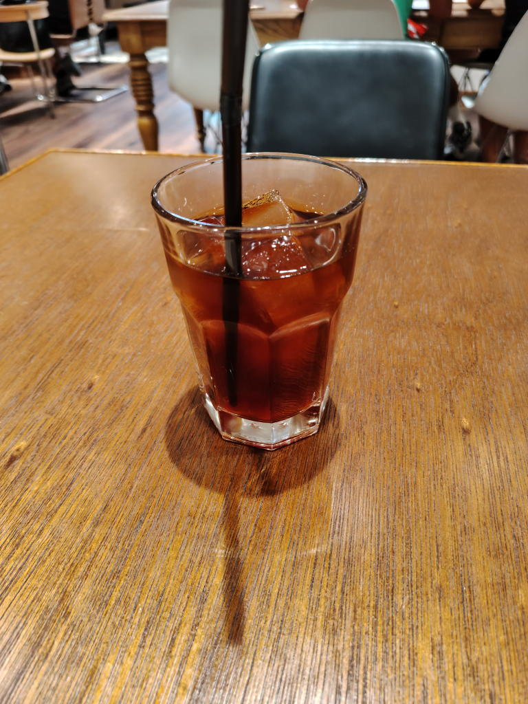

---
tags:
    - dining
    - tokyo
---
# DILL COFFEE PARLOR
神保町にある喫茶店。

メニューが英語だったり従業員も外国の方が多め、それもあってかお客さんも
外国の方が多めな印象。

意を決して中が見えない木の扉を開けて中に入ると
わたしには似つかわしくないお洒落空間が広がっていた。

私は先に注文したが、店に入ったら先に席を確保しても良さそうだった。
というか喫茶店というのはそういうものなのかもしれない。

1階はカウンター席なし、テーブルのみ。
食べログの写真を見ると2階はカウンター席が多めな感じで静かに過ごしたいなら
2階のほうが良いかもしれない。

1階は良くも悪くもにぎやかで耳栓がほしいなと思ってしまった。
まあ、こういうのは当たりハズレがあるからどうしようもないし
店のせいではないのだが。

## コールドブリュー
\630。可も不可もないアイスコーヒー。

## 訪問履歴
- 2026-08-21

## 外部リンク
<https://tabelog.com/tokyo/A1310/A131002/13294754/>
