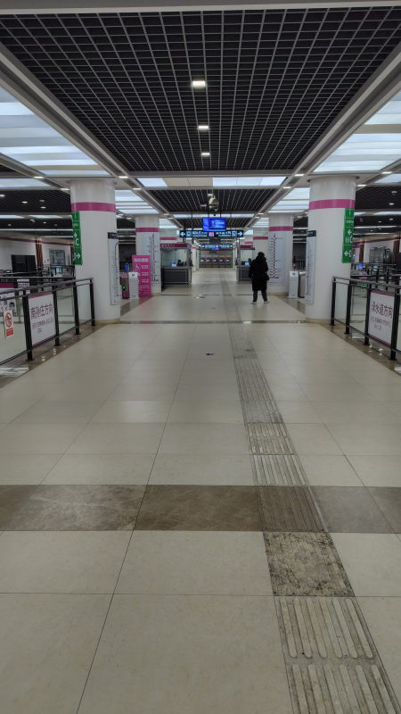
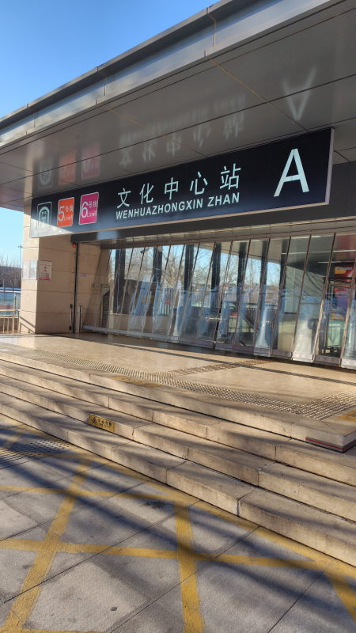

---
tags:
    - china
---
# 地下鉄
[Alipay](./alipay.md)で地域に対応したQRコードを取得しておく。

## 入場
入口で荷物検査を行う

- 水筒も持ち込めるが一口飲むように求められることがある
- パスポートも出す必要なし
- スマホは手に持って通れば良い

## 改札
手荷物検査を終えると券売機と改札がある。アプリがあればきっぷを買う必要はない。
改札にQRコードを読み取るカメラが付いているから
そこにかざせばゲートが開く。
## 乗車
わかりやすく表示が出ているから道に迷うことはおそらくない。
ホームには電光掲示板みたいのがあって何分後に電車が来るか、
各車両の混雑具合が表示されている。

だいたい5-10分に1本くらい。

## 降車・出場
改札にQRコードをかざして外に出る。
支払いはAlipayから行われるが、支払い優先順位が一番上の方法が使用される。

## 写真

