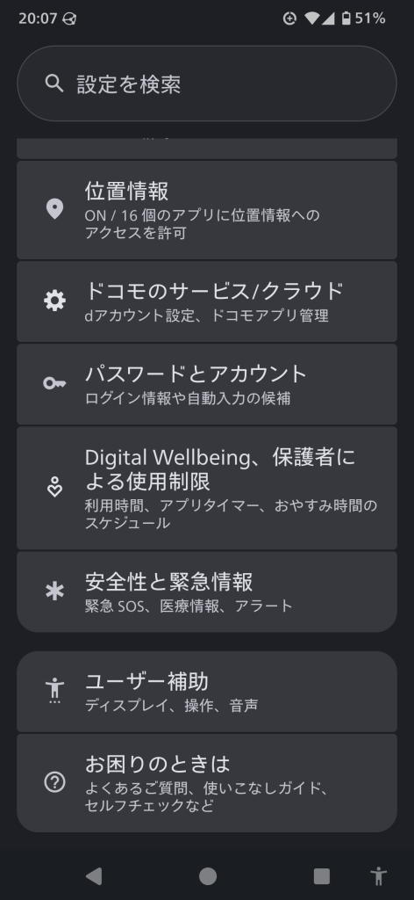
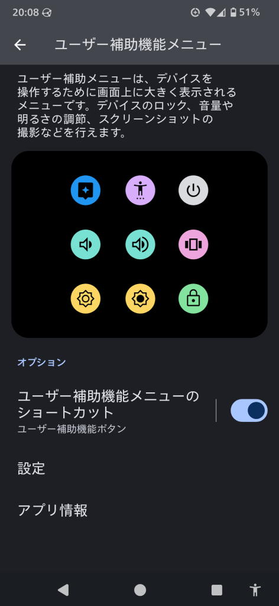
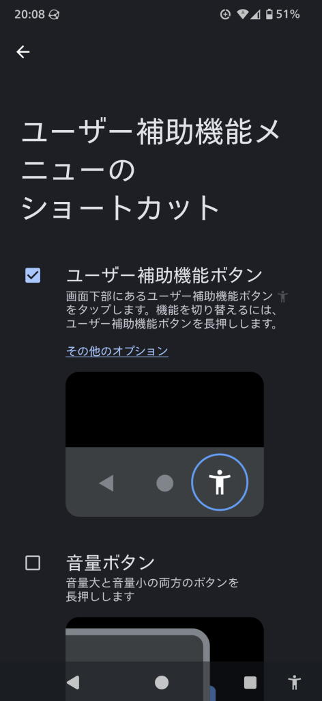

---
tags:
    - lifestyle
---
# いつでもカエドキプログラムの反省とスマホの電源ボタンをいたわる方法
##  買い替えの経緯
2018年から2024年までAQUOS SH-01K senseという機種を使っていたのだが、
約6年間経過してバッテリーの持ちが悪かったり、動作が重かったりで
もう寿命だろうという状態になっていた。

特に登山に出かけた時のバッテリーの減りの早さがネックで
下山完了する頃にはバッテリーがギリギリということもよくあった。
## カエドキプログラム
2024年3月、後継機種のSH-54D sense8というのを買ったのだが、
1から8にジャンプしているあたりずいぶん長いこと使っていたなと思い知らされる。

そのときに表題のドコモカエドキプログラムというのを利用したのだが、
詳細は公式ホームページの説明に譲るとして、
要は分割払いをしつつ24回目の支払時に機種を返却して
新しい機種に切り替えたら残価の支払いが不要になる契約で
常に新しい機種を使い続けられるサブスクのようなものと捉えている。

多分、購入した時にプログラムに「加入」して、買い替えの時にプログラムを
「利用」することになる。

利用料は\22,000なのだが、次の機種でもこのプログラムに加入する場合は
場合はプログラム利用料が免除になる。
だからお得に使うためにはプログラムに加入し続ける必要がある。
この免除になる仕組みの方は「ドコモで買替えおトク割」というらしい。

<https://www.docomo.ne.jp/campaign_event/kaedoki_program/>

ただ、免除になるためには他にも条件があって、
それが「返却する機種が故障していないこと」。

そして、わたしの使っていたスマホは電源ボタンと音量を下げるボタンの効きが非常に悪く
故障していると言っていい。

故障している機種を返却すると故障時利用料として結局\22,000支払うことになってしまうのだ...
## 費用について
少し計算してみると、私がこの機種に払った金額は
だいたい月1800円くらい、24回で43200円支払い済みということになる。

そこに\22000を足すと65,000円くらいだから、
まあ、普通にスマホを買って2年で壊れたと思えば
ある程度の納得感は得られるかなという結論に至った。
## 対策
新しいスマホはsense8の後継のsense10でボタン周りはほとんど同じ。
わたしは歩いている最中に音量を頻繁に変えるから
そのせいでボタンがダメになってしまったものと思われる。

だからできるだけボタンを触らないようにするのが対策になるのだが、
例えば、指紋認証を行えばボタンを押さずに画面を表示させることができる。

それだけじゃなくて、音量の上げ下げやディスプレイOFFもタッチパネルで行うことができて、その設定について備忘録を兼ねて書いておく。
ただし、これはAndroidの場合。

1. 設定
2. ユーザー補助
3. ユーザー補助メニュー
4. ショートカットをON

表示場所をユーザー補助機能ボタンにするとタッチパネルの右下に人形マークが出てきて、これを押すと様々な操作が行えるボタン群が表示される。

