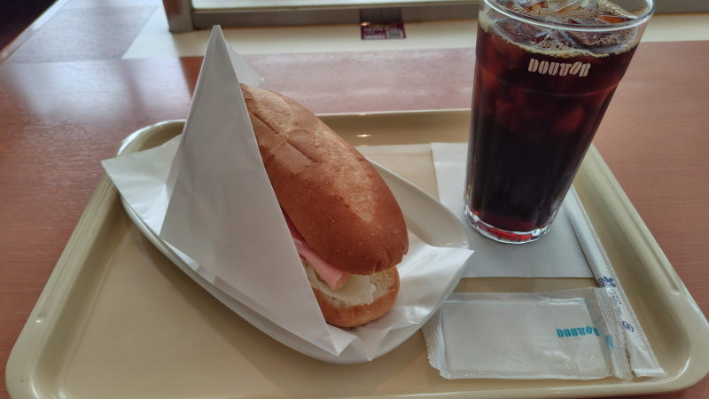

---
tags:
    - dining
aliases:
    - doutor
---
# ドトール
日本発の喫茶店

## 2026-08-04 神保町三省堂近く
初ドトール

メニュー表を見て注文、会計をしてレジの脇で待つ。
昼過ぎ辺りになると満席になって席が空くのを立って待っている人がちらほらいた。
1階席は埋まっていたから2階席へ。

冷房が効きすぎているのか寒いくらいだった。

計\820
### ミラノサンドA 生ハム・ボンレスハム・ボローニャソーセージ
\520

たぶんこれが一番普通のパンと思われる。ハムとレタスのシンプルなパン。

飲み物とセットで頼むと飲み物が\50引きになる。

### アイスコーヒー
M \350

苦め、酸味は余り感じないかな。

