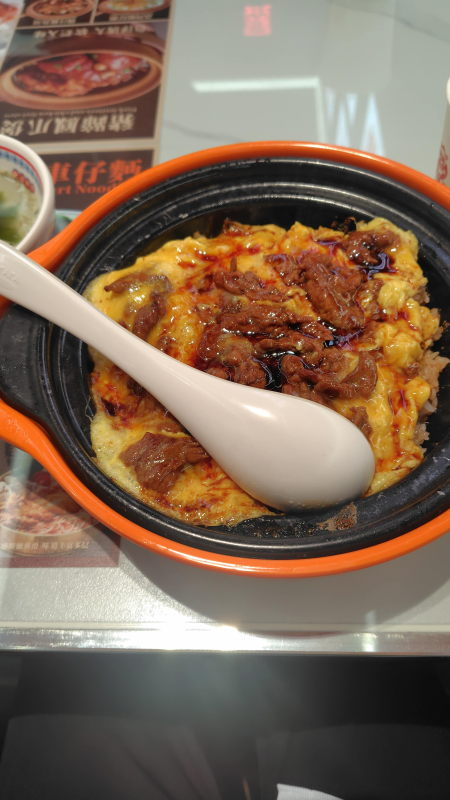
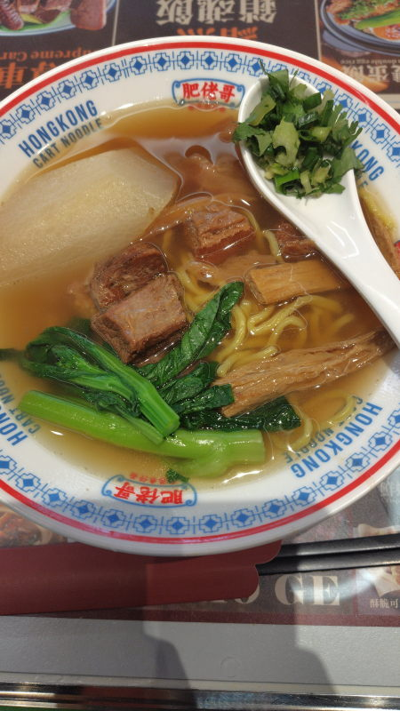

---
tags:
    - shanghai
---
# 肥佬哥香港车仔面
Féi lǎo gē xiānggǎng chē zǐ miàn

香港料理屋。APIOの地下二階(LG2)。QRコードで注文可能

## 滑鸡蛋牛肉饭 Huá jīdàn niúròu fàn
29元。スクランブルエッグと牛肉。

## 肥佬牛筋腩面 Féi lǎo niú jīn nǎn miàn 广东油面 牛骨清汤
35元。麺とスープの種類を選べる。巨大な大根が添えられている。麺は少なめ。

## 麺の種類
麺の種類を選べる。
- 广东河粉 :: 平たい米粉の麺。代表料理は「牛肉河粉」
- 广东油面 guǎngdōng yóu miàn :: あらかじめ油で絡めた黄色い麺。
- 广东米线 :: 断面が丸い細い米粉麺。台湾の「米線（ミーシェン）」とは少し異なる。
- 广东米粉 :: 日本でいう「ビーフン」に近いが、より細い場合も。
- 出钱一丁 :: 日清食品のインスタントラーメンのブランド名。出前一丁。
- 广东竹升面 :: 竹の棒で打ったコシの強い卵麺。ワンタン麺などに

## スープ
- 牛骨清汤 niú gǔ qīngtāng
- トマトスープ

