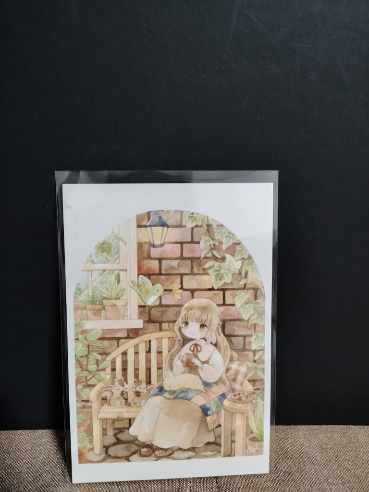
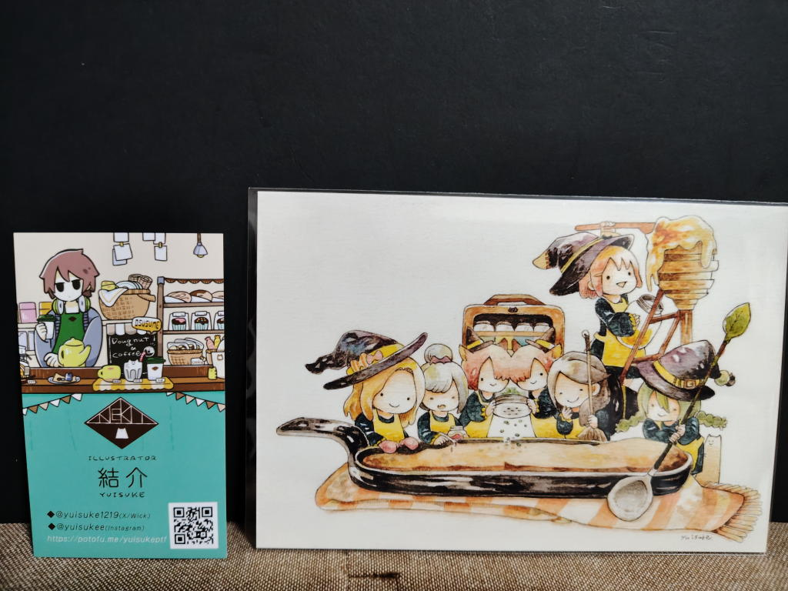
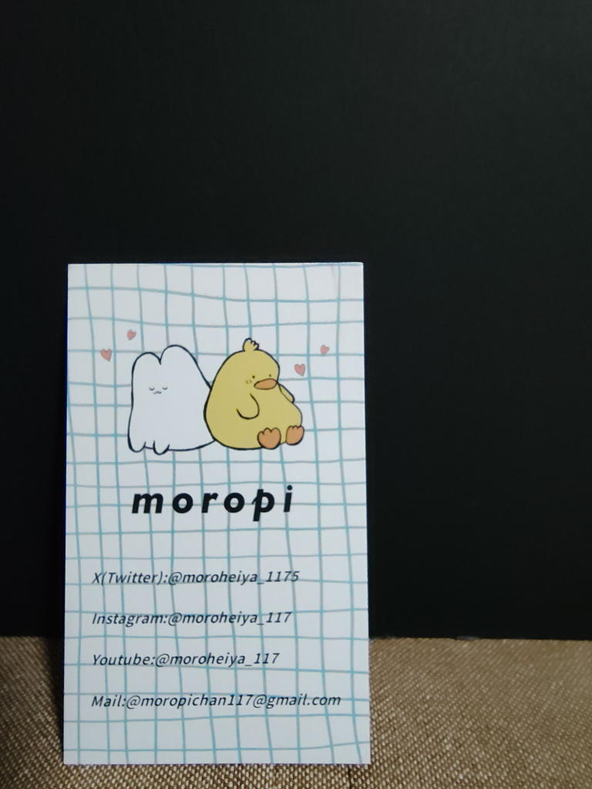
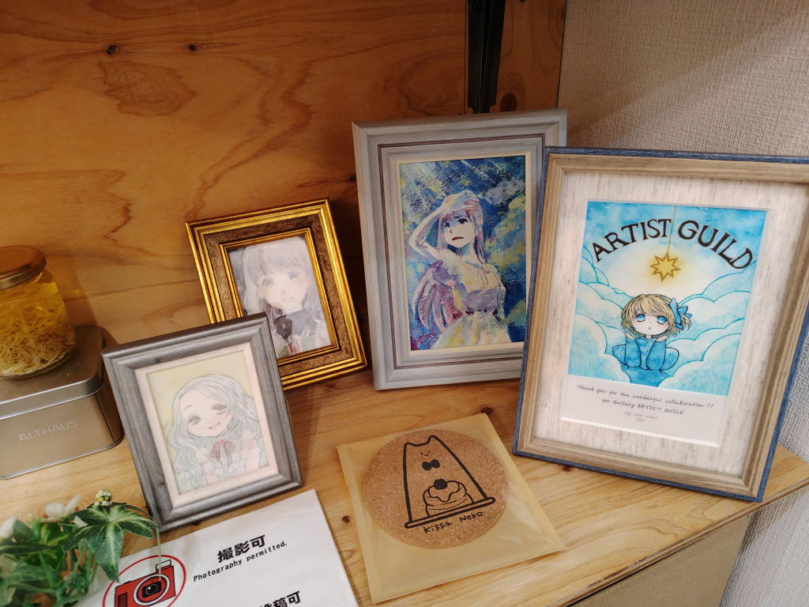

---
tags:
    - exhibition
date: 2026-10-02
---
# gallery Artist Guild 魔女の工房展/The Tarot展
- 訪問日: 2026年10月2日
- 訪問場所: [gallery Artist Guild](./gallery-artist-guild.md)

xでフォローしていた[suiさん](https://x.com/sui____23/status/2104363569588711506)のツイートで知って、
会期初日に行ってみることにした。

最寄り駅は二子玉川近くの上野毛（かみのげ）駅。ニコタマという名前はよく聞くが、
このあたりに来るのはこれが初めてだった。

ギャラリーは駅から歩いて5分と掛からない場所にある。
ただ、ぱっと見は普通の一軒家にしか見えずちょっと入るのに躊躇してしまう。
それでも1時間以上掛けてここまで来たのだから引き返すわけにもいかず、
中国研修で身につけた度胸を胸に入ってみる。

中に入ると外国人の方（スウェーデン人だそう）がsuiさんの額装を買いに来ていて
海外発送できるかどうかというやり取りをしていた。オーナーさんは英語が話せないし、
その外国の方も日本語が話せないようでお互いにスマホの画面を見せ合いながらやり取りをしていた。

展示もそれほど多くなくて、記念のポストカードを買って帰ろうかと思っていたのだが、
なんとなく事の顛末が気になったのと、オーナーさんが「どうぞ座っていってください」みたいな
気さくな感じの方だったからそのまま居座ってみることにした。

その間、やり取りを聞いてみたり、置いてあったsuiさんのイラスト集を眺めて感想ノートを書いたりしていた。

結局、30,40分くらい経って無事に送れる算段が着いたようで帰っていった。

私も半年くらい中国にいて、そのときにこんな風なやり取りをしていたなということをポツポツと話した。

その後間もなく、オーナーさんの知り合いのイラストレーターさんがやってきて最終的には
絵師さん3人とわたしという何とも不思議な組み合わせで談笑(?)をしていた。

休職中ということは言わなかったし、例によって私は聞き手に回っているだけだったのだが、
どういうわけか居心地の悪い感じはあまりしなかった。
もうすぐ休職してから3ヶ月が経つし、その間、ほとんど人と関わっていないわけだから、
人恋しいというか、抜け出すきっかけになりはしないかという想いもあったのかもしれない。

イラストを描く傍らバイトをしながら生計を立てるという、私の生きてきた世界と言うか道筋とは
全く違う生き方をしているなと思いながら話をきいていた。

率直に言えば、金銭的には私のほうがよほど恵まれているのだと思う。
ただ、どちらがより充実した生き方をしているかと聞かれたら、それは答えるまでもないだろう。
もちろん、相手方の苦労は相手にしかわからないのであるが...

最終的にポストカードを2枚買って、3時間滞在していたことになる。
私がいた意味は多分なかったろうが、これまで自分が属してきたコミュニティと
全く違うコミュニティとほんの少しだけでも接点を持てたことが新鮮で楽しかったように思う。

## 写真
suiさんのイラストは暖かみがあって癒やされる!好き!

結介さん デフォルメされた魔女が可愛い!

moropiさん。名刺のみ。TCMにも出展するようだから今度見に行こう

右端に写っているのはIONさんという方の作品。何でもできる多彩な方のよう。

<https://inwonderlandion.wixsite.com/scns-ion-top>

## メモ
<https://x.com/ARTISTGUILD2/status/2105931828213498347>

スウェーデンの君が買っていった額装。会期が終わる前に帰国すると言うので郵送するしかなかったそうだ。

M3というイベントの存在を知った <https://www.m3net.jp/> COMITIAの音楽版らしい。
## リンク
- <https://gallery-artistguild.themedia.jp/posts/58811678>
