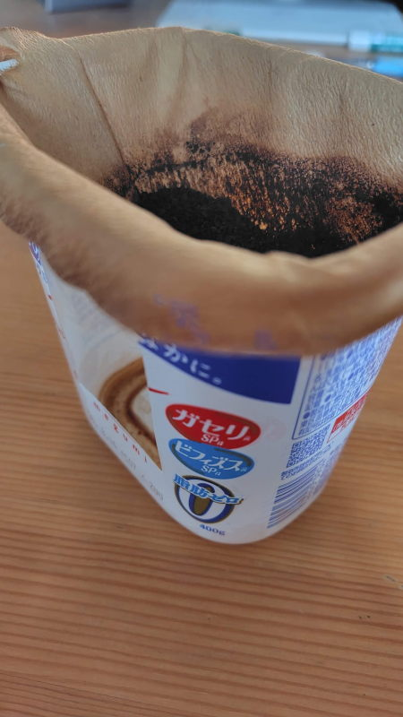

---
tags:
    - lifestyle
---
# プラスチックごみ回収、はじまる。面倒くさいが『楽しい』に変わるまで
私が住んでいる街では今年の4月からプラスチックゴミの分別回収が始まった。

私が中国に滞在している最中のことで、帰国した7月から私も分別に取り組むことになったわけだが、プラスチックごみの割合の多さに驚かされた。

これまではサーマルリサイクルと言って、要は燃やして燃料にしてしまえという発想で分別していなかったようだが、それではいけないという環境意識の高まりを受けて分別することにしたようだ。

かさばるプラスチックを圧縮するためにハサミで切り込みを入れて潰してみるとか色々と試行錯誤をしてみたり、分別する手間は増えたのだがやってみると意外と楽しめている自分がいる。環境のために何かやってる感が良いのかもしれない。

今までは紙ゴミも燃えるゴミにして出してしまっていたのだが、
A4サイズの封筒に捨てるというのを試している。

そこまでやると燃やすゴミというのはほとんどなくて、生ゴミとティッシュぐらいだなということに気づく。生ゴミは大半が水分というのを聞いて、コーヒーフィルターなんかもなるべく天日干ししてから捨てるようにしている。

400g入りのヨーグルトの容器にちょうどいい感じにかぶさるから
かぶせた状態で放置しておくだけ。

あと、キウイの皮は食べられるというのを知って剥かずに食べてしまうというのも実践している。ゼスプリが食べられるって言ってるから大丈夫!

<https://www.zespri.com/ja-JP/blogdetail/can-i-eat-the-skin-of-kiwifruit>

ついでに生ごみとか風呂の髪の毛とかを受け止めているネットも乾燥させるようにしていて、
コーヒーを機にゴミの捨て方が改善されているように感じる。

キャベツの芯も食べられるというのを知って細かく切って鍋に入れている。

単三電池等は電極に布テープなどを貼って絶縁してから出すこと。

最初は面倒に思っていたが、些細なことでもこだわり始めると意外と楽しくて達成感があるものだなと思う。

