---
tags:
    - beijing
---
# 故宮(紫禁城)
もともとは元の都（大都）があった場所で大都を造ったのは
遊牧民というよりは漢民族の専門家で劉秉忠という儒学者だった。
周礼（しゅらい）の記述に基づき、左に祖廟、右に社稷壇、土地や穀物の神を祀る場所を置いた。

1400年前後のこと、明の初代皇帝朱元璋（洪武帝）に取り壊され、
三代目の皇帝永楽帝が南京から北京へ遷都するように命じた際に跡地に造成されたのが紫禁城となる。

## 午門
天安門の北、故宮の入口の1つで故宮の南端に当たる。
セキュリティチェックが配されていて行列ができている。

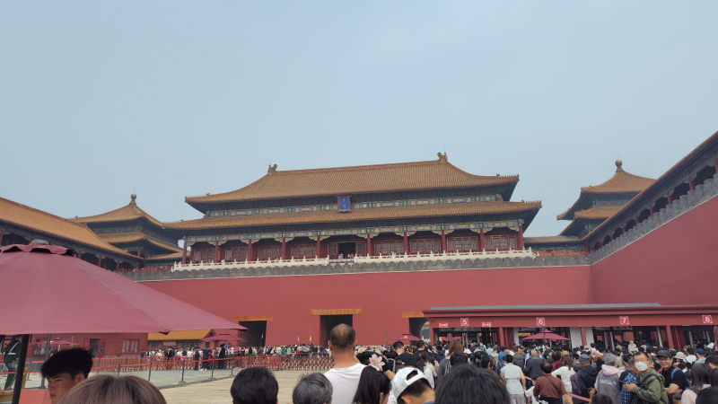

## 太和門
外朝の入口。門の左右に獅子像があって、足の下に玉があるのが雄、獅子の子があるのは雌だそう。

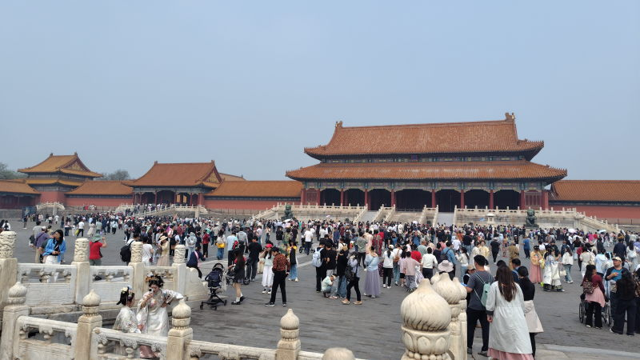

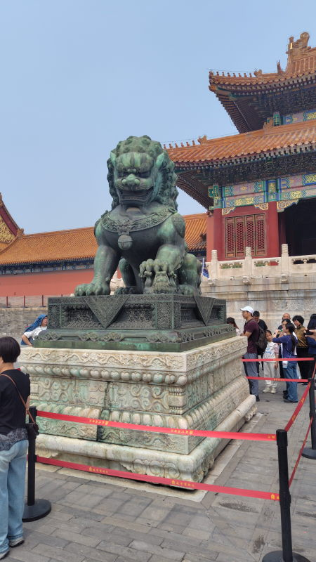

## 外朝三殿
太和殿、中和殿、保和殿と南北に3つ並んでいる。
### 太和殿
皇帝の即位などが行われた儀礼の場で最も大きな建物。
屋根にある龍の飾りはその建物の使用者の格によって何匹置けるかが決まる。
もちろんこの建物には一番多く9体?の龍が使われている。

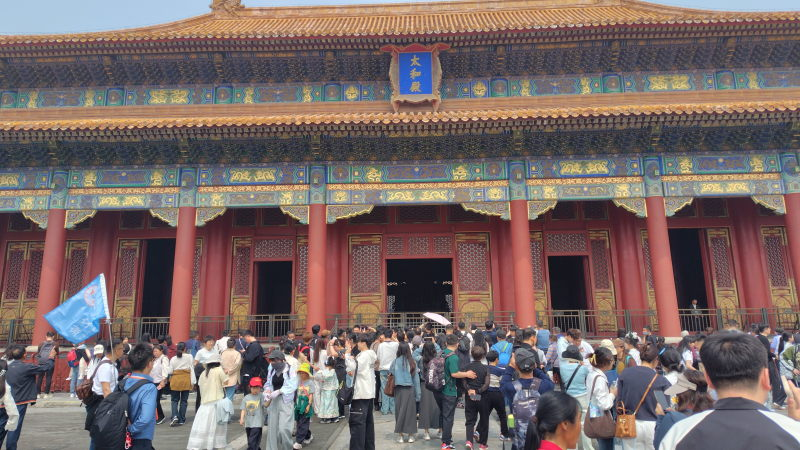

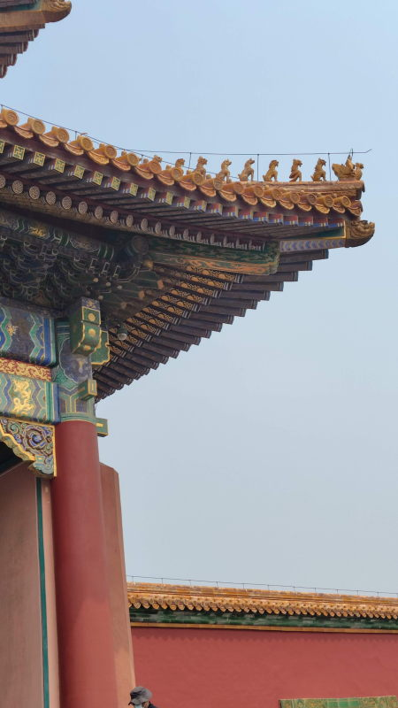

脇にある大きな瓶は火災が発生した際の消火用の水を貯めておくためのものだそう。

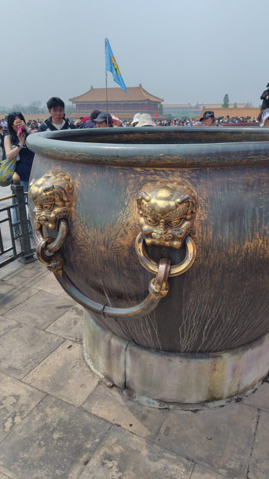

### 中和殿
太和殿のすぐ北（うしろ）にある正方形の建物。
式典の直前に皇帝が臣下から祝辞を受ける場所。

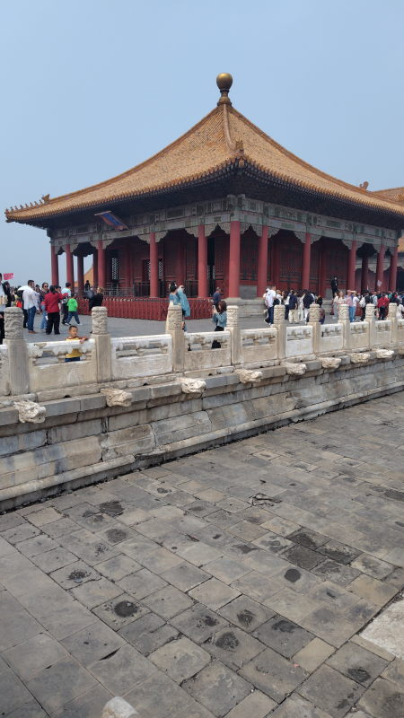

### 保和殿
式典前に皇帝が更衣をした場所。

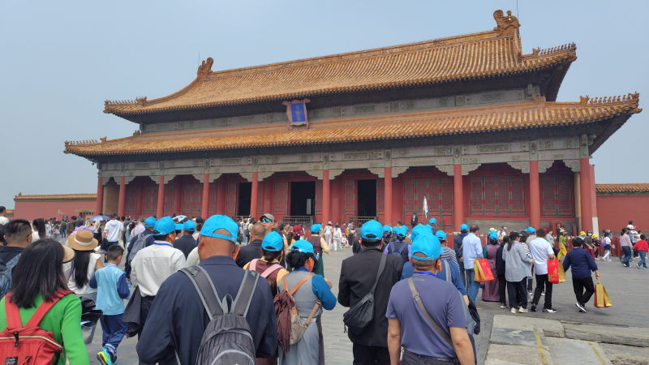

## 钟表馆
保和殿の東にある時計博物館。歴代皇帝、特に乾隆帝(清の六代目皇帝で最盛期を築き上げた)に
献上された時計が展示されている。

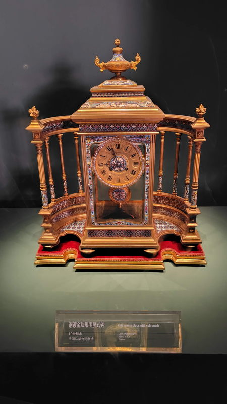

こんな感じの時計が数え切れないほど展示されている。

## 皇極殿
乾隆帝は彼の祖父の治世61年を越えないために60年目に譲位している。
太上皇となった後はここで生活をしていた。

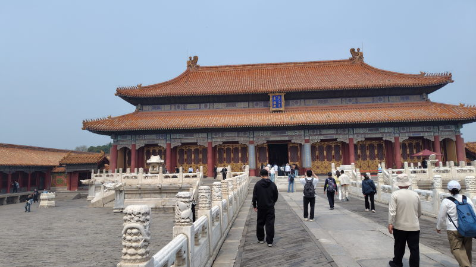

## 九龍壁
中国三大九龍壁の一つ。

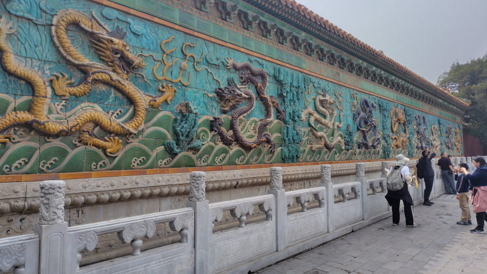

## 珍宝館
皇族が身に着けていた装身具や装飾品が展示されている博物館。

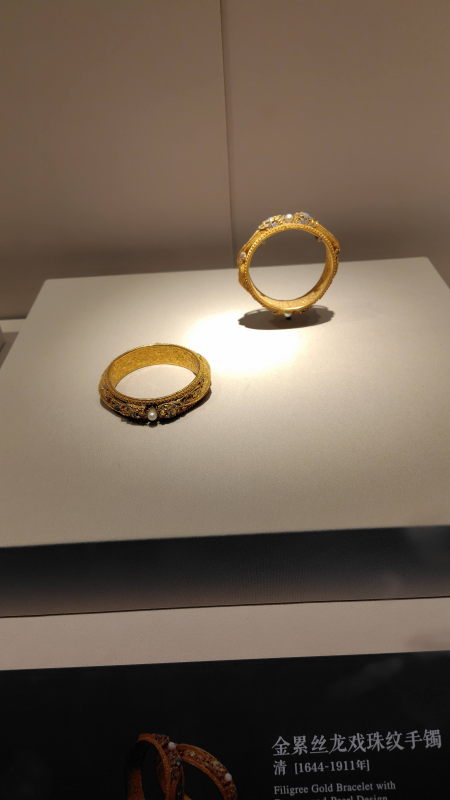

## 御花園
紫禁城内の庭園

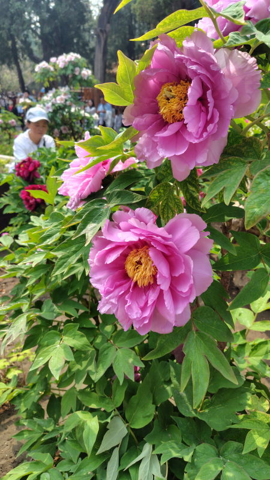

## 神武門
北門

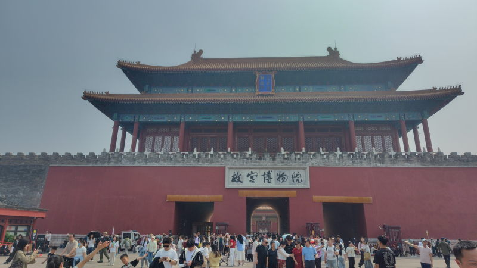

## 訪問履歴
- 2026-04-18
