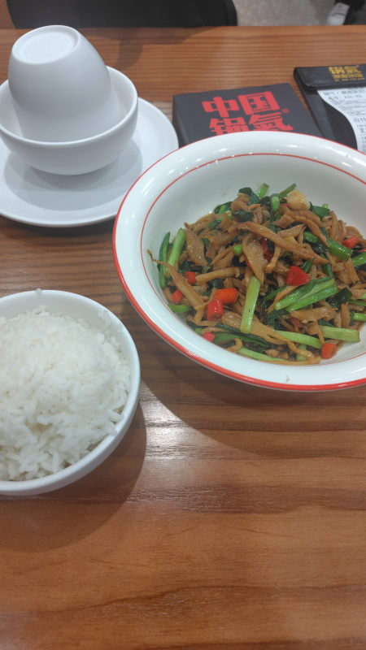

---
tags:
    - shanghai
---
# 锅气湖南饭店
Guō qì húnán fàndiàn

湖南料理。QRコードで注文できる。

## 纸巾盒 Zhǐjīn hé 1元
なぜか最初からカートに入っているティッシュ。
テーブルの上にもすでに置かれていてこれを取り除いて良いのかどうかが分からなかった。

## - 韭菜肉丝炒脆笋
Jiǔcài ròu sī chǎo cuì sǔn 39.9元。タケノコとニラと豚肉。唐辛子が多め。

## 稻花香大米饭(畅吃)
Dàohuāxiāng dàmǐ fàn (chàng chī) 3.8元 畅吃は食べ放題の意味。

