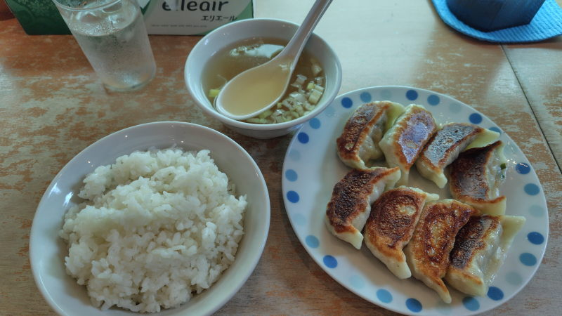

---
tags:
    - tokyo
    - dining
---
# 餃子屋一番星
新御茶ノ水駅の南側の出口から出て北西の中通りにある中華料理屋。

テレビがあって民放が流れていたり、感じの良い中国人おばちゃんが給仕をしていたりと
街の中華料理屋という感じの店だった。カウンター席は7,8席くらいでテーブル席もある。

支払いは現金かPayPay。

## 元祖餃子定食並盛
850円。少し小振りだけどちょうどいい。美味しい。
スープと餃子とご飯、こういうのでいいんだよ、という感じだった。

## 訪問履歴
- [2026-08-10](./blog/posts/2026-08-10.md)
