---
tags:
    - exhibition
date: 2026-09-19
---
# ハマクリ Vol3
- 開催期間: 2026-09-19 - 2026-09-23
- 会場: 横浜スカイビル10階

期間中は日によって出展ブースが入れ替わる。

入口で冊子が配られていてそれを見ると各日程の出展者やプロフィールを見ることができる。
開催前に欲しかったよ...

それなりの規模の展示会かと想像していたが、実際はそこまで大きくなくて、
レストランフロアの一角に10-20件くらいの小さなブースが並んでいるという感じ、
でも密度は濃い目!

会計は個別ではなくてセントラルレジでまとめて行う方式。クレカなども利用可能

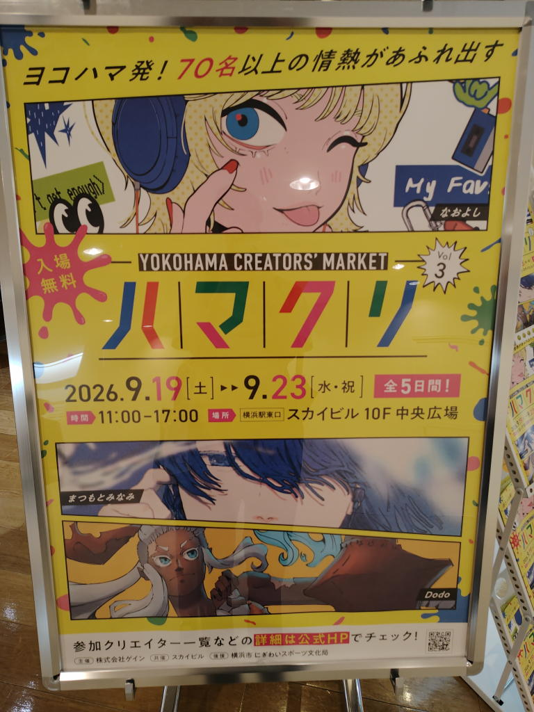

## 訪問履歴
### 2026年9月19日
事前に調べて気になっていたのは3人くらいだったのだが、
見ているうちにあれも可愛いこれも可愛いとなって結局、7名分のポスカをお迎えしてしまった。
#### みいこ
- <https://x.com/315nanairo>
- <https://x.com/315nanairo/status/2100132976248111475>

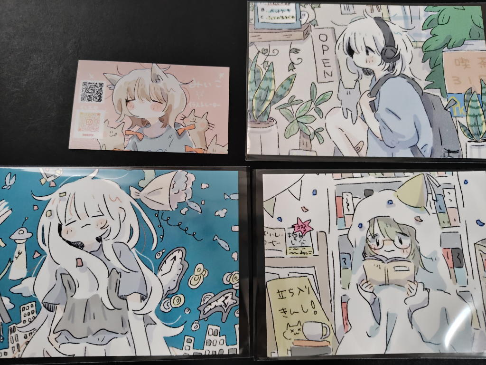

#### 一美
- <https://x.com/plasticmoon223>

『ケーキたちの交流会』という企画展の案内をしてくださった。ただ、会場は大阪...

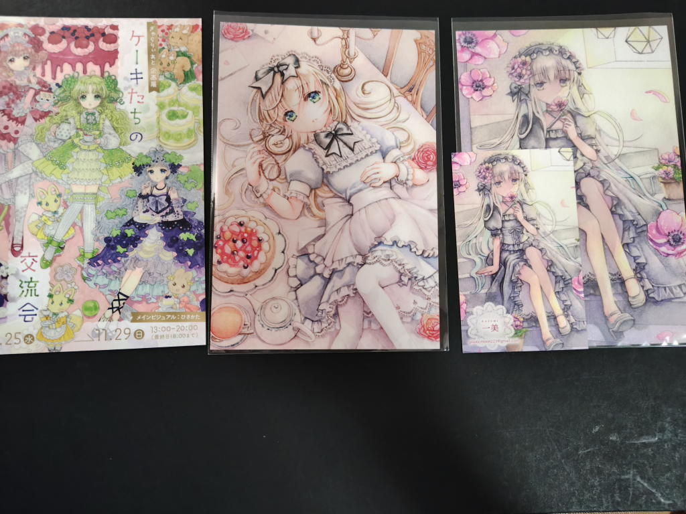

#### おもぐ
- <https://x.com/o___wu>

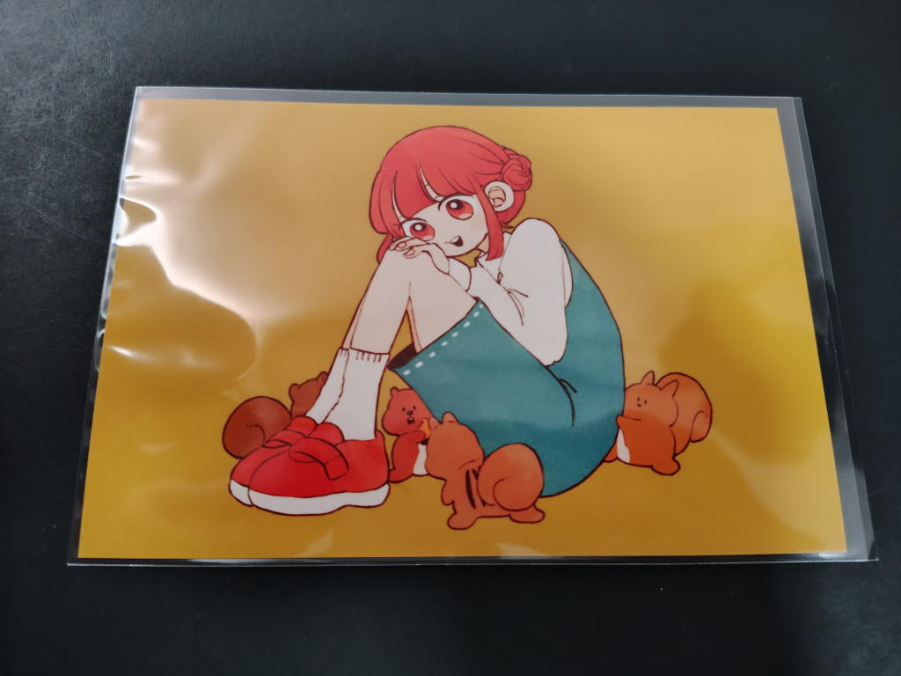

#### colili
- <https://x.com/moonpecolili>

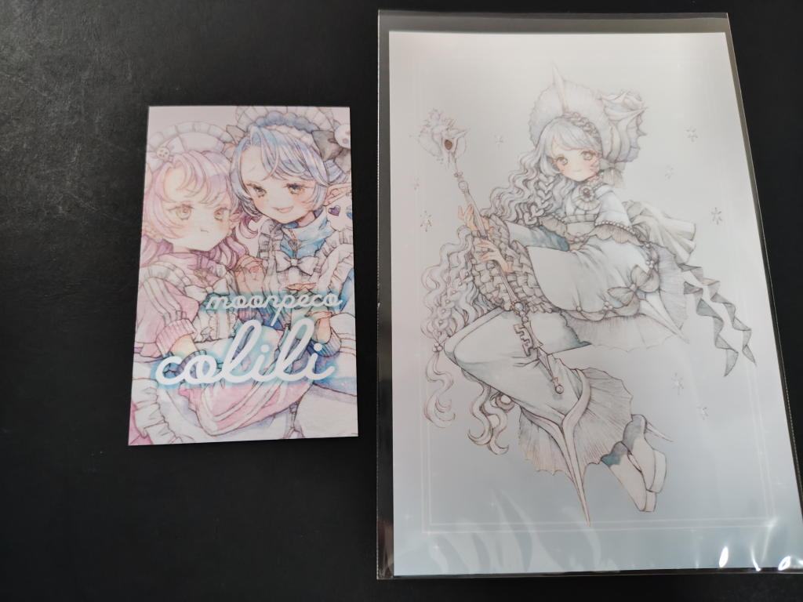
#### なっちゃんブルー
<https://x.com/Nanairopenki>

可愛いダーク系?ダウナー系?

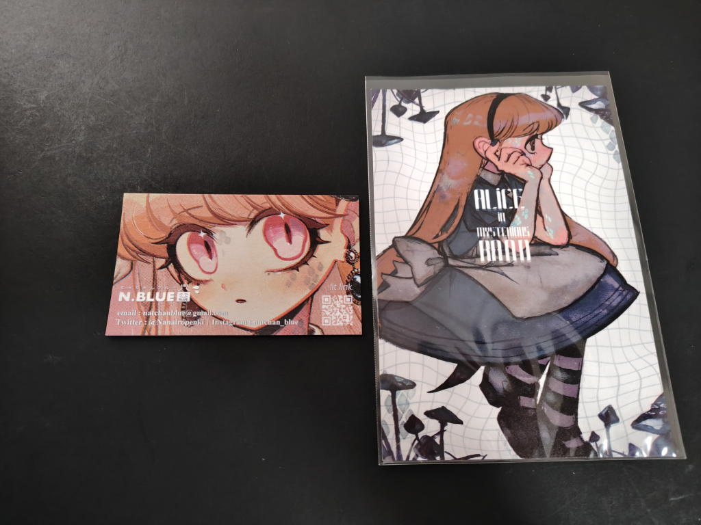

#### 伊夜
<https://x.com/osarunomisakoto>

デフォルメイラストが可愛い

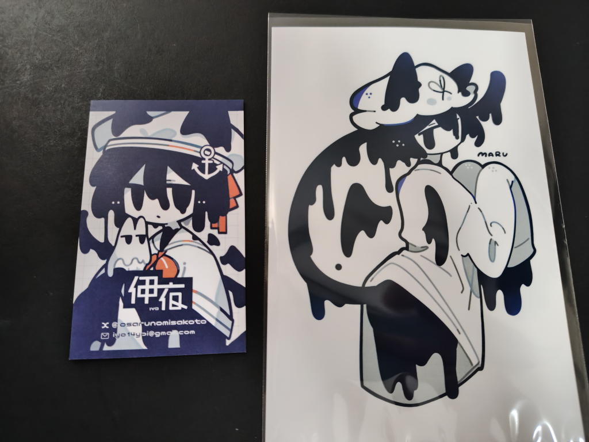

#### moeco
<https://x.com/moeko_works>

リアル寄り。二人展「よりみちリトリート」という案内のDMを頂いた。

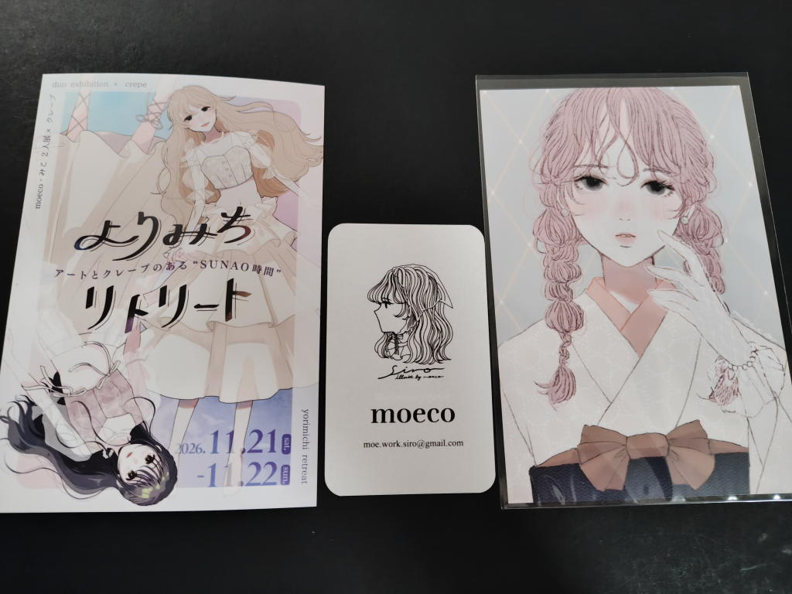

#### 名刺のみ
- ゆきお <https://x.com/TOKYOWANNOBORA> かなりリアル寄りの女性イラストが多い印象
- なおよし <https://x.com/naoyoshi_70> レトロ系という印象

### 2026年9月22日
ブースが日替わりだからいつ訪問しようかと言う悩みも尽きなかったのだが、
出会いを求めて知らない作家さんが比較的多かったこの日に再訪することにした。

天気が良くてビルの外でライブペイントが開催されていた。
あまり長居はしなかったが、かなり大きなボードに絵師さんがイラストを描いていく様子は見ごたえがあった。
#### エーベ
<https://x.com/jury051>

ブースにはいらっしゃらず、外でライブペイントをされていた。

フードx女の子のめちゃくちゃ可愛いポスカを2枚お迎えした。

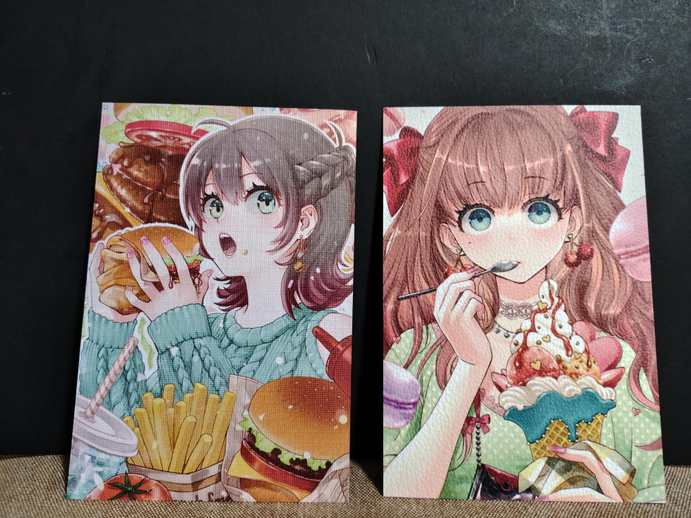

#### myaaco
<https://x.com/myaac0>

水彩絵師さん。水彩の柔らかみ?のあるイラストが結構好みなのかもしれない。

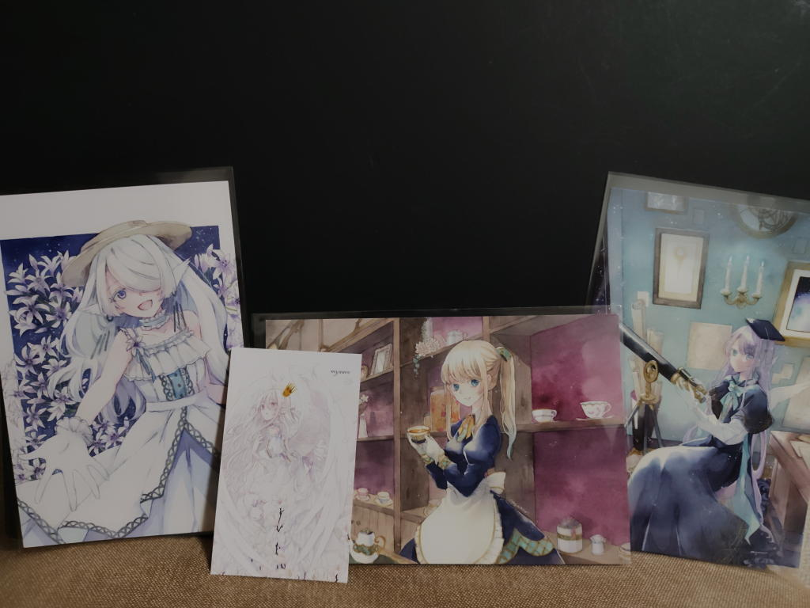

#### 加藤もりあ
[ARTs*LABO](./arts-labo-20260909.md)で原画をお迎えした方。

「この前のイベントでATCお迎えしたんですよ」みたいなことを伝えて、相手の方も
「感想ノートに書いてくれた方ですか？わざわざ来てくれて…」みたいな感じに覚えてくれていた。

この人がこれを生み出していたのかというか、こういう手の届く関係というか見える関係が良いなと感じる。

またかわいいポスカお迎えさせてもらった。今回はリスの女の子。

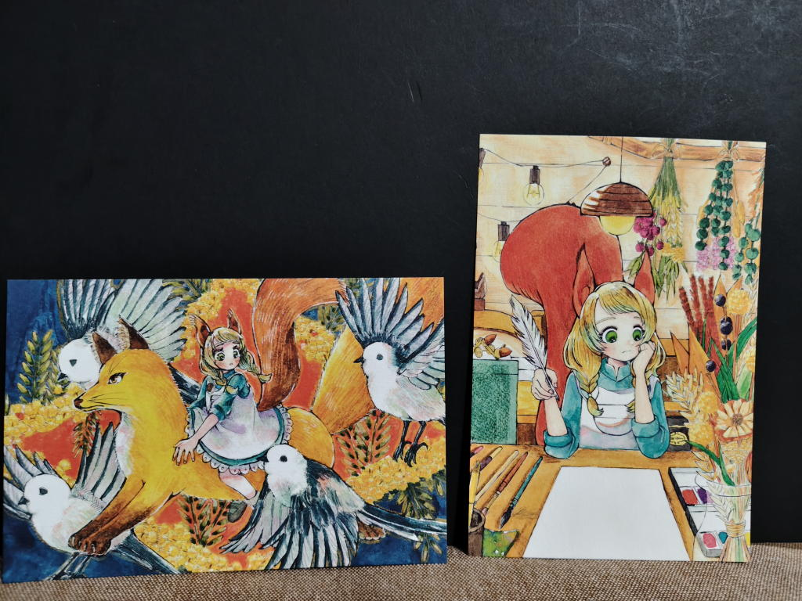

#### 白水
<https://x.com/izumi_zumy>

美人さん!

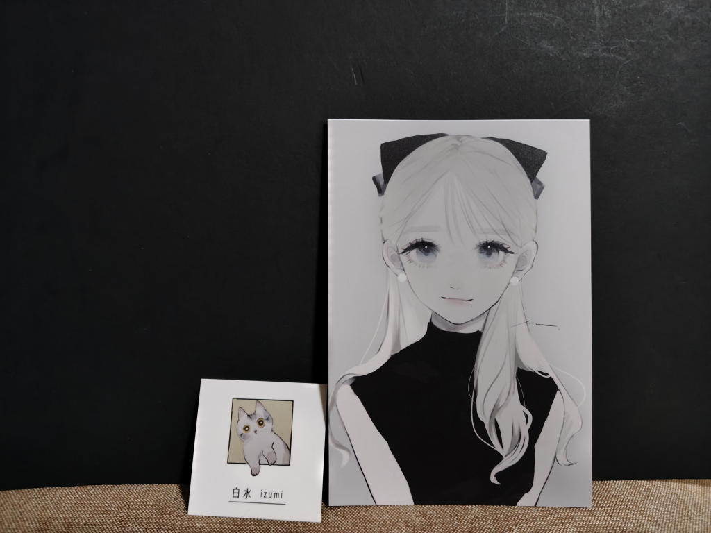

#### 小夜子
<https://x.com/sayosny2>

この方のブース、本人は不在だったが東京都美術館での展示会の招待状というかDMが置いてあってもらってきた。
賞も受賞しているようで、圧倒的な画力の高さ。

<https://tokyoten-bijutsu.com/hp/?cat=6>

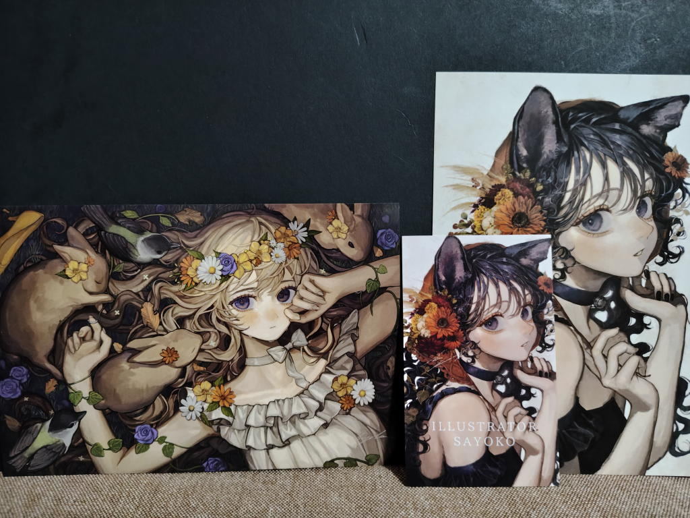

### おまけ
これも[ARTs*LABO](./arts-labo-20260909.md)をきっかけに知ったのだが、
帰りにmykさんという方のFANBOXプリントを印刷してみた。

<https://x.com/miyamiya_ko/status/2101588511413694954>

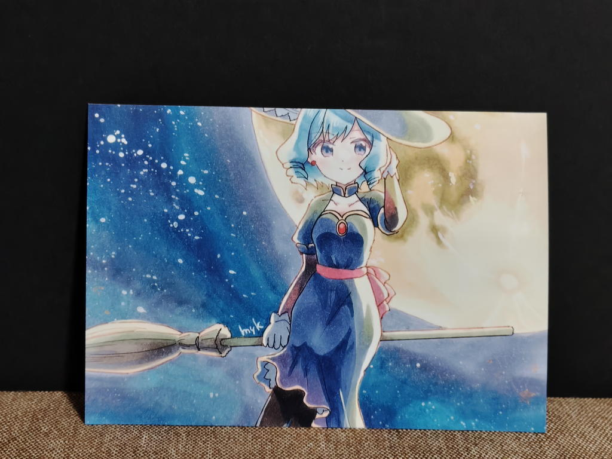
## リンク
- <https://www.yokohama-sky.co.jp/information/5519>
- <https://x.com/yokohama_ycm>
