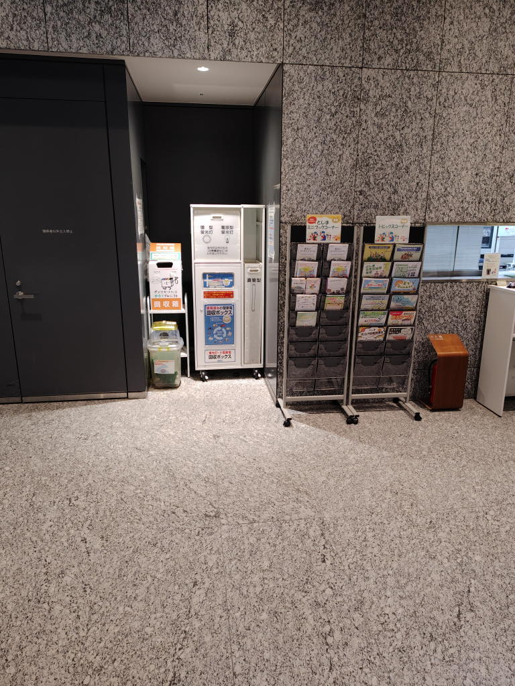

---
tags:
    - lifestyle
---
# 池袋でワイヤレスイヤホンを廃棄する、リチウムイオンバッテリーの捨て方
## ワイヤレスイヤホン
私は2020年にSoundPEATS(サウンドピーツ) TrueFreeなる3000円くらいの
ワイヤレスイヤホンを購入したことがある。

それ以前は有線のイヤホンを使っていたのだが、定期的に断線して
買い替えになるのが嫌でワイヤレスなら断線することがなくなる!
というのが主な理由だった。

確かに線がないから断線することはないのだが、
買って2年半くらいでバッテリーの持ちが悪くなって、
通勤の復路でバッテリーが切れてしまう状態になってしまった。

何だ結局ワイヤレスも消耗品なのかと落胆して
以降は有線イヤホンを使っていてそれはそれで良いのだが、
昨今炎上しがちなリチウムイオンバッテリーの入った
ワイヤレスイヤホンをどう廃棄するかが問題になっていた。

わたしの住んでいる自治体では積極的な回収は行っておらず、
アクセスの悪い清掃施設まで持ち込まないとならないようで、
4年近く部屋の奥底に放置したままになっていた。

## JBRC
このままじゃいけないと思い色々調べていたのだが、
まず、JBRCというリチウムイオン電池の回収をやっている組織がある。

<https://www.jbrc.com/>

ただ、ここで回収しているのはあくまでも「電池」で

<https://www.jbrc.com/contact/qa/>

に

Q「ワイヤレスイヤホン、スマートリングなど電池取り外しが出来ないものは回収対象外ですか。」

A「機器からバッテリーの取り外しが出来ないものは回収対象外になります。現在、機器ごと回収できるものはモバイルバッテリーのみです。」

とあるようにワイヤレスイヤホンは対象外だ。

もし、機器からバッテリーを取り外せるようなら上のホームページに載っている加盟店に
持ち込めば回収してくれると思う。
## 取り外せない機器の回収
じゃあ、取り外せない機器はどうするのとなると
試しにヤマダ電機に持っていって回収しているか聞いてみたら
小型家電リサイクルの扱いになるから\550掛かる、
自治体のホームページを調べたほうが良いと言うようなことを教えてくれた。

電器屋じゃ無理なのかもしれない。もちろん、金を払えば引き取ってもらえるだろうが。

ちょうどその時わたしは池袋にいて

<https://x.com/city_toshima/status/1750738988292522062>

のツイートを見つけた。ここなら回収してもらえるぞというので
回収ボックスの設置場所を確認してみると
池袋駅の東口から歩いて10分くらいのところにある
「豊島区役所（本庁舎）1階」に設置されていることが分かった。

庁舎の西門から入ってすぐのところに...あった!
これか!ついに見つけたぞ!という感動とともにワイヤレスイヤホンを捨てることができた。

これだけ普及しているのだから手軽な廃棄方法の確立が必要なのではないだろうか。

