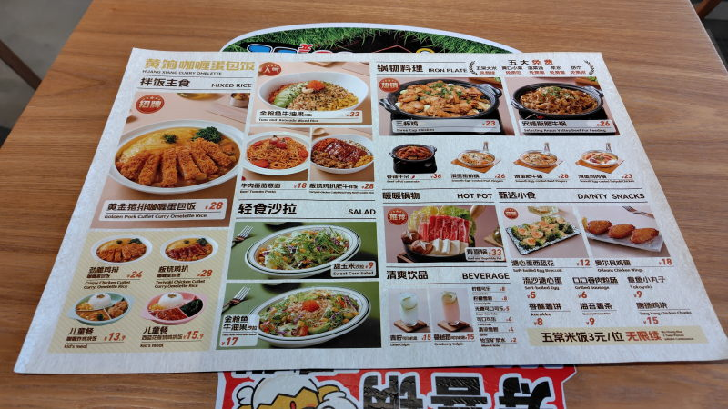
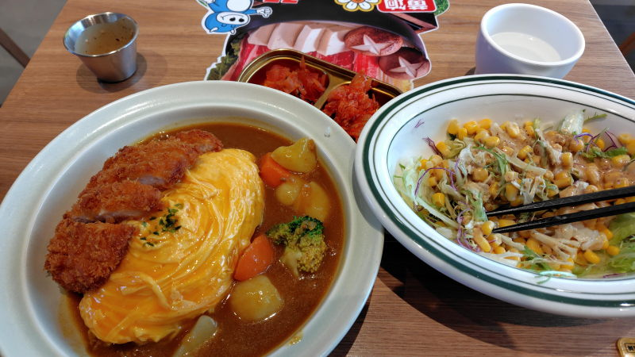

---
tags:
    - tianjin
---
# 黄饷咖喱蛋包饭
Huáng xiǎng gālí dàn bāofàn

カレー屋だがカレー以外のメニューもある。
テーブルのQRコードから注文できる。

## 黄金猪排咖喱蛋包饭 Huángjīn zhūpái gālí dàn bāofàn
28元。カツオムレツカレー。柔らかい、水っぽいカレー。

## 甜玉米沙拉 Tián yùmǐ shālā
9元。コーン入りの普通のサラダ。

