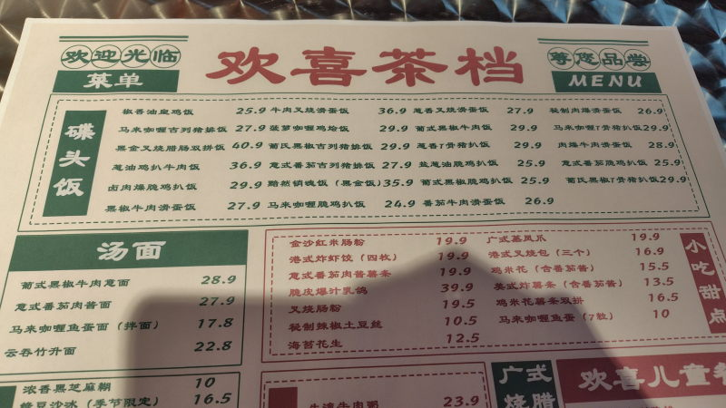
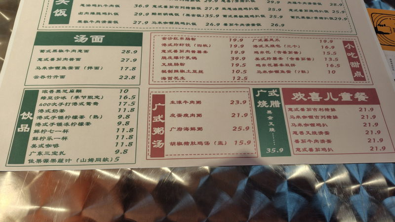
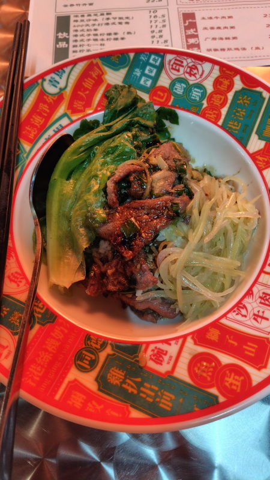
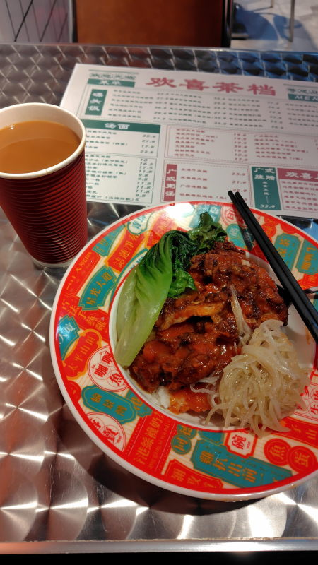

---
tags:
    - tianjin
---
# 欢喜茶档
Huānxǐ chá dàng

冷めた料理を出してくる香港料理屋。2026年6月、恵州研修から戻ってきたら潰れていた。

## 姜葱猪肉饭 Jiāng cōng zhūròu fàn
27.9元。生姜と葱の豚肉

## 港式奶茶 Gǎng shì nǎichá
7元。ミルクティー

## 意式番茄脆鸡扒饭 Yì shì fānqié cuì jī pá fàn
25.9元。イタリア式トマトチキンライス

