---
tags:
    - beijing
---
# 頤和園
世界遺産。天安門からみて北西に位置する。

1860年のアロー戦争で多くの建物が消失しており、
現在の建物もほとんどが再建されたものとなる。
ほとんどすべての建物の説明にこの件が記載されていて、
根に持っているというか、こういう経験が今の西側諸国との関係にも
影響しているのではないかと感じてしまう。

## 蘇州街
北門から入ってすぐにある。
江南の地を好んでいた乾隆帝（清の六代目皇帝）が皇太后（母）のために
蘇州の地を似せて作った街並み。

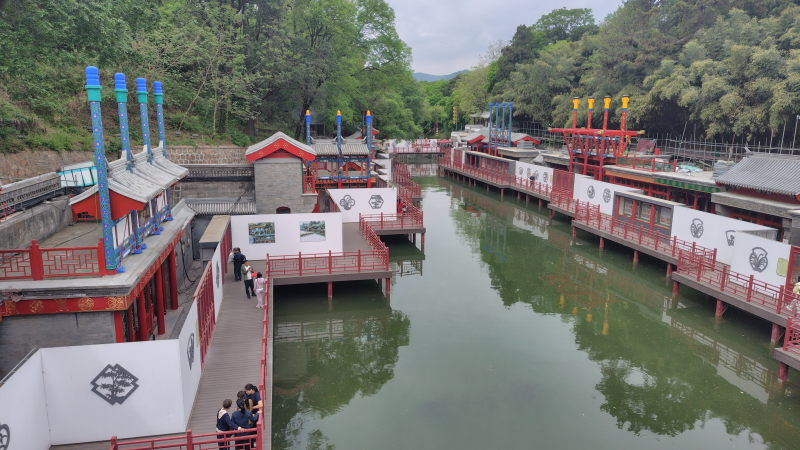

## 四大部洲
チベットのラマ教の施設を似せた建築群。

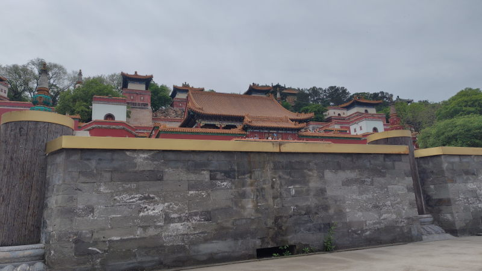

日本語の説明もあった。

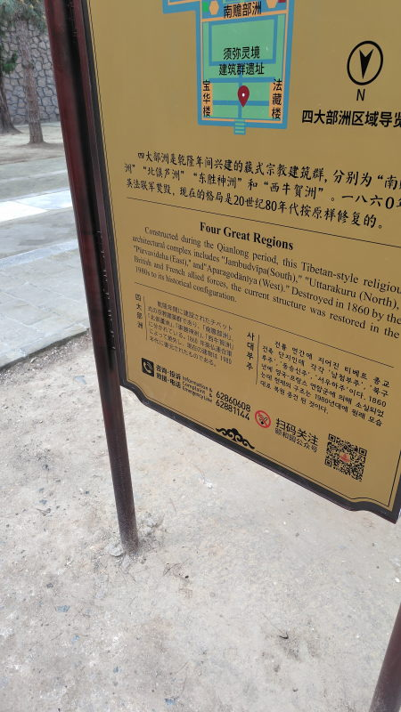

## 万寿山
頤和園、昆明湖の北側一体が万寿山と呼ばれる60mくらいの山になっている。

## 智慧海
万寿山の山頂にある建物。壁一面に仏像が彫られている。

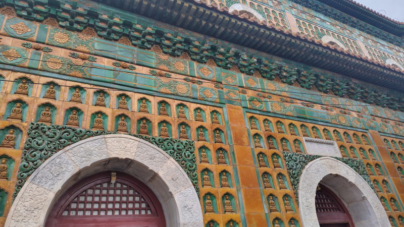

## 石舫
石で作られた船。

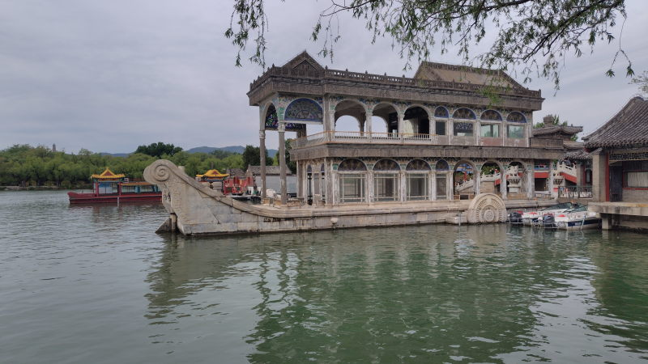

## 長廊
石船から排云殿あたりまでをつなぐ長い通路。天井部分に何千枚もの絵が描かれている。

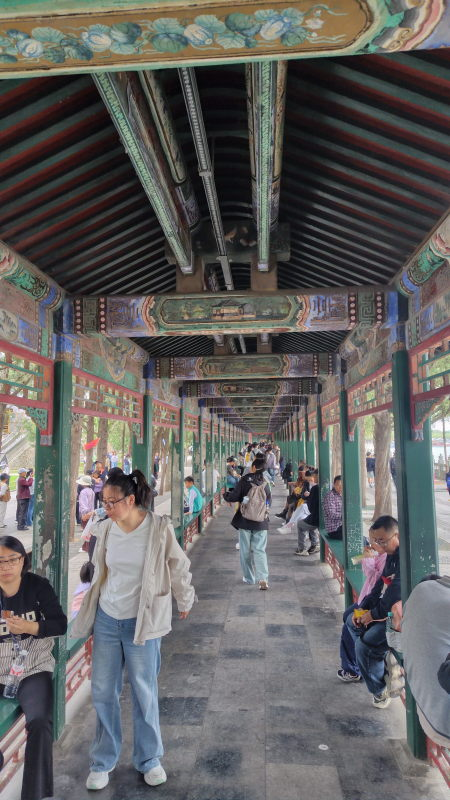

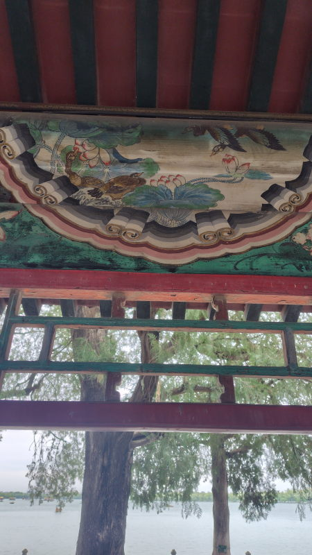

## 排云殿 仏香閣
急な石段をひたすら登っていく必要がありかなりキツイ。
頂上にある仏香閣は三重塔で千手観音が納められている。

昆明湖を一望できる。

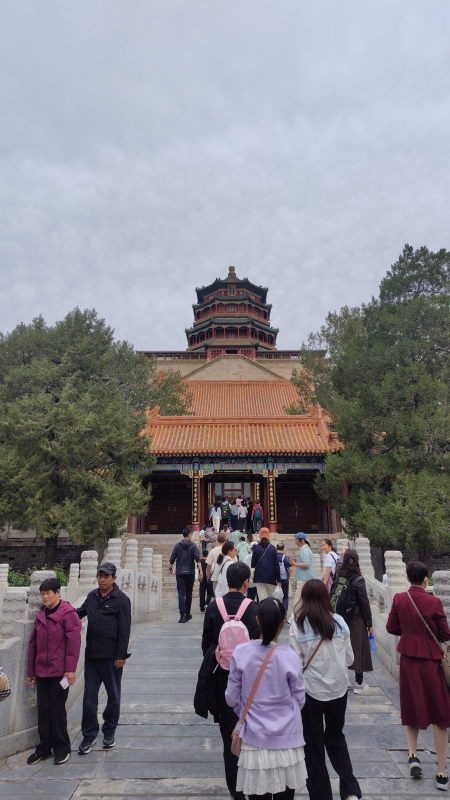

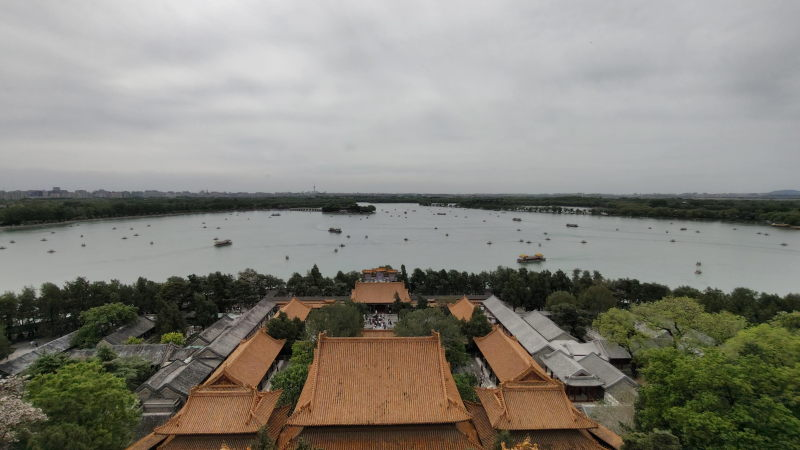

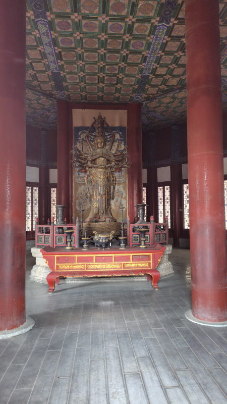

## 德和园
もとは西太后(清の九代目皇帝の后)の私的劇場として使われていた。

## 楽寿堂
西太后の生活・執務のための建物

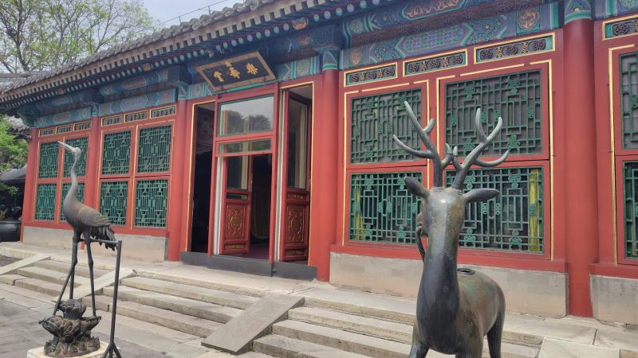

## 仁寿殿
徳和園の南。東門から入るとすぐに見える大きな建物。

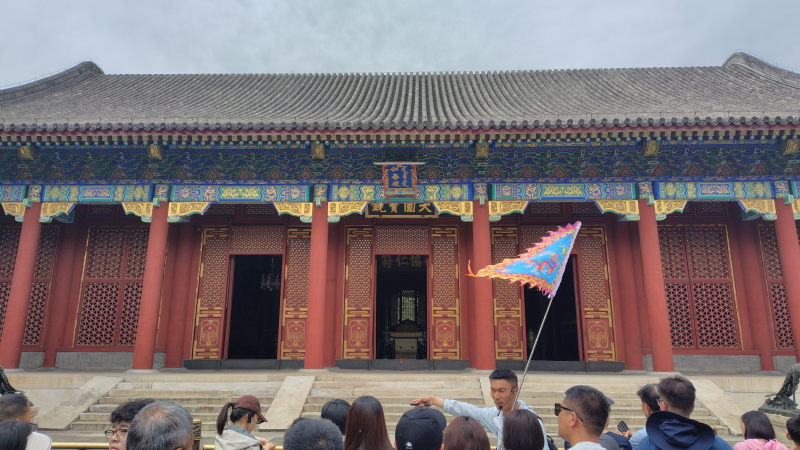

## 東門
東側の出口。最寄り駅は西苑駅

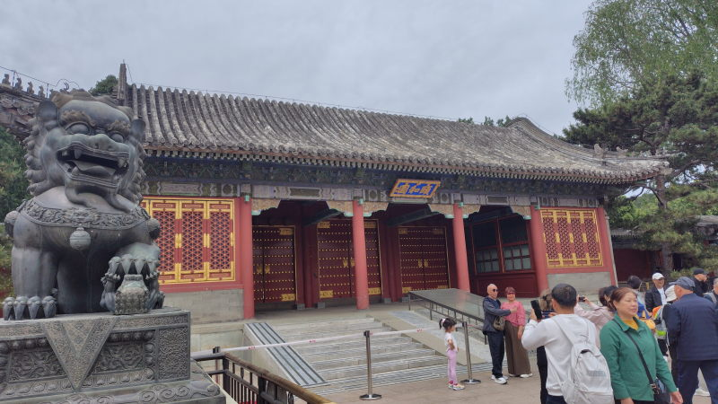

## チケット
オフシーズンは50元。オンシーズンは60元。
チケットはWeChatのミニプログラムで購入可能。

## アクセス
地下鉄4号線、最寄り駅は北门宫

## 訪問履歴
- 2026-04-26
