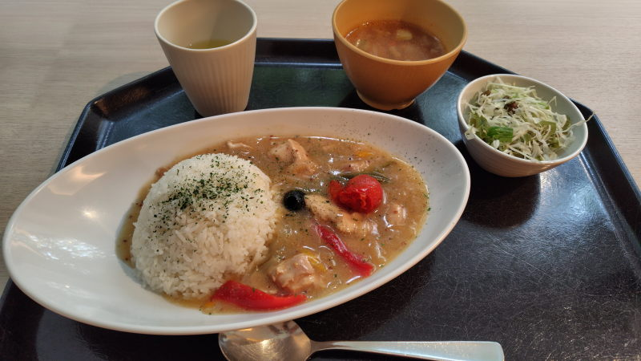
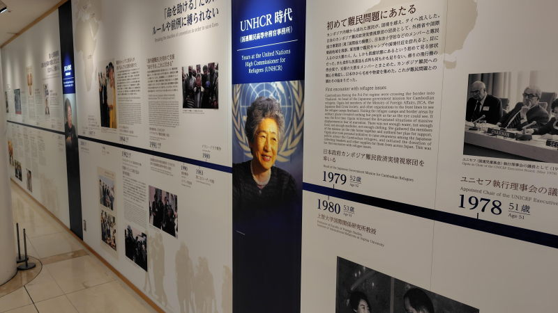

---
tags:
    - tokyo
---
# JICA地球広場
JICAの情報発信の場。

緒方貞子の発案なのか、かつて所長を務めていたこともあってか彼女の生涯が大々的に展示されている。
その他にも展示があるが子供向けと行った印象が強い。

## カフェ
2階は平日のランチタイム限定のカフェになっている。
近くで働いていると思しき人たちが来ていて結構な賑わいだった。

異国の料理を手頃な値段で食べられるというのでおすすめできる。

## セネガルのヤッサプーレ
カレーのような食べ物。鶏肉のセネガル風レモン煮込み。セネガルはアフリカ西海岸の国。

## 緒方貞子に関する展示

## メモ
2025-09-29 訪問。

## アクセス
市ヶ谷駅から徒歩

## リンク
<https://www.jica.go.jp/domestic/hiroba/index.html>
