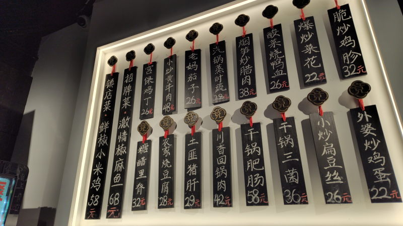

---
tags:
    - tianjin
---
# 竟哥菜馆
Jìng gē càiguǎn

只做十八道菜 Zhǐ zuò shíbā dào cài 

入口に掲げられてるメニュー（18品目）から食べたいものを選んで店員に伝える。
後払い、食事が終わったらレシートをレジに持っていってAlipay QRコードをカメラにかざす。
コーポレートカードで2人分まとめて支払っていた。

## 宫保鸡丁 Gōng bǎo jī dīng
鶏肉とカシューナッツの炒めもの。唐辛子入りで辛い。26元

## 小炒黄牛肉 Xiǎochǎo huáng niúròu
牛肉と黄色ピーマンの炒めもの。48元

## 老妈茄子 Lǎo mā qiézǐ
お母さんナス。四川の伝統料理らしい。26元。

## 汽锅蒸时蔬 Qì guō zhēng shíshū
季節の蒸し野菜。薄くて大きな鍋に入った蒸し野菜。
少し変わった味がしたか不味くはないという感じだった気がする。

时蔬は季節の野菜、汽锅は云南の蒸し鍋というらしい。

28元

## 外婆菜炒鸡蛋 Wàipó cài chǎo jīdàn
22元。おばあちゃんの野菜入りスクランブルエッグ

## 川香回锅肉 Chuān xiāng huíguōròu
四川回鍋肉

日本の回鍋肉と違って油っこくてこってりしている。唐辛子入り。
かなり美味しい。42元。

回鍋肉は2度料理した?揚げた?肉という意味らしい。

## 糖醋里脊 Táng cù lǐjǐ
豚ヒレ肉の甘酢あんかけ。砂糖と酢、豚ヒレ肉。32元。

甘い。酢豚から野菜をすべて取り除いた食べ物

## 爆炒菜花 Bào chǎocài huā
カリフラワーの炒めもの。

22元。一番安い。にんにくと塩味の（この店一番の）シンプルな炒めもの。

## 干锅三菌 Gān guō sān jūn
36元。

三種のキノコ、汁気の少ない鍋料理。唐辛子と山椒がきいていて結構辛め。

## 小炒扁豆丝 Xiǎochǎo biǎndòu sī
インゲンの細切り炒め。

26元

## 食べていない料理メモ
- 烟笋炒腊肉 Yān sǔn chǎo làròu
  ベーコンとたけのこの炒めもの。
  腊肉は塩漬け肉のこと。38元
- 脆炒鸡胗 Cuì chǎo jī zhēn 砂肝のカリカリ炒め。32元。

内臓系

- 干锅肥肠 Gān guō féicháng 豚の腸。日本でいうとホルモン的な?内臓料理。。58元
- 土匪猪肝 Tǔfěi zhū gān 豚レバーの山賊焼き?これも内臓料理。山賊焼き???29元
- 酸菜烧鸭血 Suāncài shāo yā xuè カモの血を豆腐みたいに固めたもの。見た目からヤバそう...26元。

日替わり

- 招牌菜 激情椒麻鱼 Jīqíng jiāo má yú 68元。
- 镇店菜 鲜椒小米鸡 Zhèn diàn cài xiān jiāo xiǎomǐ jī 鲜椒、小米はどちらも唐辛子の種類らしい。辛そう。58元。

