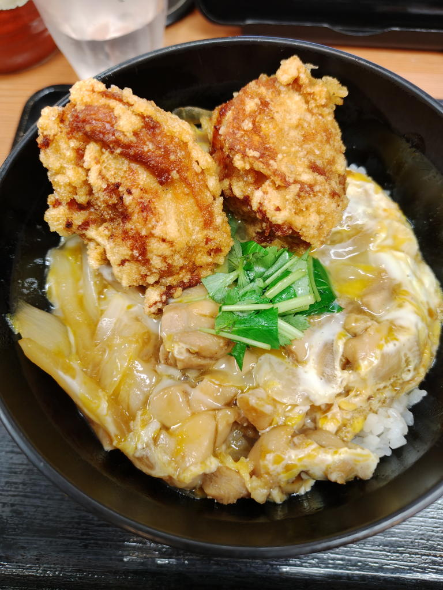

---
tags:
    - dining
---
# から好し
## 2026年9月25日 から揚げ親子丼 神保町
\670。味は可も不可もない。

料理が来た時に50円引きの割引券も載っかっていた。
今回の注文でも使えるみたいだからセルフレジでかざしてたのだが、2度打ちされて100円引きになってしまった。
この日は色々と面倒と言うか憂鬱感が強くてそのまま会計して帰ってきた。

システム側がおかしいだけなのだから、私が気にすることではない。

その後、タリーズに入って以下のメッセージを問い合わせフォームから送った。

---------------------

すかいらーくさん

いつもお世話になっております。

本日、御社の提供している50円引きの割引券をセルフレジにてスキャンしたところ、
2度打ちされてしまい100円引きとなってしまいました。誠にごめんなさい。

対策として以下を考えました。

割引券のバーコード番号を一意にして同じ番号の割引券を受け付けないようにする。

一度の会計で1枚の割引券しか読み込まないようにレジの仕様を変更する。

前者の方式は会計ごとにデータベースとの照合が必要になると思われ、
後者の方式のほうが比較的安価で済むかと存じます。

ご検討のほど、よろしくお願いいたします。

---------------------

返信不要にチェックを入れたから返事が返ってくることはない。

## リンク
<https://www.skylark.co.jp/karayoshi/>
