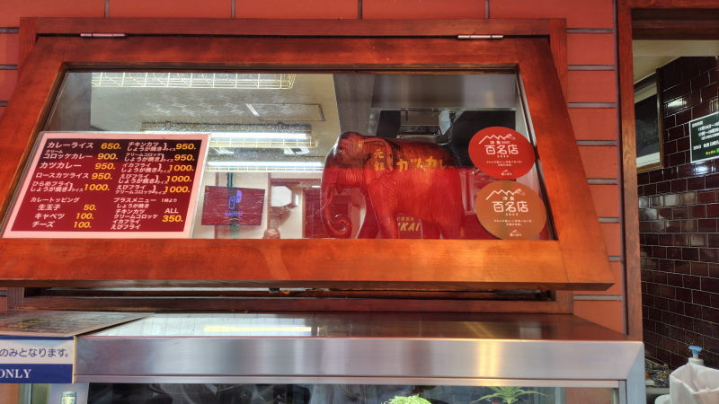
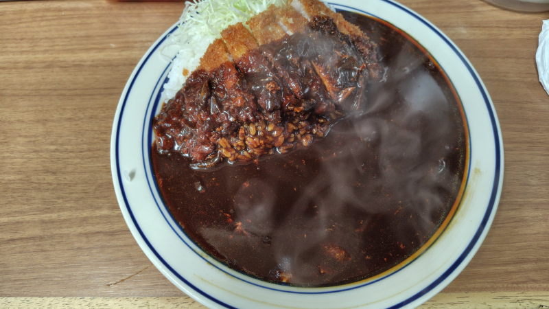

---
tags:
    - tokyo
    - dining
---
# キッチン南海
神保町、新しくできた三省堂の近くにある1960年創業の洋食屋。
名物はカツカレー。

もとは「カレーの南海」でそこからメニューを追加した結果今のスタイルに落ち着いた。

支払いは現金のみ。

[今日もカレーですか?](./kyoumo-curry-desuka.md)の8巻45話で
紹介されていたのを読んで前々から気になっていたのだ。
象の置物は思いの外に小さかった。

## 2026-08-06 カツカレー
平日、11:50ごろに着いたときには10-15人くらいの列ができていて、
12:15頃に席に着くことができた。前もって注文を聞かれるから
座るとすぐに料理が出てくる。

黒いカレーのカツカレー。客の8割が頼むという。
わたしが訪問したときは950円だったが、コミックだと850円。ここにも値上げの波が。

辛すぎなくておいしい。そして、たしかに黒い。
味は特別な特徴のない普通のカレーだなぁという印象だった。

