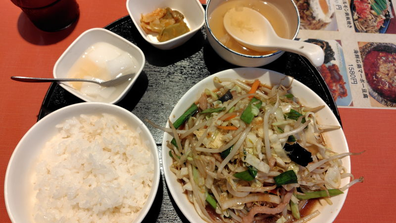

---
tags:
    - tokyo
    - dining
---
# 紅燈記
神保町にある中華料理屋。

昼時に入ったが、それほど混んでおらず、
店内は店員同士の中国語での会話が飛び交う、こういう雰囲気は嫌いではない。

コーヒーとサラダはセルフサービスで。
ランチは現金かPaypayのみでクレカ不可。

## 五目肉野菜炒め
\900。もやしが多めだけど、まあ、美味しかったかな。

でも、また来たいかと言われるとそうでもないかも...

訪問日 [2026-08-17](./blog/posts/2026-08-17.md)

## 外部リンク
<https://tabelog.com/tokyo/A1310/A131003/13262558/>
