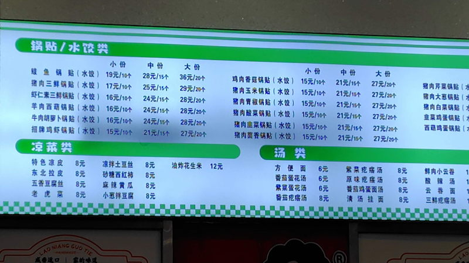
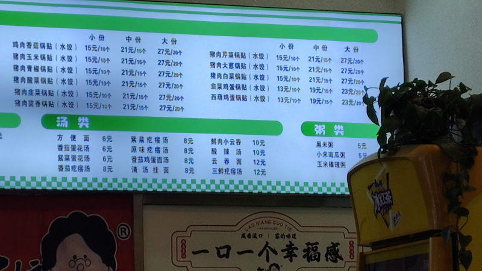
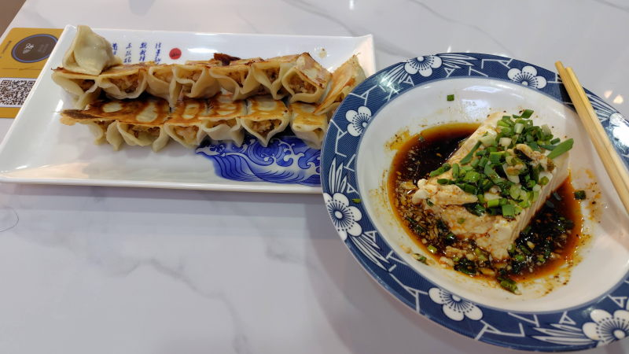
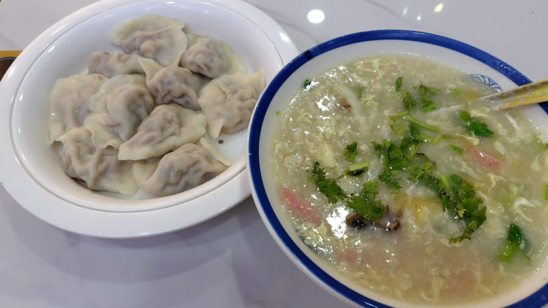

---
tags:
    - tianjin
---
# 老娘锅贴
Lǎoniáng guōtiē

餃子屋。QRコードで読み込んで注文する。

箸やタレはセルフサービスで厨房前に置いてある。

## 附带猪肉和腌白菜汤的饺子
21元/15個。

## 葱和豆腐的拌菜 Cōng hé dòufu de bàn cài
8元。冷奴

## 猪肉三鲜水饺
17元。小籠包みたいに中から肉汁みたいのが出てくる。

## 三鲜疙瘩汤
12元。パクチー入り。細かくちぎったパンみたいのが入っている。

