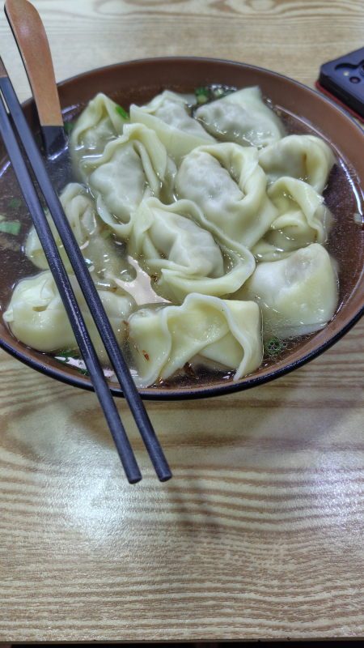
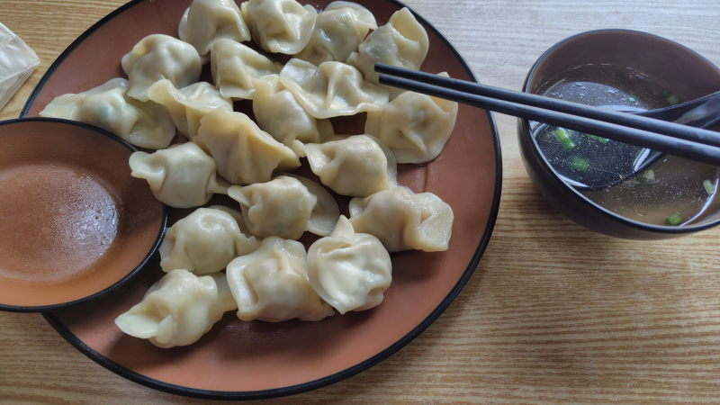
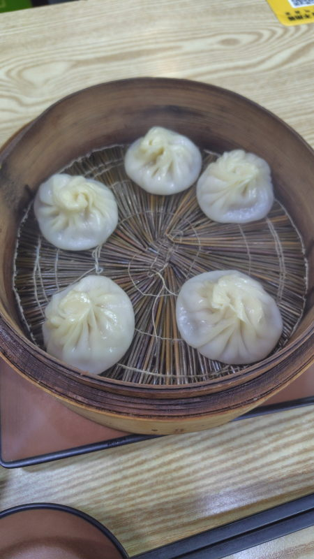
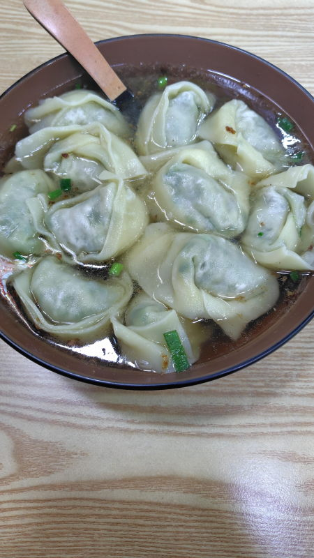

---
tags:
    - shanghai
---
# 老上海馄饨铺
Lǎo shànghǎi húntún pù

マンションの西にあるワンタン料理屋。広東（广东, 潮汕）料理?
QRコードのある席と無い席がある。
無い席でどうやって注文するかは不明。

## 虾仁鲜肉大馄饨 Xiārén xiān ròu dà húntún
30元。

## 白菜肉水饺 大
19元。スープ付き

## 灌汤小笼包 Guàn tāng xiǎo lóng bāo
10元。餃子やワンタンと違って、小籠包には中に肉汁というかスープが閉じ込められている。
ゼラチン状にしたスープを蒸したときの熱で液体にしている...

## 荠菜肉大馄饨 中 Jìcài ròu dà húntún
19元。

