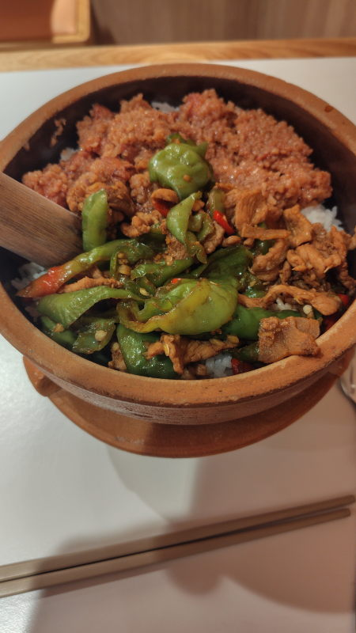

---
tags:
    - tianjin
---
# 擂饭
湖南省の郷土料理。
すり鉢みたいな鍋と木の棒が入っている。

具材をすりつぶしてご飯の上に乗せるらしいが、
この店ではすでにある程度すり潰されていて、棒で混ぜて食べるらしい。

デリバリーがひっきりなしに出入りしている。1階にも何席かあるが、2階に上がったほうが席は多い。

座席のQRコードを読み込むと注文できる

## 擂氏辣椒炒肉拼粉蒸肉
22.8元

