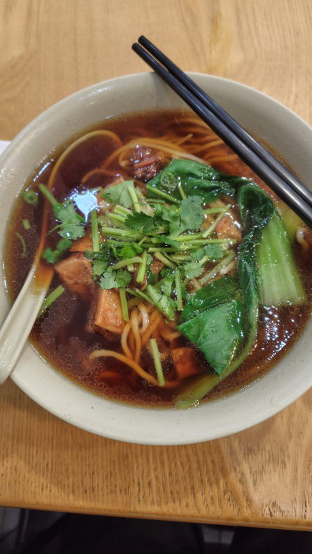
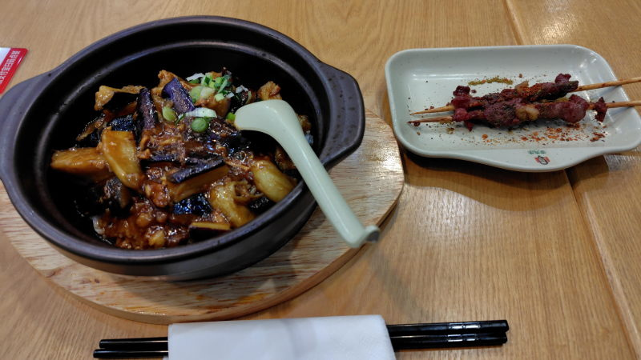
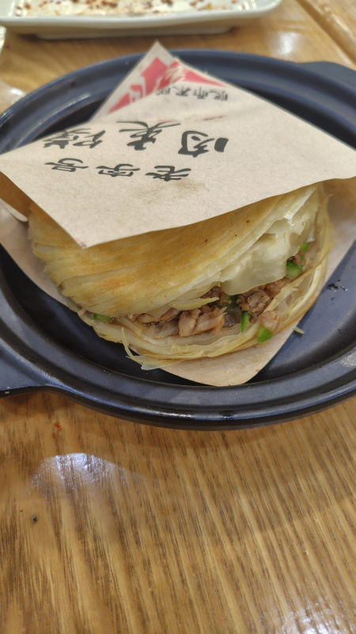
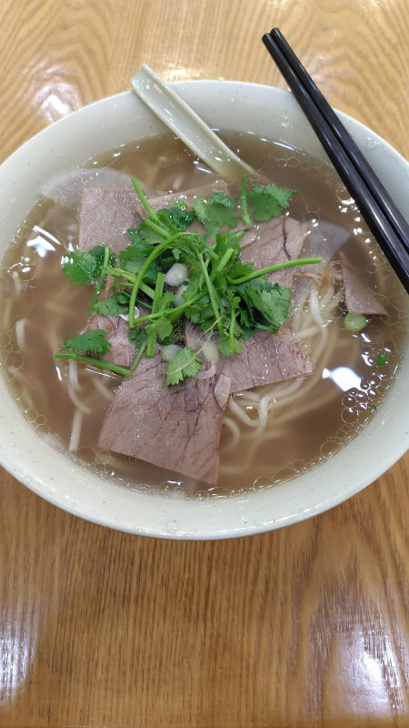
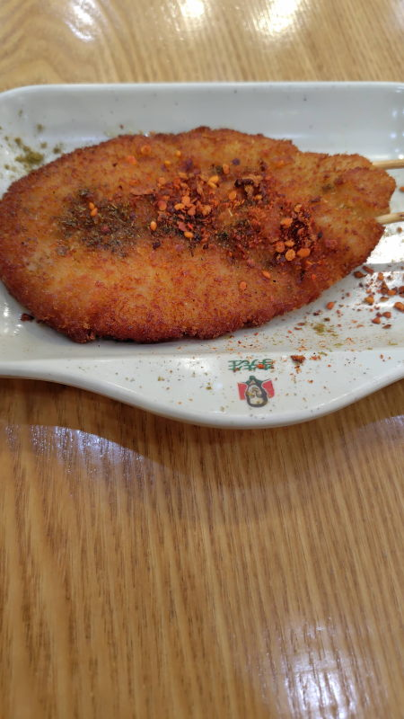
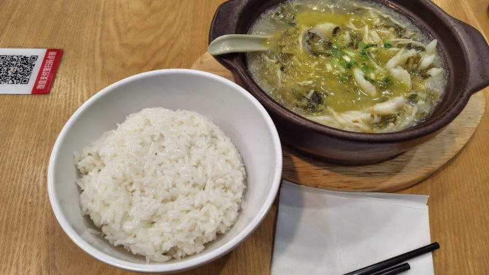
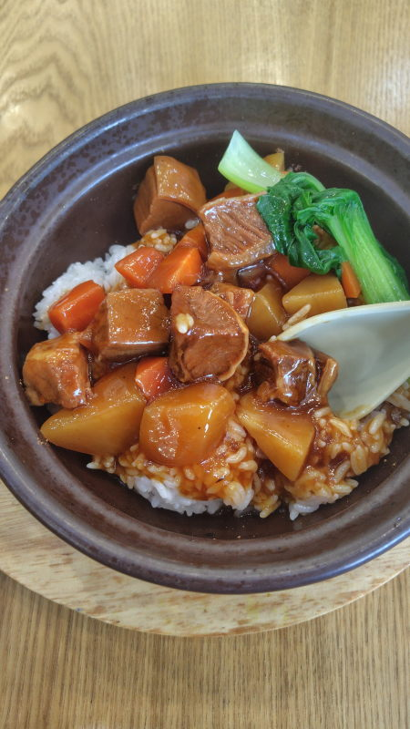

---
tags:
    - tianjin
---
# 李先生
Lǐ xiānshēng

天津や北京でよく見かけるチェーン店。

テーブルのQRコードで注文できる。

箸は持ってきてくれることもあれば持ってきてくれないこともある。
## 招牌牛肉面 Zhāo pái niú ròu miàn
看板メニューの牛肉麺。上に載っているのはパクチー。

## 肉沫茄子饭 Ròu mò qiézǐ fàn
18元。ひき肉とナスの丼。

## 内蒙羔羊肉串 Nèiméng gāoyáng ròu chuàn
8元。羊串。

## 酥皮肉夹馍 Sū píròu jiā mó
8元。パイみたいな食感のバンズ。

## 西北骨汤牛肉面 Xīběi gǔ tāng niúròu miàn
18元。

## 巴掌大鸡排 Bāzhang dà jī pái
6.9元。

## 老坛酸菜鱼
22元。骨なしの魚鍋。

## 招牌牛腩饭
25元。牛バラの丼

