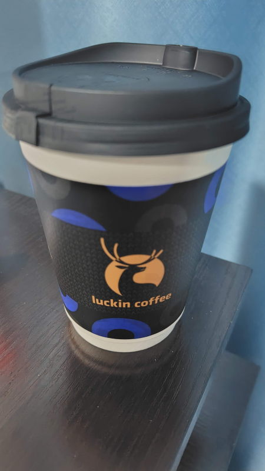

---
tags:
    - china
---
# 瑞幸咖啡
中国全土に展開している鹿?のマークが目印のコーヒーチェーン店。

LuckinCoffee、ラッキンコーヒー。

WeChatのミニプログラムから店舗を選んで注文できる。
注文してドリンクが完成するとQRコードと番号が表示される。
QRコードをカウンターの読み取り機にかざすと受取完了になる。

店内でも飲めるが、基本的にはテイクアウト専門店。

クーポンを使うと1杯9.9元。

## 中日対応
- 美式 :: アメリカーノ
- 埃塞 :: エチオピア
- 标准 :: スタンダード
- 深烘 :: 深煎
- 加浓 :: 濃い
- 意式 :: イタリアン
- 拼配 :: ブレンド
- 耶加雪菲 :: yirgacheffはエチオピアの街
- 澳瑞白 :: フラットホワイト
- 拿铁 :: ラテ
- 生椰拿铁 :: ココナッツコーヒー、ラッキンコーヒーの看板メニュー
