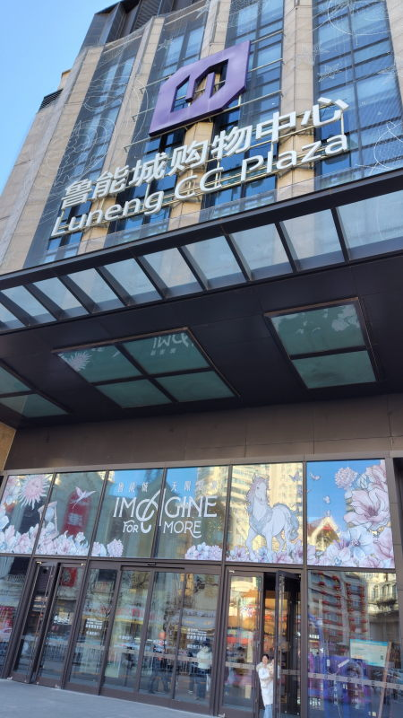
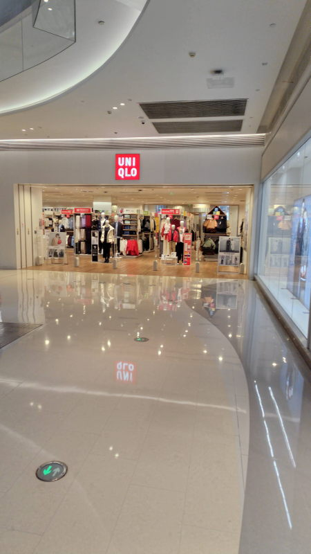
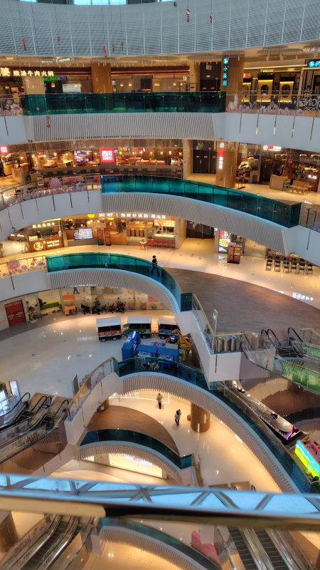

---
tags:
    - tianjin
---
# 鲁能城购物中心
Lǔnéng chéng gòuwù zhòng xīn
水上公园北東にあるショッピングセンター。

6階建てのショッピングセンターになっていて、日本でいうと北千住の駅ビルを小さくしたような感じ。

UNIQLOも入っているが日本よりも割高。
地下は食品売り場（7FRESH 七鲜 Qī xiān）になっていて、
マンションから歩ける範囲では一番大きなスーパーと思われる。

## 写真

