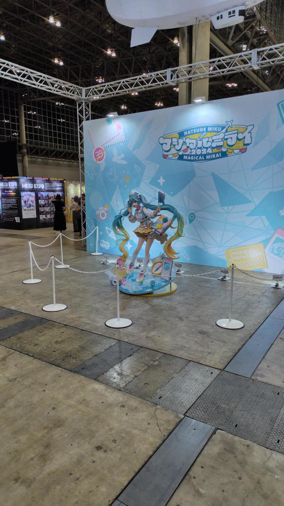
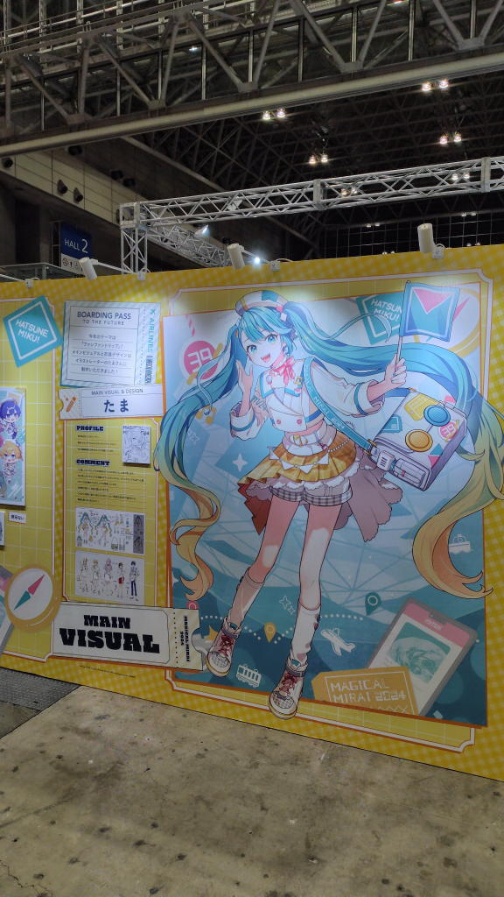
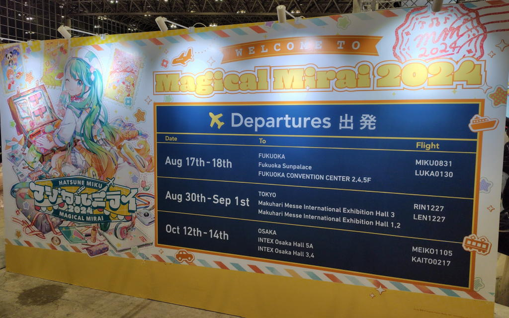
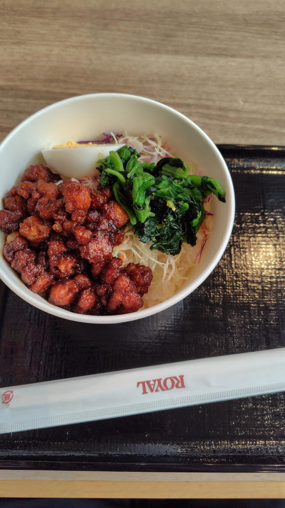

---
tags:
    - event
date: 2024-08-30
---
# マジカルミライ2024
8月30日、マジカルミライ2024TOKYOの昼公演に参加した。

今までコンサートだったらBilly Joelや岡村孝子なんかに行ったことはあるのだが、
ライブというのは今回が初めてで盛り上がりについて行けるものなのかどうかとか
不安に思うところも多かった。

ただ、ここ最近はずっとボカロ曲ばかり聞いているし
知らない世界に足を踏み入れるのも決して悪くないだろうという思いと
ミクのライブなら行ってみたいというのとで色々調べていると
着席専用席とかいう私向けな感じの座席もあることを知った。
それならと思ってこの座席のこともまた調べていたのだが、
親子連れ向けな雰囲気もあったりしてどうしようかと悩んでしまう。

で、どうせ新しい世界に足を踏み入れるなら冒険したほうが良いと思って
SとSSで申し込んだ結果S席に当選、初めてのライブ参加ということになった。

公式の事前物販でアクスタとパンフレット、そして本当にこれを振るのかと思いつつも
ペンライトも買っておいた。

当日は台風が接近していて傘を持っていくべきかどうかと頭を悩ませてたが、
幸いそれほどひどい天気にはなっておらず、折りたたみ傘で事足りた。

企画展会場に前に着いたのは10時少し前、この頃には外まで行列ができていて
入れるのか?と不安になったが、列はすんなり進んでいって10:20くらいには中に入れた。
メインビジュアルの巨大なフィギュアを眼の前にすると
ついに来てしまったんだという実感も湧いてくる。

MIKU EXPOの物販に並んだのだが、結局ここに1時間近く並ぶことになってしまった。
物販は通販で済ませるのが正解だなと少し後悔するが、次に活かそうということで前向きな気持ちで考えていた。

待っている人を見るとやっぱりTシャツやら法被を着ている人がかなり多い印象だった。
私はさすがに着たいとは思わなかったが、むしろ着ていないほうが少数派なのかというくらいでもあった。
...それでも、着ることはないかなぁ。いまのところは。

12:00少しすぎに企画展を出て昼食をどうしようかと考える。
これも少し失敗だったなという点でパンか何かを持っていってどこかのベンチで食べるのが
一番安上がりなような気がした。飲食の可否がよく分からなくて何も持っていかなくて、
入口にあったデイリーヤマザキは行列を作っていた。そんな中でなぜか比較的空いていた店があって、
そこで魯肉飯を食べた。

12:50に会場入り、座席は入口のすぐ近くの後方寄りで
右に小学生ぐらいの子と母親の二人組、左は初老の夫婦で旦那さんのほうがファンという感じだった。
タブレットでミクの絵を描いていたのが印象的と言うか、一体何者だったんだろうか。
ただ、そういう意味では落ち着いた席だったような気もする。
ポツポツとオタクがいて声を張り上げていたり謎の振りをしていたりという感じ。

開演してからは始終立ちっぱなしで私も下手くそながらもペンライトを振っていた。
これも私は1本しか買わなかったのだが2本持っている人がほとんどだった。
でも、始まってしまえばどうでも良いかなという感じではあった。
どう考えたってわたしのペンライトを見ている人などいないだろう。
振らないで腕組んでみていても楽しめるんじゃないかとか、
それなら着席限定の席もありかもしれないなとか、そんなことも思ったりした。
これもまた、次回のライブの時に考えればいいだろう。

ミク推しとしてはミクの出番が多くて嬉しかった。
テーマ曲はもちろん良かったし、結構古めの曲が歌われたりするとこんなのも選ばれるんだと少し驚きつつも嬉しかった、好きな曲でもあったし。ラストのhand in handは多分恒例なのだろう、サビの振りもノリが良くて好き。

一番印象的と言うか心が動いたのは10年後の私...って言う感じの曲があって、自分の10年間が思い出されて
ちょっとグッときてしまった。

ライブはちょうど二時間で終わって、次回も絶対来ようとかBlurayを買おうとか、そんなことを思いながら帰宅した。
帰りの電車は混雑するのかなと思ったがそうでもなかった。多分、終わった後に企画展に行ったり、
夜公演にも出るという人のほうが多いのだろう。

初めてのライブで、どうしても一体感みたいなものを感じるまでにはならなかったけど、
十分楽しめたし行ってよかったかなと思う。
知らない世界を知るという当所の目的は達成できたし、
こうやって活動範囲を広げていけるのなら私にとって良いことなのだ。

## セトリ
1. ブリキノダンス/日向電工
2. 混沌ブキ/jon-TAKITORI
3. 愛の詩/ラマーズP
4. HERO/Ayase
5. SUPERHERO/めろくる
6. Call!!/沫尾
7. TYQOON/Sohbana
8. REALITY/マイナス(ワンダフル☆オポチュニティ!)
9. 新人類/まらしぃ
10. 流星のパルス/*Luna
11. 踊/giga
12. lost and found / ashcolor
13. Letter Song/doriko
14. 陽だまりのセツナ / 赤乃わい
15. すろぉもぉしょん/ピノキオピー
16. 快晴/Orangestar
17. 僕が夢を捨てて大人になるまで/傘村トータ
18. Satisfaction/livetune
19. グリーンライツ・セレナーデ/Omoi
20. ノヴァ/*Luna
21. 初めての恋が終わる時 / supercell
22. アンテナ39/柊マグネタイト

encore

23. ボルテッカー/DECO*27
24. Hand in Hand/livetune
