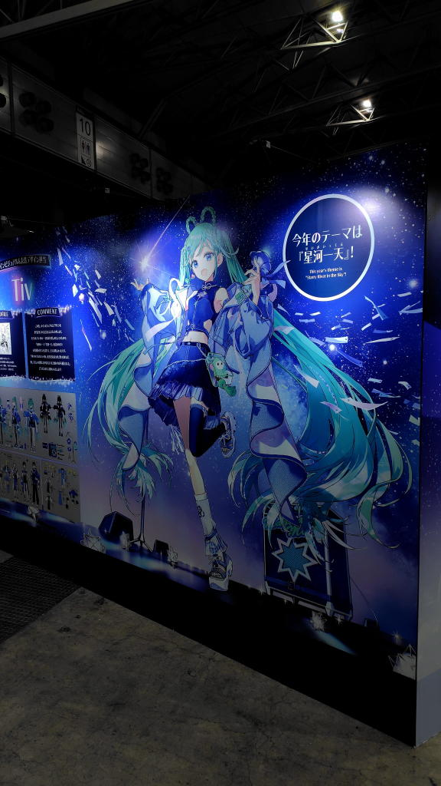
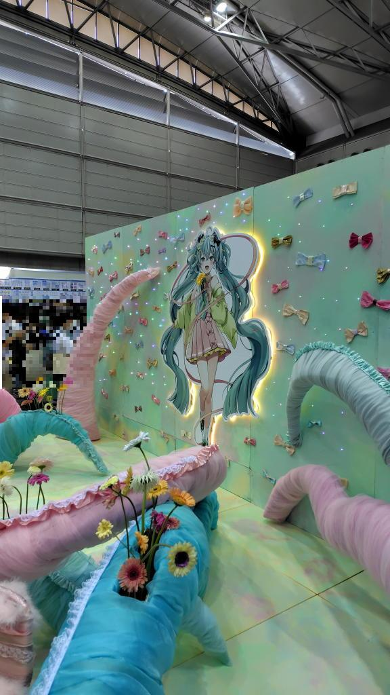
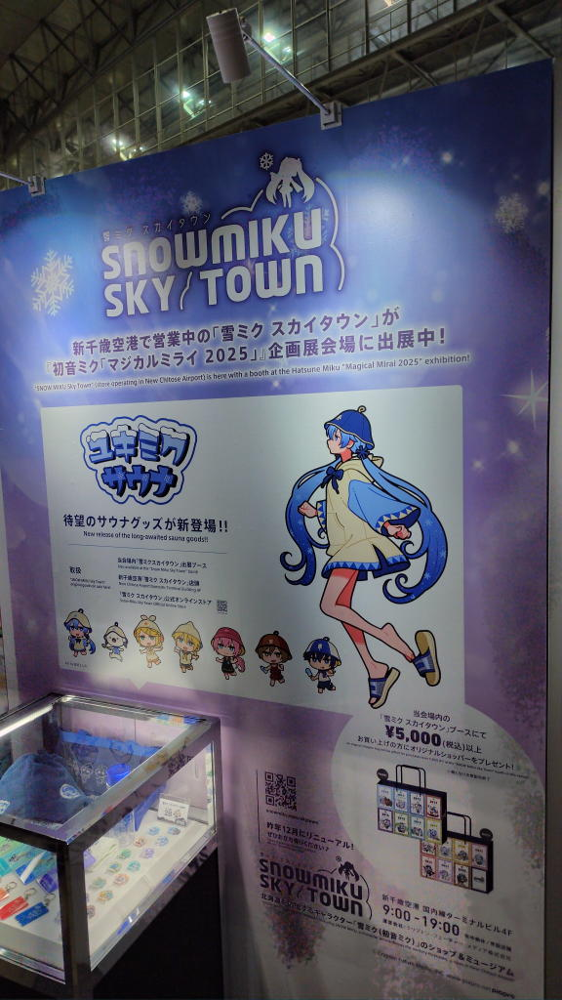
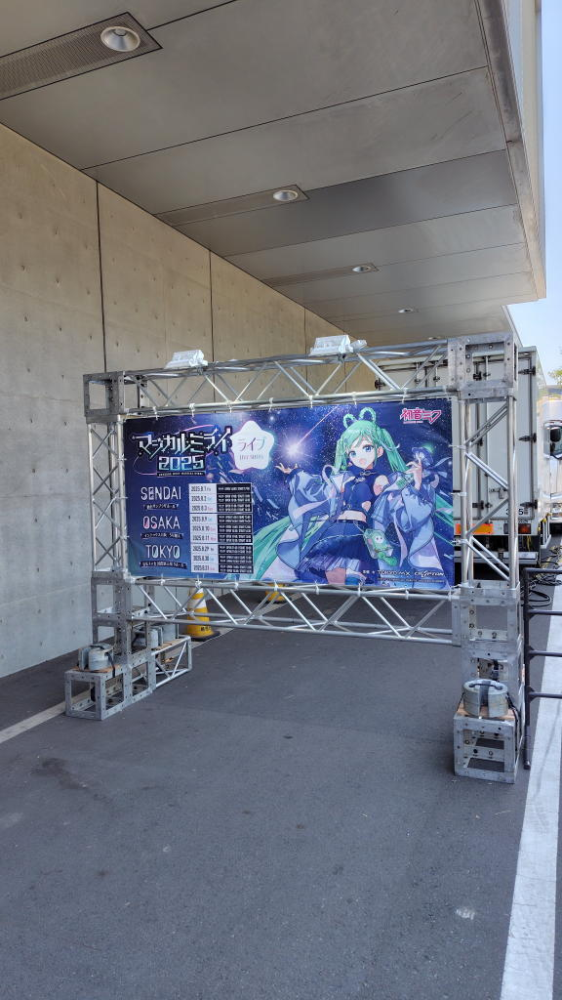

---
tags:
    - event
date: 2025-08-29
---
# マジカルミライ2025
## 東京初日
去年に続いて今回も初日の昼公演に参加してきた。

まずは企画展。前回はスイスイと列が進んですぐに入れた気がするが、
今回は列が屋外まで伸びていて天気も良かったからかなり暑かった。
列に並び始めたのが09:55、会場内に入れたのが10:40くらい。

前回はEXPOの物販に1時間近く並んだのだが、今回は展示を見てあちこちウロウロして過ごしていた。
物欲がなさすぎると言うかミニマリストをこじらせていると言うか、
モノを家に迎えるという気に全然ならなくなってしまったのだ。
思い出と経験があればそれでいいのだと思っている。

会場内でやったのは

- プロセカのブースでカードをもらう
- 札幌市ふるさと納税のブースにかわいいイラストを見つける。今度寄付しようかなと。
- 赤い羽根募金。これだ!と思って1000円寄付して缶バッジとクリアファイルをもらった。
- ぬいぐるみがめっちゃかわいかった。
- Flowersのガーベラの展示も良き。

<https://x.com/yoshi_mi_yoshi> メチャ好みのイラスト!

11:20くらいに会場を出てご飯でも食べようかと少し引き返す。
ただ、ここで気づいたのだが開演が12:00!去年が13:00からだったから
今年も同じだろうと思っていたらそんなこともなかった。
で、とりあえずコンビニでパンを買って適当に外のベンチに座って食べて
早々にライブ会場へ。気づいてなかったらかなり危なかった。
## ライブ
席はAブロックの11列目、
ほぼセンターでこんないい場所二度と当たらないだろう。
ここでミクちゃんに会えるのかとちょっと緊張してしまった。

ライブはめっちゃ良くって、衣装もめっちゃ良くて特にMEIKOが!!!星空クロノグラフ!!!

前回はスクリーン越しでないと小さくて見えなかったが、
生のミクちゃんは本当に可愛かった。

1つ反省があるとするとスクリーンでないと歌詞が表示されない場合が多くて、
私の場合聞いたことはあるけど歌詞が分からんっていうのが結構多かった。
日頃からちゃんと予習をしておかないとな。
それか、着席専用の席もありなんじゃないかなと思っている。
ゆったり座りながら見るのも決して悪くなさそうだし。

本当にあっという間の2時間だった。
またBlu-ray買おうかな、去年も買ったし。でも、再生機器を持っていないから
早いところプレイヤーを買わねば。

ライブ用耳栓、去年買ったのだが持っていくのを忘れてしまい結局使わなかった。
前列というのもあって音が大きいと言うか振動を感じるくらいのレベルなのだ。
家に帰ってきてからもなんか少し音がくぐもって聞こえているような感じがする。

## Q&A
行く前に疑問だったこと
### 去年のグッズ ペンライト TシャツでもOK?
OK!もっと古いのを持ってる人もいっぱいいる。
去年と今年の2本持ち、去年のを2本持ち、なんでもOK!
### 法被・Tシャツ着るべき?
これもどっちでもOK。法被やTシャツを着ている人は目立つが、
実際のところ普段着で参加してる人が多数派じゃないだろうか。
## 事前
<https://magicalmirai.com/2025/>

ライブ会場は9ホール、企画展が10-11ホール。前回と違うみたい。

MEIKO 20th 記念撮影会 2025年 8月 29日(金) 11:00～11:30
## セトリ
<https://note.com/nunutete_mk/n/na50cac71077f>
