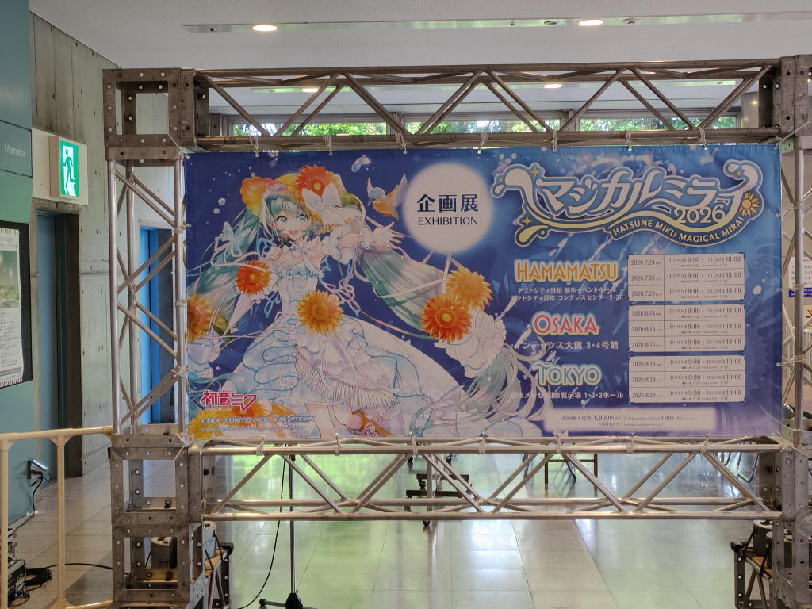
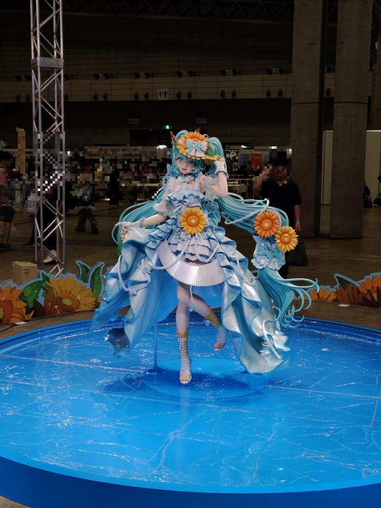
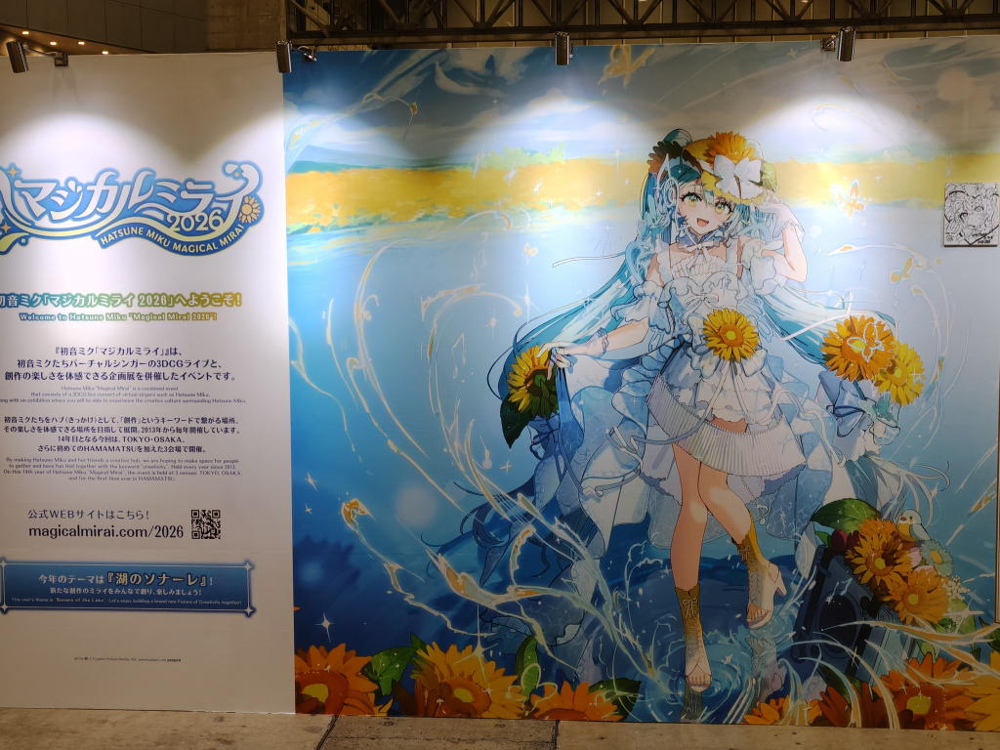
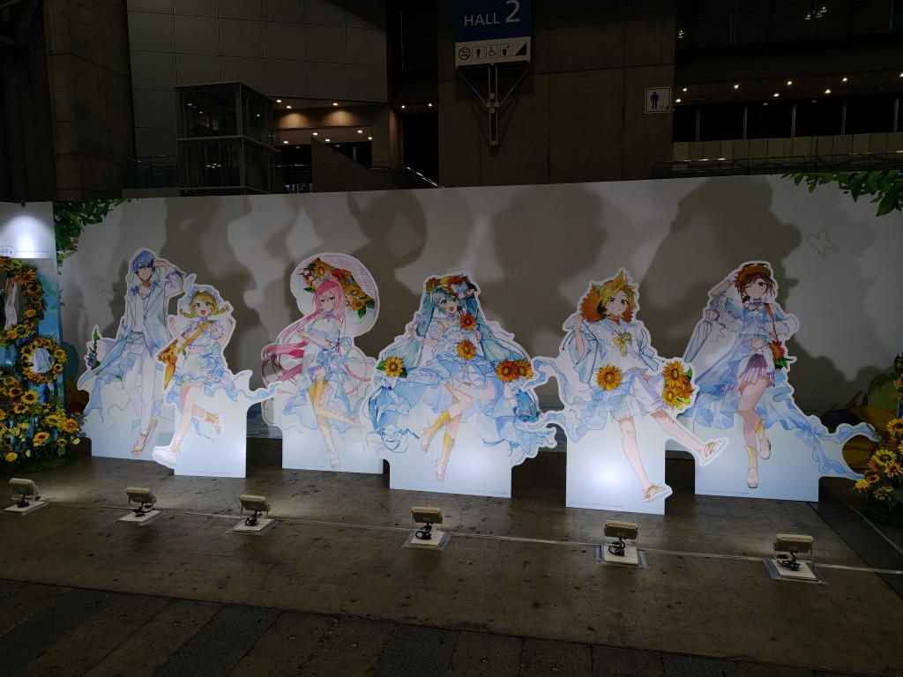
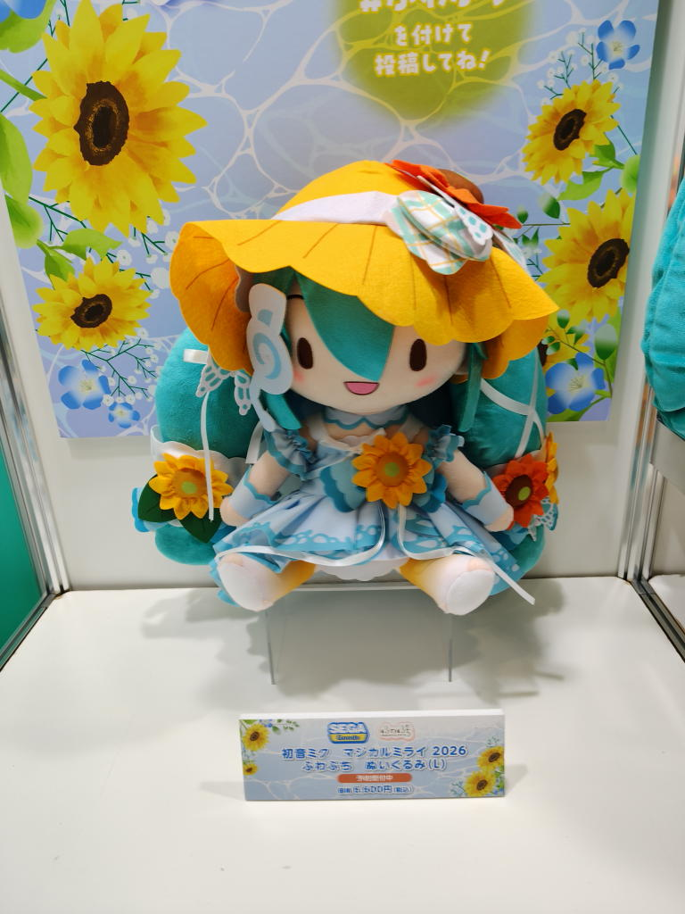
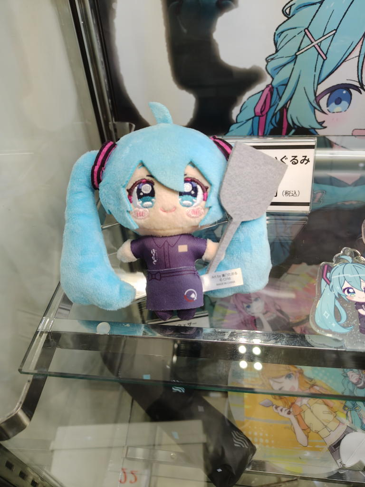
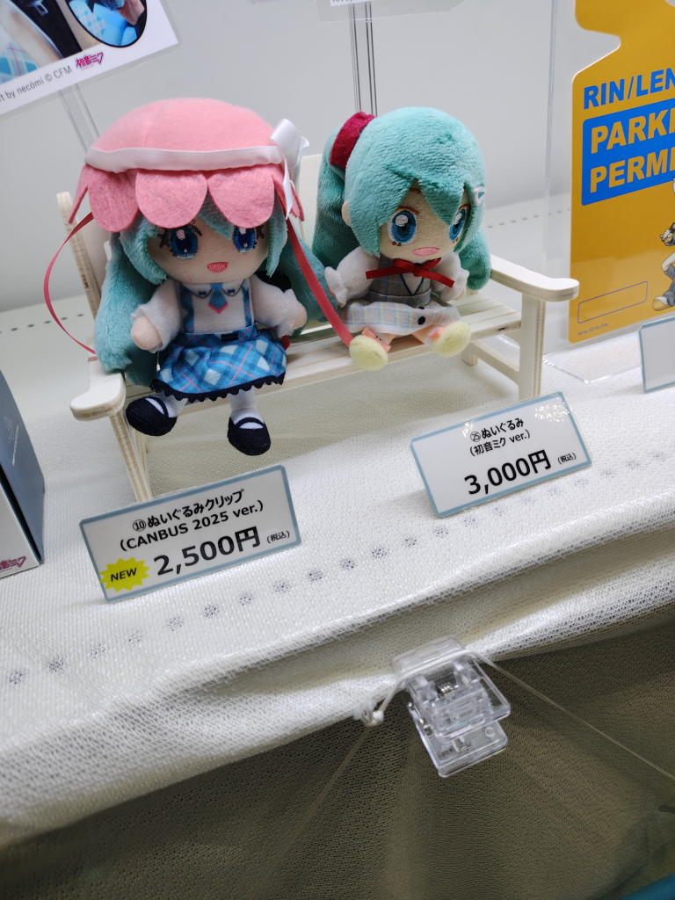
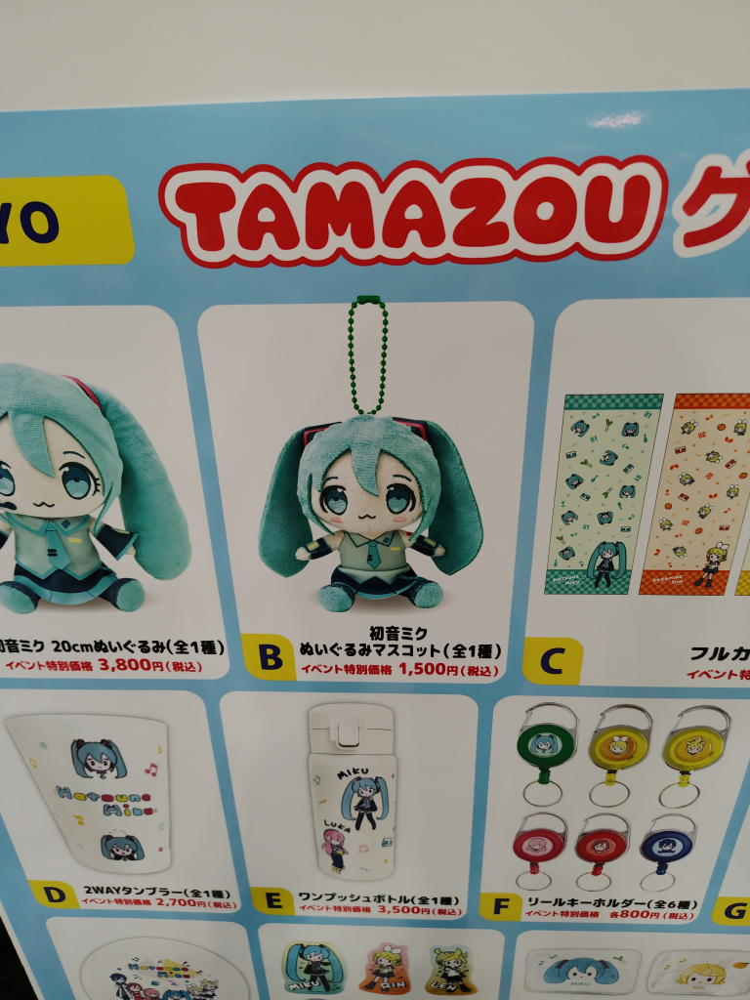
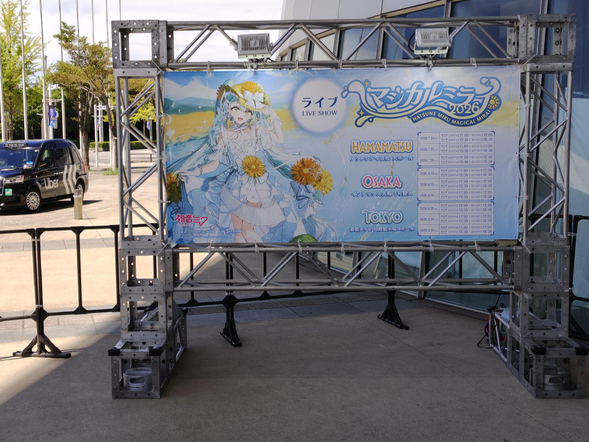
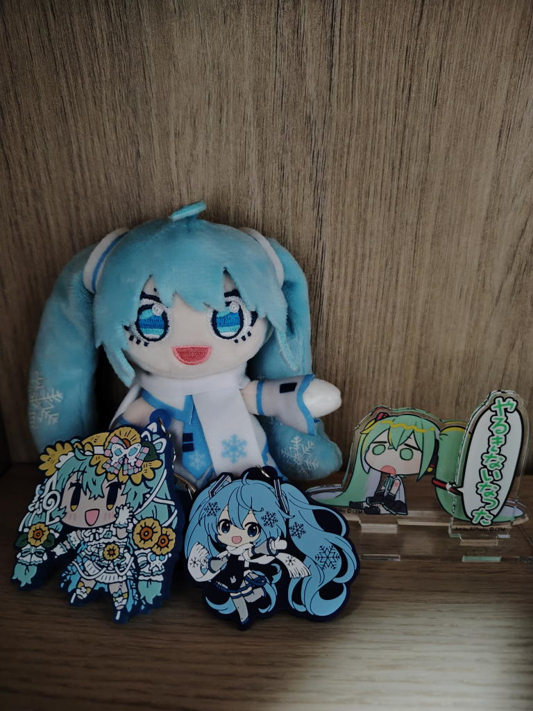

---
tags:
    - event
date: 2026-08-28
---
# マジカルミライ2026
2026年8月28日、今日はマジカルミライに参戦してきた。
2024, 2025と今回で3回目になる。

例年より早めに家を出て、09:40ごろに企画展の列に並び始めて09:55に中に入ることができた。
早いに越したことはないのかもしれない。
去年は09:55着、10:40に入場している。ホールの違いも影響しているのかもしれない。
今年は1-3ホール、去年は10-11ホールだったようだ。

去年は入ったはいいがほとんど何も買わずにただ赤い羽根に寄付して缶バッジとクリアファイルを
もらっただけだったのだが、今年はミクちゃんと一緒に登山をしたりお出かけしたりして
写真を撮りたいという想いがあって、ラバーストラップと持ち運びやすそうな小さい雪ミクぬいを
お迎えすることにした。
ぬいと写真を撮る練習も必要かもしれない。

アクスタも最近は手放すようにしていて実際かなり数を減らしたのだが、コスパのブースにあった
「やるきないなった」とつぶやく脱力ミクちゃんがあまりにも可愛くてこれもお迎えしてしまった。

今年も運良く前列正面あたりだった。ただ、身体に振動を感じるほどに音の圧がすごくて、
去年はそれで何日か耳に違和感が残っていたのだが、今年はライブ用耳栓([thunderplug](https://dirigent.jp/thunderplugs/thunderplugs-hatsune-miku))を装着することである程度改善された。それでも音が大きいと思ってしまうことはあったのだが。

ライブは良かった。言葉でうまく表現できないけど。テーマ曲の空に免じての歌詞も心に来るものがあったし、
懐かしの曲も披露されてうおーってなったりした。

ただ、曲を聞いている最中に今が休職中のみであることや次に出社したらなにを話すことになることやらとか
色々考えてしまって没入するということができていなかった。

ライブが終わった後はエンタGOという公式物販の受け取りサービスでパンフを受け取った。
これはかなりスムーズで便利なサービス。ただ、終わった後じゃなくて公演前に取りに行ったほうが楽かな。
## 写真

わたしの推しの八三さんのイラスト!

どのぬいにしようかなー

これはデカすぎる。。。でもダントツにカワイイ。

お迎えしたグッズたち

## メモ
もう少し静かに楽しむという意味では着席専用席でも良いかもなーと思った。

ライブ途中から頭痛がしていて、多分塩分不足か熱中症初期症状だろうなと感じていた。
ポカリスエットは持参していたが、塩飴とかもあると良いかもしれない。

## リンク
- <https://magicalmirai.com/2026/>
- [セットリスト](https://w.atwiki.jp/hmiku/pages/71541.html)
- <https://enta-go.com/>

