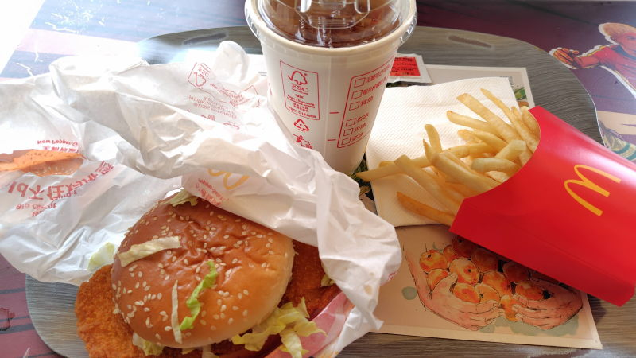

---
tags:
    - china
---
# マクドナルド
テーブルにQRコードはない。WeChatのミニプログラムを検索して起動すると
アプリで注文できる。注文後、画面に完成と表示されたら受取口に取りに行く。
カウンターに大きなディスプレイがあってオーダーの状況がわかるときもある。

注文店舗名を間違えないようにすること。

トレイは自分で下げなくても問題なさそうだが、日本と同じでゴミ箱がおいてあるから
紙類を捨ててトレイを置き場所においておく。

## 麦当劳天津宾水西道餐厅
天津奥城の店舗。

- 大堡口福三件套 22.9元
  - Hold不住鸡排堡(椒盐风味)
  - 中薯条
  - 阳光柠檬红茶中杯

レモンティーは薄味。大きすぎてHoldできないチキンカツバーガー、確かにバンズからはみ出している。

