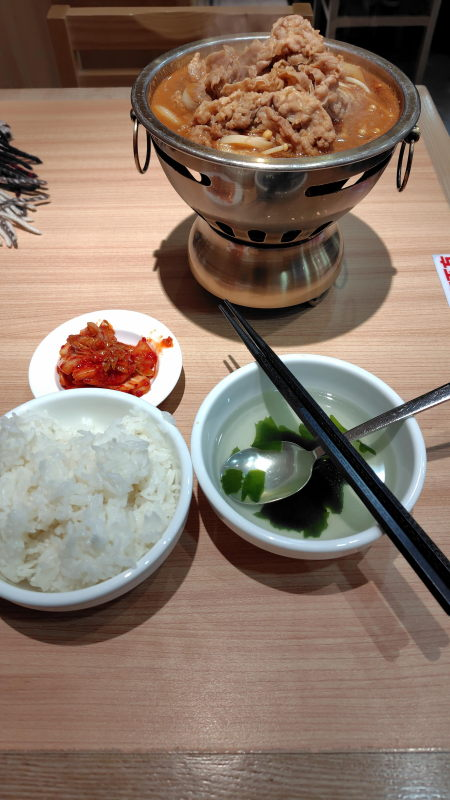
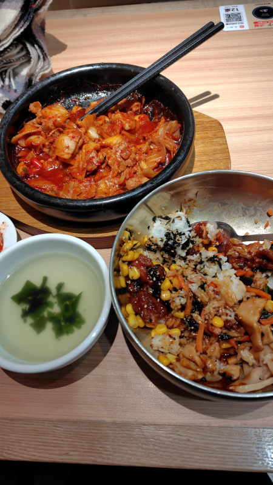
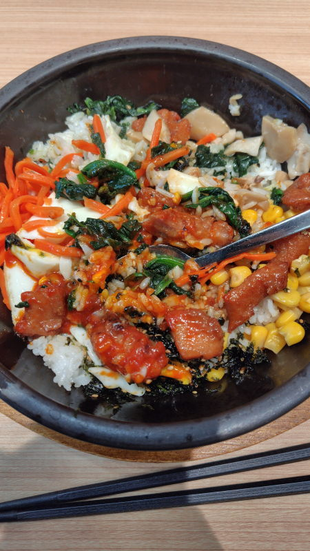
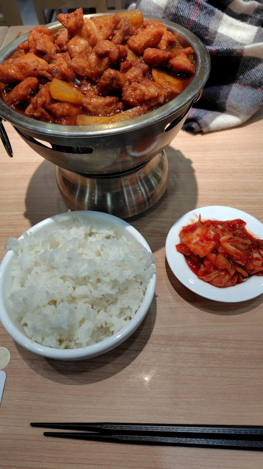
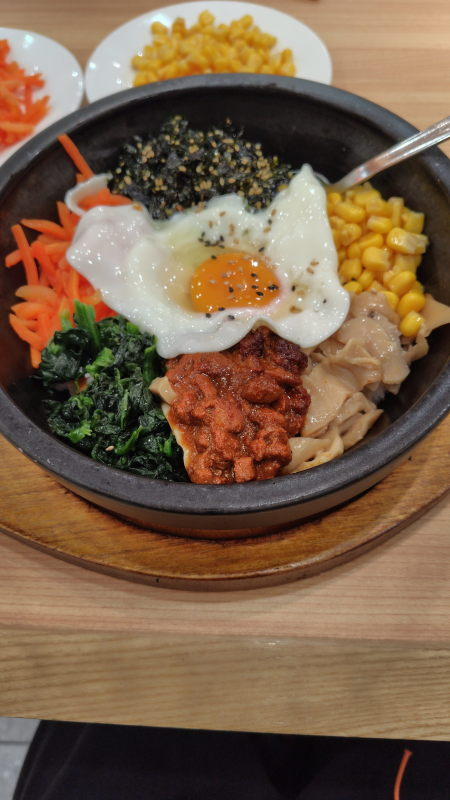
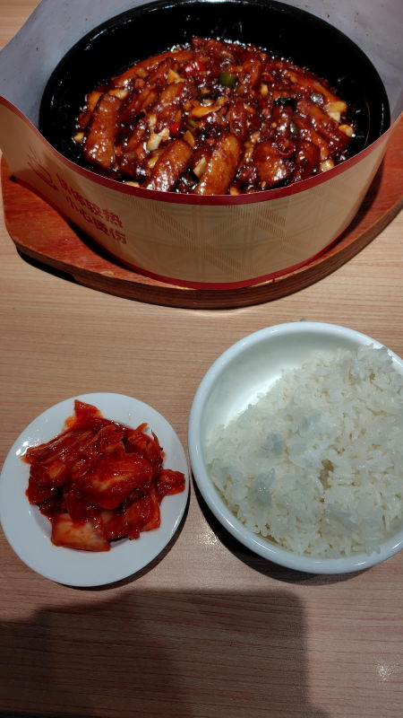
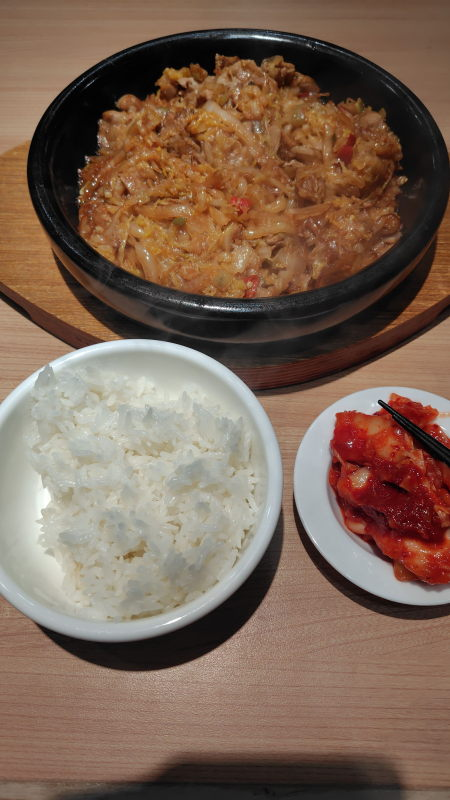
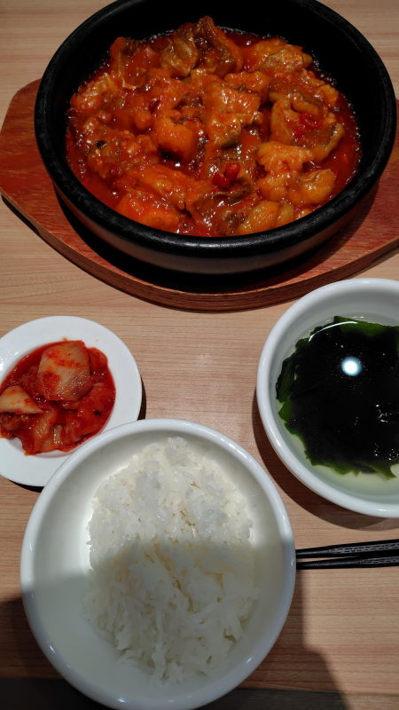
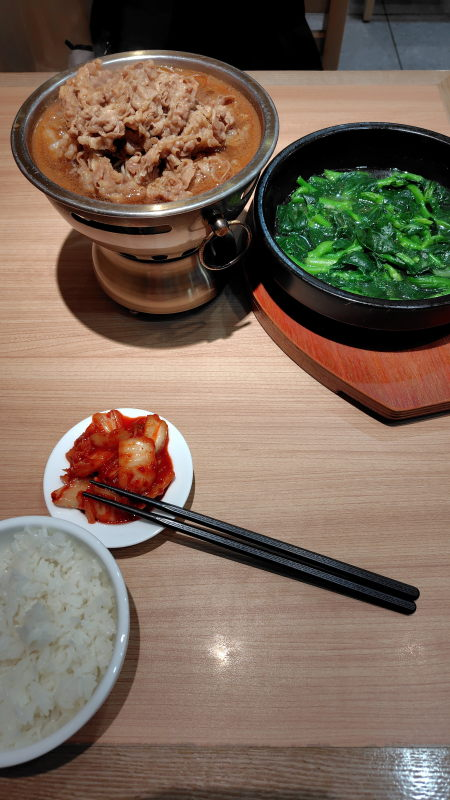
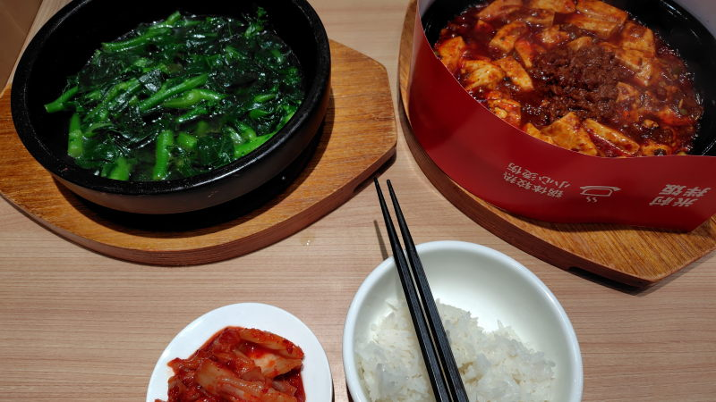

---
tags:
    - tianjin
---
# 米村拌饭
Mǐcūn bàn fàn ミーツン バンファン

わかめスープとご飯、キムチは無料、セルフサービス。

[朝族小吃](./chaozuxiaochi.md)に近いが、こっちのほうがチェーン店で天津の各所に展開している。

## 招牌肥牛锅 Zhāopái féi niú guō
25.9元。すき焼きみたいな味付けの牛鍋。

## 辣白菜炒五花肉 Là báicài chǎo wǔhuāròu
22.9元。キムチ鍋

## 照烧鸡腿肉拌饭 Zhào shāo jītuǐ ròu bàn fàn
15.9元。ビビンバ

## 照烧鸡腿肉石锅拌饭
17.9元。石焼ビビンバ

## 鸡腿肉炖土豆 Jītuǐ ròu dùn tǔdòu
24.9元。じゃがいもと鶏肉の鍋。

## 非遗石锅拌饭 Fēi yí shí guō bàn fàn
21.9元。非遗は無形文化遺産のこと。石焼ビビンバ。

  

## 肉末茄子煲 Ròu mò qiézǐ bāo
18.9元。紙で覆われているのは油ハネを防止するためで、ある程度冷めたら取り外して良い。

## 五花肉煎酸菜
24.9元。五花肉は豚バラ肉のこと。酸菜はザワークラウトみたいな味付け。

## 红烧深海鳕鱼
27.9元。骨なし魚

## 石锅清煮菜心
8.9元。チンゲンサイみたいなものを煮た鍋

## 石板肉酱豆腐
19.9元。麻婆豆腐

